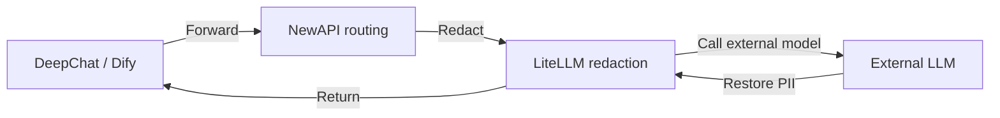

# Chapter 1: Platform Overview and Architecture

*Part 1 · Deployment*

> Understanding the platform's components, ports, and data flow is a prerequisite for all subsequent deployment and administration tasks.

[📖 Index](index.md) · [Chapter 2: Prerequisites →](ch02-prereq.md)

---

## 1.1 What This Platform Is

"AI AllInOne" is an **enterprise intranet AI platform** that orchestrates more than a dozen open-source products with Docker into a whole: unified authentication, LLM routing, PII redaction, AI applications, enterprise portal, source-code CI, client distribution, unified administration, monitoring & alerting, observability, logging, backup & restore — all connected end to end, with **a single Keycloak account for SSO across every product**.

| Layer | Component | Purpose |
| --- | --- | --- |
| Unified Authentication | Keycloak | SSO / OIDC, can integrate with AD/LDAP or local accounts |
| LLM Routing | NewAPI | Channels, keys, quotas, auditing, cost |
| PII Redaction | LiteLLM + Presidio | Automatically redacts phone numbers / ID numbers / emails, etc. before model calls |
| AI Applications | Dify | Visual AI app / Agent / knowledge base platform |
| Enterprise Portal | Ghost | Announcements, news, download center, employee Hub |
| Source Code / CI | Gitea + Runner | Internal Git repository + Actions automation |
| Client | DeepChat | Local AI desktop client (Win/macOS/Linux) |
| Client Distribution | Update server | Hosts DeepChat installers and auto-updates |
| Unified Administration | AI Admin Center | Single administration entry: Dashboard + embedded products + audit/cost/reports |
| Gateway | MCP Gateway | Skill / MCP marketplace management |
| Monitoring & Alerting | Prometheus + Grafana + Alertmanager | Container resource monitoring + alert notifications |
| LLM Observability | Langfuse | trace / latency / token / cost for every model call |
| Unified Logging | Loki + Promtail | Aggregation and search of all container logs |
| Backup & Restore | backup / restore scripts + admin page | Daily full-data backup + one-click restore |

## 1.2 Hardware and Software Requirements

| Item | Minimum | Recommended |
| --- | --- | --- |
| Operating System | Windows 11 (Docker Desktop + WSL2 backend) | Windows 11 Pro / Enterprise (additionally supports Hyper-V to run the AD domain controller) |
| CPU | 4 cores / 8 threads | 8 cores / 16 threads |
| Memory | 16 GB | 32 GB |
| Disk | 60 GB free SSD | 150 GB+ free SSD |
| GPU | No discrete GPU required | No discrete GPU required |

> 📌 Based on actual measurements: about 30 containers use about 5 GB of memory combined when idle; Dify processing/indexing, the Keycloak JVM, database caches, etc. add another 3–5 GB at peak; adding WSL2 virtual memory, 16 GB is the minimum and 32 GB is the comfortable figure. All large models go through external APIs (deepseek-chat, etc.) with no local inference, so **no GPU is required**.

## 1.3 Port Allocation Table

Throughout this document, `<server-IP>` denotes the host machine's external address (currently `192.168.31.117`; replace it with your own intranet IP or domain when deploying).

| # | Product | Purpose | Local access | Intranet access (employees) |
| --- | --- | --- | --- | --- |
| 1 | AI Admin Center | Unified admin portal | `127.0.0.1:10086` | `<server-IP>:10086` |
| 2 | Keycloak | Authentication / SSO | `127.0.0.1:9090` | `<server-IP>:9090` |
| 3 | NewAPI | LLM routing gateway | `127.0.0.1:3000` | `<server-IP>:3000` |
| 4 | LiteLLM | PII redaction proxy | `<server-IP>:4001` | — (called only by NewAPI) |
| 5 | Dify | AI application platform | `127.0.0.1` | `<server-IP>` (port 80) |
| 6 | Ghost | Enterprise portal | `127.0.0.1:8090` | `<server-IP>:8090` |
| 7 | Gitea | Source code + CI/CD | `127.0.0.1:3002` | `<server-IP>:3002` |
| 8 | Update server | DeepChat installers | `127.0.0.1:8091` | `<server-IP>:8091` |
| 9 | MCP Gateway | Skill / MCP gateway | `127.0.0.1:3100` | `<server-IP>:3100` |
| 10 | Grafana | Monitoring dashboard | `127.0.0.1:3030` | `<server-IP>:3030` |
| 11 | Prometheus | Metrics collection / alerting | `127.0.0.1:9091` | `<server-IP>:9091` |
| 12 | Langfuse | LLM observability | `127.0.0.1:3010` | `<server-IP>:3010` |
| 13 | Loki | Log aggregation (internal) | `127.0.0.1:3110` | — (viewed via the admin page) |
| 14 | MailHog | Local mail reception | `127.0.0.1:8025` | `<server-IP>:8025` |

> ⚠️ Always access via **intranet IP**, not `localhost` (Docker Desktop WSL2 has unstable IPv6 `::1` support, causing port forwarding failures). Databases (MySQL/Redis/PostgreSQL) are not exposed to users; they communicate only within the Docker network.

## 1.4 Core Data Flow

### LLM Request Flow (the most critical chain)

*Figure 1-1: Core LLM chain*

1. **① Forward**: DeepChat / Dify sends the request to NewAPI (`:3000/v1`);

2. **② Redact**: NewAPI forwards to LiteLLM, which uses regex + Presidio to replace phone numbers / ID numbers / emails, etc. with `[xxx_REDACTED]`;

3. **③ Call external model**: the redacted request is sent to DeepSeek / GPT / Claude;

4. **④ Restore PII**: when the response comes back, LiteLLM restores the sensitive information;

5. **⑤ Return**: the final result returns to the client.

### Other Flows

- **Authentication flow**: Keycloak OIDC SSO for unified login to all web products (shared `ai_all_in_one_admin`);

- **Observability flow**: LiteLLM `success_callback` → Langfuse traces every call;

- **Auto-update flow**: Gitea Actions build → update server (:8091) → DeepChat checks `version.txt` and auto-downloads/installs;

- **Unified logging flow**: Promtail collects container logs → Loki aggregates → queried on the AI Admin Center "Unified Logging" page.

## 1.5 Book Structure and Navigation

This manual is divided into three parts: **Deployment** (Chapters 1–13, get the platform running from scratch), **Administration** (Chapters 14–26, day-to-day operations for each of the 13 products), and **Operations** (Chapters 27–29, backup / health checks / troubleshooting). You can jump around via the sidebar at any time; the bottom of each page has previous/next chapter navigation.

> ✅ During deployment you can also hand the work to an **AI Agent tool** (WorkBuddy / OpenClaw, etc.) for automation: give the Agent this manual + `docker-compose.yml` + `.env.example` + `scripts/`, and let it execute step by step following the "Deployment" part (see the Agent deployment prompt at the beginning of Chapter 2).

---

[📖 Index](index.md) · [Chapter 2: Prerequisites →](ch02-prereq.md)
