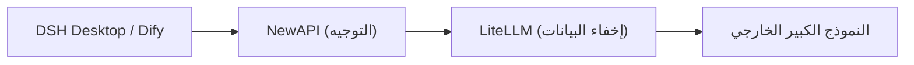

# الفصل 1: نظرة عامة على المنصة والبنية المعمارية

*الجزء الأول · قسم النشر*

> فهم مكونات هذه المنصة ومنافذها وتدفق البيانات هو الأساس لجميع عمليات النشر والإدارة اللاحقة.

[📖 الفهرس](index.md) · [الفصل 2: الاستعدادات المسبقة →](ch02-prereq.md)

---

## 1.1 ما هي هذه المنصة

«AI AllInOne» هي **منصة ذكاء اصطناعي داخلية للمؤسسة** تنظم أكثر من عشرة منتجات مفتوحة المصدر عبر Docker في منظومة واحدة: المصادقة الموحدة، وتوجيه LLM، وإخفاء بيانات PII، وتطبيقات الذكاء الاصطناعي، وبوابة المؤسسة، وCI للمصدر، وتوزيع العملاء، والإدارة الموحدة، والمراقبة والإنذارات، وقابلية المراقبة، والسجلات، والنسخ الاحتياطي والاستعادة — كلها تعمل بشكل متكامل، مع **دخول موحّد عبر حساب Keycloak واحد لجميع المنتجات**.

| الطبقة | المكوّن | الوظيفة |
| --- | --- | --- |
| المصادقة الموحدة | Keycloak | SSO / OIDC، يمكن الاتصال بـ AD/LDAP أو الحسابات المحلية |
| توجيه LLM | NewAPI | القنوات والمفاتيح والحصص والتدقيق والتكلفة |
| إخفاء PII | LiteLLM + Presidio | إخفاء أرقام الهاتف وبطاقات الهوية والبريد الإلكتروني تلقائيًا قبل استدعاء النموذج |
| تطبيقات الذكاء الاصطناعي | Dify | منصة تطبيقات AI مرئية / Agent / قاعدة معرفية |
| بوابة المؤسسة | Ghost | الإعلانات والأخبار ومركز التنزيلات وHub الموظفين |
| المصدر / CI | Gitea + Runner | مستودع Git داخلي + أتمتة Actions |
| العميل | DSH Desktop | عميل سطح مكتب AI محلي (Win/macOS/Linux) |
| توزيع العميل | خادم التحديثات | استضافة حزم تثبيت DSH Desktop والتحديث التلقائي |
| الإدارة الموحدة | مركز إدارة الذكاء الاصطناعي | نقطة الإدارة الوحيدة: Dashboard + تضمين المنتجات + التدقيق/التكلفة/التقارير |
| البوابة | MCP Gateway | إدارة سوق Skill / MCP |
| المراقبة والإنذارات | Prometheus + Grafana + Alertmanager | مراقبة موارد الحاويات + إشعارات الإنذار |
| قابلية مراقبة LLM | Langfuse | تتبع / زمن الاستجابة / الرموز / التكلفة لكل استدعاء نموذج |
| السجلات الموحدة | Loki + Promtail | تجميع والبحث في سجلات جميع الحاويات |
| النسخ الاحتياطي والاستعادة | سكربتات backup / restore + صفحة الإدارة | نسخ احتياطي يومي كامل للبيانات + استعادة بضغطة واحدة |

## 1.2 متطلبات البرامج والأجهزة

| البند | الحد الأدنى | الإعداد الموصى به |
| --- | --- | --- |
| نظام التشغيل | Windows 11 (Docker Desktop + واجهة WSL2 الخلفية) | Windows 11 Pro / Enterprise (مع دعم إضافي لـ Hyper-V لتشغيل نطاق AD) |
| CPU | 4 أنوية / 8 خيوط | 8 أنوية / 16 خيطًا |
| الذاكرة | 16 GB | 32 GB |
| القرص | 60 GB مساحة SSD متاحة | 150 GB+ مساحة SSD متاحة |
| GPU | بدون بطاقة رسومات منفصلة | بدون بطاقة رسومات منفصلة |

> 📌 بناءً على قياسات فعلية: نحو 30 حاوية تستهلك معًا حوالي 5 GB من الذاكرة عند الخمول، وتزداد الذاكرة بمقدار 3–5 GB إضافية في الذروة بسبب معالجة/فهرسة Dify وJVM في Keycloak وذاكرة التخزين المؤقت لقواعد البيانات، إضافة إلى الذاكرة الافتراضية لـ WSL2؛ لذا فإن 16 GB هو الحد الأدنى و32 GB هي القيمة المريحة. جميع النماذج الكبيرة تستخدم واجهات API خارجية (مثل deepseek-chat) دون استدلال محلي، لذا **لا حاجة لـ GPU**.

## 1.3 جدول توزيع المنافذ

فيما يلي يُستخدم `<عنوان-IP-الخادم>` للإشارة إلى عنوان المضيف الخارجي (العنوان في البيئة الحالية هو `192.168.31.117`، ويجب استبداله بعنوان IP الداخلي أو اسم النطاق الخاص بك عند النشر).

| # | المنتج | الاستخدام | الوصول المحلي | الوصول الداخلي (الموظفون) |
| --- | --- | --- | --- | --- |
| 1 | مركز إدارة الذكاء الاصطناعي | بوابة المدير الموحدة | `127.0.0.1:10086` | `<عنوان-IP-الخادم>:10086` |
| 2 | Keycloak | المصادقة / SSO | `127.0.0.1:9090` | `<عنوان-IP-الخادم>:9090` |
| 3 | NewAPI | بوابة توجيه LLM | `127.0.0.1:3000` | `<عنوان-IP-الخادم>:3000` |
| 4 | LiteLLM | وكيل إخفاء PII | `<عنوان-IP-الخادم>:4001` | — (يُستدعى فقط من NewAPI) |
| 5 | Dify | منصة تطبيقات الذكاء الاصطناعي | `127.0.0.1` | `<عنوان-IP-الخادم>` (المنفذ 80) |
| 6 | Ghost | بوابة المؤسسة | `127.0.0.1:8090` | `<عنوان-IP-الخادم>:8090` |
| 7 | Gitea | المصدر + CI/CD | `127.0.0.1:3002` | `<عنوان-IP-الخادم>:3002` |
| 8 | خادم التحديثات | حزم تثبيت DSH Desktop | `127.0.0.1:8091` | `<عنوان-IP-الخادم>:8091` |
| 9 | MCP Gateway | بوابة Skill / MCP | `127.0.0.1:3100` | `<عنوان-IP-الخادم>:3100` |
| 10 | Grafana | لوحة المراقبة | `127.0.0.1:3030` | `<عنوان-IP-الخادم>:3030` |
| 11 | Prometheus | جمع المؤشرات / الإنذار | `127.0.0.1:9091` | `<عنوان-IP-الخادم>:9091` |
| 12 | Langfuse | قابلية مراقبة LLM | `127.0.0.1:3010` | `<عنوان-IP-الخادم>:3010` |
| 13 | Loki | تجميع السجلات (داخلي) | `127.0.0.1:3110` | — (يُعرض عبر صفحة الإدارة) |
| 14 | MailHog | استقبال البريد المحلي | `127.0.0.1:8025` | `<عنوان-IP-الخادم>:8025` |

> ⚠️ استخدم دائمًا **عنوان IP الداخلي** للوصول، ولا تستخدم `localhost` (لأن دعم Docker Desktop WSL2 لعنوان IPv6 `::1` غير مستقر مما يؤدي إلى فشل إعادة توجيه المنافذ). قواعد البيانات (MySQL/Redis/PostgreSQL) غير مكشوفة للمستخدمين، وتتواصل داخل شبكة Docker فقط.

## 1.4 تدفقات البيانات الأساسية

### تدفق طلبات LLM (أهم مسار)

*الشكل 1-1: مسار LLM الأساسي*

*اتجاه الطلب →؛ اتجاه الاستجابة ← (تُعاد بعد استعادة LiteLLM لبيانات PII)؛ يرسل LiteLLM تقاريره إلى Langfuse عبر مسار جانبي*

1. **① إعادة التوجيه**: يرسل DSH Desktop / Dify الطلب إلى NewAPI (`:3000/v1`)؛

2. **② إخفاء البيانات**: يحوّل NewAPI الطلب إلى LiteLLM، الذي يستبدل أرقام الهاتف وبطاقات الهوية والبريد الإلكتروني بـ `[xxx_REDACTED]` باستخدام التعبيرات النمطية + Presidio؛

3. **③ طلب النموذج الخارجي**: يُرسل الطلب بعد إخفاء البيانات إلى DeepSeek / GPT / Claude؛

4. **④ استعادة PII**: عند عودة الاستجابة يستعيد LiteLLM المعلومات الحساسة؛

5. **⑤ الإرجاع**: تعود النتيجة النهائية إلى العميل.

### تدفقات أخرى

- **تدفق المصادقة**: يوفر Keycloak OIDC SSO دخولًا موحدًا لجميع منتجات الويب (باستخدام `ai_all_in_one_admin` المشترك)؛

- **تدفق قابلية المراقبة**: `success_callback` في LiteLLM → يتتبع Langfuse كل استدعاء؛

- **تدفق التحديث التلقائي**: بناء Gitea Actions → خادم التحديثات (:8091) → يتحقق DSH Desktop من `version.txt` وينزّل ويثبّت تلقائيًا؛

- **تدفق السجلات الموحدة**: يجمع Promtail سجلات الحاويات → يجمعها Loki → تُعرض في صفحة «السجلات الموحدة» بمركز إدارة الذكاء الاصطناعي.

## 1.5 هيكل الكتاب وطريقة التنقل

ينقسم هذا الدليل إلى ثلاثة أجزاء: **قسم النشر** (الفصول 1–13، لتشغيل المنصة من الصفر)، **قسم الإدارة** (الفصول 14–26، العمليات اليومية لكل منتج من المنتجات الثلاثة عشر)، **قسم التشغيل والصيانة** (الفصول 27–29، النسخ الاحتياطي/الفحص الصحي/استكشاف الأخطاء). يمكن التنقل في أي وقت عبر الشريط الجانبي، وتوجد أزرار الصفحة السابقة/التالية أسفل الصفحة.

> ✅ يمكن أثناء النشر تسليم العمل مباشرة إلى **أدوات AI Agent** (مثل WorkBuddy / OpenClaw) لأتمتته: سلّم هذا الدليل + `docker-compose.yml` + `.env.example` + `scripts/` إلى الوكيل، ودعه ينفذ الخطوات بترتيب «قسم النشر» (راجع موجه نشر الوكيل في بداية الفصل الثاني).

---

[📖 الفهرس](index.md) · [الفصل 2: الاستعدادات المسبقة →](ch02-prereq.md)
