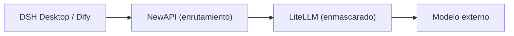

# Capítulo 1: Descripción general y arquitectura de la plataforma

*Parte I · Implementación*

> Entender la composición, los puertos y el flujo de datos de esta plataforma es la base de todas las operaciones posteriores de implementación y administración.

[📖 Índice](index.md) · [Capítulo 2: Preparación previa →](ch02-prereq.md)

---

## 1.1 Qué es esta plataforma

«AI AllInOne» es una **plataforma de IA para la intranet corporativa** que orquesta con Docker más de una docena de productos de código abierto en un todo unificado: autenticación unificada, enrutamiento de LLM, enmascaramiento de PII, aplicaciones de IA, portal corporativo, CI de código fuente, distribución de clientes, administración unificada, monitoreo y alertas, observabilidad, registro, copia de seguridad y restauración — todo funcionando, y con **una única cuenta de Keycloak para iniciar sesión (SSO) en todos los productos**.

| Capa | Componente | Función |
| --- | --- | --- |
| Autenticación unificada | Keycloak | SSO / OIDC; puede integrarse con AD/LDAP o cuentas locales |
| Enrutamiento de LLM | NewAPI | Canales, claves, cuotas, auditoría, costos |
| Enmascaramiento de PII | LiteLLM + Presidio | Enmascara automáticamente números de teléfono / DNI / correos antes de llamar al modelo |
| Aplicaciones de IA | Dify | Plataforma visual de aplicaciones de IA / Agentes / bases de conocimiento |
| Portal corporativo | Ghost | Anuncios, noticias, centro de descargas, Hub de empleados |
| Código fuente / CI | Gitea + Runner | Repositorio Git interno + automatización con Actions |
| Cliente | DSH Desktop | Cliente de escritorio local de IA (Win/macOS/Linux) |
| Distribución de clientes | Servidor de actualización | Alojamiento del instalador de DSH Desktop y actualización automática |
| Administración unificada | Centro de administración de IA | Punto de entrada único de administración: Dashboard + productos integrados + auditoría/costos/informes |
| Gateway | MCP Gateway | Gestión del mercado de Skills / MCP |
| Monitoreo y alertas | Prometheus + Grafana + Alertmanager | Monitoreo de recursos de contenedores + notificaciones de alerta |
| Observabilidad de LLM | Langfuse | Trace / latencia / tokens / costos de cada llamada al modelo |
| Registro unificado | Loki + Promtail | Agregación y búsqueda de registros de todos los contenedores |
| Copia de seguridad y restauración | Scripts backup / restore + página de administración | Copia de seguridad diaria de todos los datos + restauración con un clic |

## 1.2 Requisitos de software y hardware

| Elemento | Requisito mínimo | Configuración recomendada |
| --- | --- | --- |
| Sistema operativo | Windows 11 (Docker Desktop + backend WSL2) | Windows 11 Pro / Enterprise (con soporte adicional de Hyper-V para ejecutar el controlador de dominio AD) |
| CPU | 4 núcleos / 8 hilos | 8 núcleos / 16 hilos |
| Memoria | 16 GB | 32 GB |
| Disco | 60 GB de SSD disponible | 150 GB+ de SSD disponible |
| GPU | No se requiere tarjeta gráfica dedicada | No se requiere tarjeta gráfica dedicada |

> 📌 Según mediciones reales: unos 30 contenedores inactivos suman alrededor de 5 GB de memoria; los picos de procesamiento/indexado de Dify, la JVM de Keycloak y la caché de bases de datos añaden otros 3–5 GB, más la memoria virtual de WSL2. 16 GB es el mínimo y 32 GB el valor cómodo. Todos los modelos grandes pasan por API externa (deepseek-chat, etc.), no se hace inferencia local, por lo que **no se requiere GPU**.

## 1.3 Tabla de asignación de puertos

En adelante se usa `<IP-del-servidor>` para representar la dirección externa del host (en el entorno actual es `192.168.31.117`; al implementar, sustitúyela por tu propia IP de intranet o dominio).

| # | Producto | Uso | Acceso local | Acceso intranet (empleados) |
| --- | --- | --- | --- | --- |
| 1 | Centro de administración de IA | Portal unificado de administración | `127.0.0.1:10086` | `<IP-del-servidor>:10086` |
| 2 | Keycloak | Autenticación / SSO | `127.0.0.1:9090` | `<IP-del-servidor>:9090` |
| 3 | NewAPI | Gateway de enrutamiento de LLM | `127.0.0.1:3000` | `<IP-del-servidor>:3000` |
| 4 | LiteLLM | Proxy de enmascaramiento de PII | `<IP-del-servidor>:4001` | — (solo lo llama NewAPI) |
| 5 | Dify | Plataforma de aplicaciones de IA | `127.0.0.1` | `<IP-del-servidor>` (puerto 80) |
| 6 | Ghost | Portal corporativo | `127.0.0.1:8090` | `<IP-del-servidor>:8090` |
| 7 | Gitea | Código fuente + CI/CD | `127.0.0.1:3002` | `<IP-del-servidor>:3002` |
| 8 | Servidor de actualización | Instalador de DSH Desktop | `127.0.0.1:8091` | `<IP-del-servidor>:8091` |
| 9 | MCP Gateway | Gateway de Skill / MCP | `127.0.0.1:3100` | `<IP-del-servidor>:3100` |
| 10 | Grafana | Panel de monitoreo | `127.0.0.1:3030` | `<IP-del-servidor>:3030` |
| 11 | Prometheus | Recolección de métricas / alertas | `127.0.0.1:9091` | `<IP-del-servidor>:9091` |
| 12 | Langfuse | Observabilidad de LLM | `127.0.0.1:3010` | `<IP-del-servidor>:3010` |
| 13 | Loki | Agregación de registros (interno) | `127.0.0.1:3110` | — (se consulta desde la página de administración) |
| 14 | MailHog | Recepción local de correo | `127.0.0.1:8025` | `<IP-del-servidor>:8025` |

> ⚠️ Accede siempre por **IP de intranet**, no uses `localhost` (Docker Desktop WSL2 no soporta bien la IPv6 `::1`, lo que provoca fallos en el reenvío de puertos). Las bases de datos (MySQL/Redis/PostgreSQL) no se exponen a los usuarios; solo se comunican dentro de la red de Docker.

## 1.4 Flujo de datos principal

### Flujo de peticiones LLM (la cadena más crítica)

*Figura 1-1: Cadena LLM principal*

*Dirección de la petición →; dirección de la respuesta ← (LiteLLM restaura la PII antes de devolverla); LiteLLM informa a Langfuse por un canal lateral*

1. **① Reenvío**: DSH Desktop / Dify envía la petición a NewAPI (`:3000/v1`);

2. **② Enmascarado**: NewAPI la reenvía a LiteLLM, que con expresiones regulares + Presidio sustituye números de teléfono / DNI / correos por `[xxx_REDACTED]`;

3. **③ Llamada al modelo externo**: la petición ya enmascarada se envía a DeepSeek / GPT / Claude;

4. **④ Restauración de PII**: al volver la respuesta, LiteLLM restaura la información sensible;

5. **⑤ Devolución**: el resultado final regresa al cliente.

### Otros flujos

- **Flujo de autenticación**: SSO OIDC de Keycloak para iniciar sesión unificada en todos los productos web (realm compartido `ai_all_in_one_admin`);

- **Flujo de observabilidad**: `success_callback` de LiteLLM → Langfuse rastrea cada llamada;

- **Flujo de actualización automática**: Gitea Actions compila → servidor de actualización (:8091) → DSH Desktop comprueba `version.txt` y descarga e instala automáticamente;

- **Flujo de registro unificado**: Promtail recolecta los registros de cada contenedor → Loki los agrega → se consultan en la página «Registro unificado» del Centro de administración de IA.

## 1.5 Estructura y navegación de este libro

Este manual se divide en tres partes: **Implementación** (capítulos 1–13, poner la plataforma en marcha desde cero), **Administración** (capítulos 14–26, operaciones diarias de cada uno de los 13 productos) y **Operaciones** (capítulos 27–29, copia de seguridad / verificación de estado / resolución de problemas). La barra lateral permite saltar en cualquier momento, y al pie de cada página hay navegación de capítulo anterior/siguiente.

> ✅ Durante la implementación también puedes delegarla a una **herramienta de Agente de IA** (WorkBuddy / OpenClaw, etc.) para automatizarla: entrega este manual + `docker-compose.yml` + `.env.example` + `scripts/` al Agente y pídele que ejecute paso a paso la «Parte de implementación» (consulta el prompt de implementación del Agente al inicio del capítulo 2).

---

[📖 Índice](index.md) · [Capítulo 2: Preparación previa →](ch02-prereq.md)
