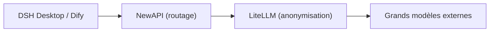

# Chapitre 1 : Vue d'ensemble et architecture de la plateforme

*Première partie · Déploiement*

> Comprendre la composition, les ports et les flux de données de cette plateforme est le préalable à toutes les opérations de déploiement et d'administration qui suivent.

[📖 Index](index.md) · [Chapitre 2 : Préparation préalable →](ch02-prereq.md)

---

## 1.1 Ce qu'est cette plateforme

« AI AllInOne » est une **plateforme IA d'intranet d'entreprise** qui orchestre une douzaine de produits open source au moyen de Docker pour en faire un tout : authentification unifiée, routage LLM, anonymisation PII, applications IA, portail d'entreprise, CI du code source, distribution des clients, administration unifiée, surveillance et alertes, observabilité, journaux, sauvegarde et restauration — tout est opérationnel, et **un seul compte Keycloak assure la connexion unique (SSO) à tous les produits**.

| Couche | Composant | Rôle |
| --- | --- | --- |
| Authentification unifiée | Keycloak | SSO / OIDC, compatible AD/LDAP ou comptes locaux |
| Routage LLM | NewAPI | Canaux, clés, quotas, audit, coûts |
| Anonymisation PII | LiteLLM + Presidio | Anonymise automatiquement numéros de téléphone, cartes d'identité, e-mails, etc. avant l'appel au modèle |
| Applications IA | Dify | Plateforme visuelle d'applications IA / Agents / bases de connaissances |
| Portail d'entreprise | Ghost | Annonces, actualités, centre de téléchargement, Hub des employés |
| Code source / CI | Gitea + Runner | Dépôt Git interne + automatisation Actions |
| Client | DSH Desktop | Client de bureau IA local (Win/macOS/Linux) |
| Distribution du client | Serveur de mise à jour | Hébergement des paquets d'installation DSH Desktop et mise à jour automatique |
| Administration unifiée | Centre d'administration IA | Point d'accès d'administration unique : Dashboard + produits intégrés + audit/coûts/rapports |
| Passerelle | MCP Gateway | Gestion du marché Skill / MCP |
| Surveillance et alertes | Prometheus + Grafana + Alertmanager | Surveillance des ressources des conteneurs + notifications d'alerte |
| Observabilité LLM | Langfuse | Trace / latence / token / coût de chaque appel au modèle |
| Journaux unifiés | Loki + Promtail | Agrégation et recherche des journaux de tous les conteneurs |
| Sauvegarde et restauration | Scripts backup / restore + page d'administration | Sauvegarde quotidienne complète des données + restauration en un clic |

## 1.2 Exigences matérielles et logicielles

| Élément | Exigence minimale | Configuration recommandée |
| --- | --- | --- |
| Système d'exploitation | Windows 11 (Docker Desktop + backend WSL2) | Windows 11 Pro / Entreprise (prise en charge supplémentaire de Hyper-V pour exécuter un contrôleur de domaine AD) |
| CPU | 4 cœurs / 8 threads | 8 cœurs / 16 threads |
| Mémoire | 16 Go | 32 Go |
| Disque | 60 Go de SSD disponible | 150 Go ou plus de SSD disponible |
| GPU | Pas de carte graphique dédiée requise | Pas de carte graphique dédiée requise |

> 📌 Selon les mesures réelles : environ 30 conteneurs au repos consomment environ 5 Go de mémoire au total ; le traitement/l'indexation de Dify, la JVM de Keycloak, le cache des bases de données, etc. ajoutent 3 à 5 Go en pic, plus la mémoire virtuelle de WSL2 — 16 Go est le minimum, 32 Go la valeur confortable. Tous les grands modèles passent par des API externes (deepseek-chat, etc.), aucune inférence n'est effectuée localement : **aucun GPU n'est requis**.

## 1.3 Tableau d'attribution des ports

Dans la suite, `<IP-du-serveur>` désigne l'adresse externe de l'hôte (dans l'environnement actuel `192.168.31.117` ; remplacez-la par votre propre IP intranet ou votre nom de domaine lors du déploiement).

| # | Produit | Usage | Accès local | Accès intranet (employés) |
| --- | --- | --- | --- | --- |
| 1 | Centre d'administration IA | Portail d'administration unifié | `127.0.0.1:10086` | `<IP-du-serveur>:10086` |
| 2 | Keycloak | Authentification / SSO | `127.0.0.1:9090` | `<IP-du-serveur>:9090` |
| 3 | NewAPI | Passerelle de routage LLM | `127.0.0.1:3000` | `<IP-du-serveur>:3000` |
| 4 | LiteLLM | Proxy d'anonymisation PII | `<IP-du-serveur>:4001` | — (appelé uniquement par NewAPI) |
| 5 | Dify | Plateforme d'applications IA | `127.0.0.1` | `<IP-du-serveur>` (port 80) |
| 6 | Ghost | Portail d'entreprise | `127.0.0.1:8090` | `<IP-du-serveur>:8090` |
| 7 | Gitea | Code source + CI/CD | `127.0.0.1:3002` | `<IP-du-serveur>:3002` |
| 8 | Serveur de mise à jour | Paquets d'installation DSH Desktop | `127.0.0.1:8091` | `<IP-du-serveur>:8091` |
| 9 | MCP Gateway | Passerelle Skill / MCP | `127.0.0.1:3100` | `<IP-du-serveur>:3100` |
| 10 | Grafana | Tableau de bord de surveillance | `127.0.0.1:3030` | `<IP-du-serveur>:3030` |
| 11 | Prometheus | Collecte de métriques / alertes | `127.0.0.1:9091` | `<IP-du-serveur>:9091` |
| 12 | Langfuse | Observabilité LLM | `127.0.0.1:3010` | `<IP-du-serveur>:3010` |
| 13 | Loki | Agrégation des journaux (interne) | `127.0.0.1:3110` | — (consultable via la page d'administration) |
| 14 | MailHog | Réception locale des e-mails | `127.0.0.1:8025` | `<IP-du-serveur>:8025` |

> ⚠️ Utilisez toujours l'**IP intranet** pour accéder aux services, jamais `localhost` (Docker Desktop WSL2 gère mal l'IPv6 `::1`, ce qui fait échouer la redirection de ports). Les bases de données (MySQL/Redis/PostgreSQL) ne sont pas exposées aux utilisateurs et ne communiquent qu'en interne sur le réseau Docker.

## 1.4 Flux de données principaux

### Flux de requêtes LLM (la chaîne la plus critique)

*Figure 1-1 : chaîne LLM principale*

*Sens de la requête → ; sens de la réponse ← (LiteLLM restaure les PII avant de renvoyer) ; LiteLLM remonte à Langfuse en chemin latéral*

1. **① Transfert** : DSH Desktop / Dify envoie la requête à NewAPI (`:3000/v1`) ;

2. **② Anonymisation** : NewAPI transfère à LiteLLM, qui remplace les numéros de téléphone, cartes d'identité, e-mails, etc. par `[xxx_REDACTED]` au moyen d'expressions régulières + Presidio ;

3. **③ Requête au modèle externe** : la requête anonymisée est envoyée à DeepSeek / GPT / Claude ;

4. **④ Restauration des PII** : au retour de la réponse, LiteLLM restaure les informations sensibles ;

5. **⑤ Retour** : le résultat final revient au client.

### Quelques autres flux

- **Flux d'authentification** : SSO OIDC de Keycloak pour tous les produits Web (partageant `ai_all_in_one_admin`) ;

- **Flux d'observabilité** : `success_callback` de LiteLLM → Langfuse trace chaque appel ;

- **Flux de mise à jour automatique** : build Gitea Actions → serveur de mise à jour (:8091) → DSH Desktop vérifie `version.txt` et télécharge/installe automatiquement ;

- **Flux de journaux unifiés** : Promtail collecte les journaux de chaque conteneur → agrégation par Loki → consultation via la page « Journaux unifiés » du Centre d'administration IA.

## 1.5 Structure et navigation de ce manuel

Ce manuel se divise en trois parties : **Déploiement** (chapitres 1 à 13, pour faire fonctionner la plateforme de zéro), **Administration** (chapitres 14 à 26, les opérations quotidiennes de chacun des 13 produits), **Exploitation** (chapitres 27 à 29, sauvegarde / contrôle de santé / dépannage). La barre latérale permet de naviguer à tout moment, et des liens page précédente / page suivante se trouvent en bas de page.

> ✅ Le déploiement peut aussi être confié directement à un **outil d'Agent IA** (WorkBuddy / OpenClaw, etc.) pour l'automatiser : fournissez ce manuel + `docker-compose.yml` + `.env.example` + `scripts/` à l'Agent et demandez-lui d'exécuter les étapes dans l'ordre de la partie « Déploiement » (voir le prompt de déploiement pour l'Agent au début du chapitre 2).

---

[📖 Index](index.md) · [Chapitre 2 : Préparation préalable →](ch02-prereq.md)
