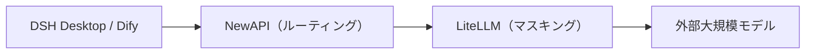

# 第1章：プラットフォーム概要とアーキテクチャ

*第一部 · デプロイ編*

> このプラットフォームの構成・ポート・データフローを理解することは、以降すべてのデプロイ・管理作業の前提です。

[📖 目次](index.md) · [第2章：事前準備 →](ch02-prereq.md)

---

## 1.1 このプラットフォームとは

「AI AllInOne」は**企業内網 AI プラットフォーム**で、十数個のオープンソース製品を Docker で一つの全体にオーケストレーションします：統合認証、LLM ルーティング、PII マスキング、AI アプリケーション、企業ポータル、ソースコード CI、クライアント配布、統合管理、監視・アラート、可観測性、ログ、バックアップ・復元——すべてを接続し、かつ**1 つの Keycloak アカウントですべての製品にシングルサインオン**します。

| レイヤー | コンポーネント | 役割 |
| --- | --- | --- |
| 統合認証 | Keycloak | SSO / OIDC。AD/LDAP またはローカルアカウントに接続可能 |
| LLM ルーティング | NewAPI | チャネル、キー、クォータ、監査、コスト |
| PII マスキング | LiteLLM + Presidio | モデル呼び出し前に携帯番号/身分証番号/メールなどを自動マスキング |
| AI アプリケーション | Dify | ビジュアル AI アプリ / Agent / ナレッジベースプラットフォーム |
| 企業ポータル | Ghost | お知らせ、ニュース、ダウンロードセンター、従業員 Hub |
| ソースコード / CI | Gitea + Runner | 社内 Git リポジトリ + Actions 自動化 |
| クライアント | DSH Desktop | ローカル AI デスクトップクライアント（Win/macOS/Linux） |
| クライアント配布 | 更新サーバー | DSH Desktop インストーラのホスティングと自動更新 |
| 統合管理 | AI 管理センター | 唯一の管理エントリ：Dashboard + 製品埋め込み + 監査/コスト/レポート |
| ゲートウェイ | MCP Gateway | スキル / MCP マーケット管理 |
| 監視・アラート | Prometheus + Grafana + Alertmanager | コンテナリソース監視 + アラート通知 |
| LLM 可観測性 | Langfuse | 各モデル呼び出しの trace / 遅延 / token / コスト |
| 統合ログ | Loki + Promtail | 全コンテナログの集約検索 |
| バックアップ・復元 | backup / restore スクリプト + 管理ページ | 全データの毎日バックアップ + ワンクリック復元 |

## 1.2 ハードウェア・ソフトウェア要件

| 項目 | 最低要件 | 推奨構成 |
| --- | --- | --- |
| OS | Windows 11（Docker Desktop + WSL2 バックエンド） | Windows 11 Pro / Enterprise（Hyper-V で AD ドメインコントローラを追加運用可能） |
| CPU | 4 コア / 8 スレッド | 8 コア / 16 スレッド |
| メモリ | 16 GB | 32 GB |
| ディスク | 60 GB 空き SSD | 150 GB 以上 空き SSD |
| GPU | 独立 GPU 不要 | 独立 GPU 不要 |

> 📌 実測に基づく：約 30 コンテナのアイドル時合計は約 5 GB メモリ。Dify の処理/インデックス、Keycloak JVM、データベースキャッシュなどのピーク時にさらに 3–5 GB 増加し、WSL2 仮想メモリを加えると、16 GB が最低、32 GB が快適値です。すべての大規模モデルは外部 API（deepseek-chat など）を利用し、ローカルで推論しないため**GPU は不要**です。

## 1.3 ポート割り当て表

以下では統一して `<サーバーIP>` をホストマシンの対外アドレスとして使います（現環境は `192.168.31.117`。デプロイ時に自分のイントラネット IP またはドメインに置き換えてください）。

| # | 製品 | 用途 | ローカルアクセス | イントラネットアクセス（従業員） |
| --- | --- | --- | --- | --- |
| 1 | AI 管理センター | 統合管理者ポータル | `127.0.0.1:10086` | `<サーバーIP>:10086` |
| 2 | Keycloak | 認証 / SSO | `127.0.0.1:9090` | `<サーバーIP>:9090` |
| 3 | NewAPI | LLM ルーティングゲートウェイ | `127.0.0.1:3000` | `<サーバーIP>:3000` |
| 4 | LiteLLM | PII マスキングプロキシ | `<サーバーIP>:4001` | —（NewAPI からのみ呼び出し） |
| 5 | Dify | AI アプリケーションプラットフォーム | `127.0.0.1` | `<サーバーIP>`（80 ポート） |
| 6 | Ghost | 企業ポータル | `127.0.0.1:8090` | `<サーバーIP>:8090` |
| 7 | Gitea | ソースコード + CI/CD | `127.0.0.1:3002` | `<サーバーIP>:3002` |
| 8 | 更新サーバー | DSH Desktop インストーラ | `127.0.0.1:8091` | `<サーバーIP>:8091` |
| 9 | MCP Gateway | スキル / MCP ゲートウェイ | `127.0.0.1:3100` | `<サーバーIP>:3100` |
| 10 | Grafana | 監視ダッシュボード | `127.0.0.1:3030` | `<サーバーIP>:3030` |
| 11 | Prometheus | メトリクス収集 / アラート | `127.0.0.1:9091` | `<サーバーIP>:9091` |
| 12 | Langfuse | LLM 可観測性 | `127.0.0.1:3010` | `<サーバーIP>:3010` |
| 13 | Loki | ログ集約（内部） | `127.0.0.1:3110` | —（管理ページで閲覧） |
| 14 | MailHog | ローカルメール受信 | `127.0.0.1:8025` | `<サーバーIP>:8025` |

> ⚠️ 統一して**イントラネット IP** でアクセスし、`localhost` は使いません（Docker Desktop WSL2 は IPv6 `::1` のサポートが不安定で、ポート転送失敗の原因になります）。データベース（MySQL/Redis/PostgreSQL）はユーザーに公開せず、Docker ネットワーク内部でのみ通信します。

## 1.4 コアデータフロー

### LLM リクエストフロー（最も重要な経路）

*図 1-1：コア LLM 経路*

*リクエスト方向 →；レスポンス方向 ←（LiteLLM が PII を復元して返却）；LiteLLM はサイドチャネルで Langfuse に報告*

1. **① 転送**：DSH Desktop / Dify がリクエストを NewAPI に送信（`:3000/v1`）；

2. **② マスキング**：NewAPI が LiteLLM へ転送し、LiteLLM が正規表現 + Presidio で携帯番号/身分証番号/メールなどを `[xxx_REDACTED]` に置換；

3. **③ 外部モデルへリクエスト**：マスキング済みリクエストを DeepSeek / GPT / Claude に送信；

4. **④ PII 復元**：レスポンス返却時に LiteLLM が機密情報を復元；

5. **⑤ 返却**：最終結果がクライアントに戻ります。

### その他のフロー

- **認証フロー**：Keycloak OIDC SSO で全 Web 製品に統合ログイン（共用 `ai_all_in_one_admin`）；

- **可観測性フロー**：LiteLLM `success_callback` → Langfuse が各呼び出しを追跡；

- **自動更新フロー**：Gitea Actions ビルド → 更新サーバー（:8091）→ DSH Desktop が `version.txt` を確認して自動ダウンロード・インストール；

- **統合ログフロー**：Promtail が各コンテナログを収集 → Loki に集約 → AI 管理センター「統合ログ」ページで照会。

## 1.5 本書の構成とナビゲーション

本マニュアルは三部構成です：**デプロイ編**（第 1–13 章、ゼロからプラットフォームを起動）、**管理編**（第 14–26 章、13 製品それぞれの日常運用）、**運用編**（第 27–29 章、バックアップ/ヘルスチェック/トラブル対応）。サイドバーからいつでも移動でき、ページ下部に前章/次章のページ送りがあります。

> ✅ デプロイは **AI Agent ツール**（WorkBuddy / OpenClaw など）に任せて自動化することも可能です：本マニュアル + `docker-compose.yml` + `.env.example` + `scripts/` を Agent に渡し、「デプロイ編」の順序に沿って段階的に実行させます（詳細は第 2 章冒頭の Agent デプロイプロンプト参照）。

---

[📖 目次](index.md) · [第2章：事前準備 →](ch02-prereq.md)
