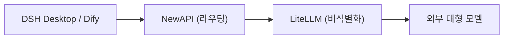

# 제1장: 플랫폼 개요 및 아키텍처

*제1부 · 배포편*

> 이 플랫폼의 구성, 포트, 데이터 흐름을 이해하는 것이 이후 모든 배포 및 관리 작업의 전제입니다.

[📖 목차](index.md) · [제2장: 사전 준비 →](ch02-prereq.md)

---

## 1.1 이 플랫폼이란 무엇인가

「AI AllInOne」은 **기업 내부망 AI 플랫폼**으로, 10여 개의 오픈소스 제품을 Docker로 하나의 통합체로 오케스트레이션합니다: 통합 인증, LLM 라우팅, PII 비식별화, AI 애플리케이션, 기업 포털, 소스 CI, 클라이언트 배포, 통합 관리, 모니터링 알림, 옵저버빌리티, 로그, 백업 복구——모두 연동되며, **하나의 Keycloak 계정으로 모든 제품에 SSO 로그인**됩니다.

| 계층 | 컴포넌트 | 역할 |
| --- | --- | --- |
| 통합 인증 | Keycloak | SSO / OIDC, AD/LDAP 또는 로컬 계정 연동 가능 |
| LLM 라우팅 | NewAPI | 채널, 키, 할당량, 감사, 비용 |
| PII 비식별화 | LiteLLM + Presidio | 모델 호출 전 휴대폰번호/주민등록번호/이메일 등 자동 비식별화 |
| AI 애플리케이션 | Dify | 비주얼 AI 앱 / Agent / 지식베이스 플랫폼 |
| 기업 포털 | Ghost | 공지, 뉴스, 다운로드 센터, 직원 Hub |
| 소스 / CI | Gitea + Runner | 내부 Git 저장소 + Actions 자동화 |
| 클라이언트 | DSH Desktop | 로컬 AI 데스크톱 클라이언트 (Win/macOS/Linux) |
| 클라이언트 배포 | 업데이트 서버 | DSH Desktop 설치 패키지 호스팅 및 자동 업데이트 |
| 통합 관리 | AI 관리 센터 | 유일한 관리 진입점: Dashboard + 제품 임베드 + 감사/비용/보고서 |
| 게이트웨이 | MCP Gateway | Skill / MCP 마켓 관리 |
| 모니터링 알림 | Prometheus + Grafana + Alertmanager | 컨테이너 리소스 모니터링 + 알림 통지 |
| LLM 옵저버빌리티 | Langfuse | 매 모델 호출의 trace / 지연시간 / token / 비용 |
| 통합 로그 | Loki + Promtail | 모든 컨테이너 로그 집계 검색 |
| 백업 복구 | backup / restore 스크립트 + 관리 페이지 | 전체 데이터 매일 백업 + 원클릭 복구 |

## 1.2 소프트웨어/하드웨어 요구사항

| 항목 | 최소 요구사항 | 권장 사양 |
| --- | --- | --- |
| 운영체제 | Windows 11 (Docker Desktop + WSL2 백엔드) | Windows 11 Pro / Enterprise (추가로 Hyper-V로 AD 도메인 컨트롤러 실행 지원) |
| CPU | 4코어 / 8스레드 | 8코어 / 16스레드 |
| 메모리 | 16 GB | 32 GB |
| 디스크 | 60 GB 여유 SSD | 150 GB+ 여유 SSD |
| GPU | 별도 그래픽 카드 불필요 | 별도 그래픽 카드 불필요 |

> 📌 실측 기준: 약 30개 컨테이너가 유휴 상태일 때 합계 약 5 GB 메모리, Dify 처리/인덱싱, Keycloak JVM, 데이터베이스 캐시 등 피크 시 3–5 GB 추가, WSL2 가상 메모리까지 더하면 16 GB가 최소, 32 GB가 여유 있는 값입니다. 모든 대형 모델은 외부 API(deepseek-chat 등)를 사용하며 로컬에서 추론하지 않으므로 **GPU가 필요 없습니다**.

## 1.3 포트 할당표

아래에서는 호스트의 외부 주소를 `<서버-IP>`로 표기합니다 (현재 환경은 `192.168.31.117`이며, 배포 시 본인의 내부망 IP 또는 도메인으로 교체하세요).

| # | 제품 | 용도 | 로컬 접근 | 내부망 접근 (직원) |
| --- | --- | --- | --- | --- |
| 1 | AI 관리 센터 | 통합 관리자 포털 | `127.0.0.1:10086` | `<서버-IP>:10086` |
| 2 | Keycloak | 인증 / SSO | `127.0.0.1:9090` | `<서버-IP>:9090` |
| 3 | NewAPI | LLM 라우팅 게이트웨이 | `127.0.0.1:3000` | `<서버-IP>:3000` |
| 4 | LiteLLM | PII 비식별화 프록시 | `<서버-IP>:4001` | —(NewAPI에서만 호출) |
| 5 | Dify | AI 앱 플랫폼 | `127.0.0.1` | `<서버-IP>`(80 포트) |
| 6 | Ghost | 기업 포털 | `127.0.0.1:8090` | `<서버-IP>:8090` |
| 7 | Gitea | 소스 + CI/CD | `127.0.0.1:3002` | `<서버-IP>:3002` |
| 8 | 업데이트 서버 | DSH Desktop 설치 패키지 | `127.0.0.1:8091` | `<서버-IP>:8091` |
| 9 | MCP Gateway | Skill / MCP 게이트웨이 | `127.0.0.1:3100` | `<서버-IP>:3100` |
| 10 | Grafana | 모니터링 대시보드 | `127.0.0.1:3030` | `<서버-IP>:3030` |
| 11 | Prometheus | 지표 수집 / 알림 | `127.0.0.1:9091` | `<서버-IP>:9091` |
| 12 | Langfuse | LLM 옵저버빌리티 | `127.0.0.1:3010` | `<서버-IP>:3010` |
| 13 | Loki | 로그 집계 (내부) | `127.0.0.1:3110` | —(관리 페이지로 조회) |
| 14 | MailHog | 로컬 메일 수신 | `127.0.0.1:8025` | `<서버-IP>:8025` |

> ⚠️ 반드시 **내부망 IP**로 접속하고 `localhost`는 사용하지 마세요 (Docker Desktop WSL2는 IPv6 `::1` 지원이 불안정하여 포트 포워딩이 실패할 수 있습니다). 데이터베이스(MySQL/Redis/PostgreSQL)는 사용자에게 개방하지 않으며 Docker 네트워크 내부에서만 통신합니다.

## 1.4 핵심 데이터 흐름

### LLM 요청 흐름 (가장 중요한 링크)

*그림 1-1: 핵심 LLM 링크*

*요청 방향 →; 응답 방향 ← (LiteLLM이 PII를 복원한 후 반환); LiteLLM이 사이드채널로 Langfuse에 보고*

1. **① 전달**: DSH Desktop / Dify가 요청을 NewAPI에 전송 (`:3000/v1`);

2. **② 비식별화**: NewAPI가 LiteLLM으로 전달, LiteLLM이 정규식 + Presidio로 휴대폰번호/주민등록번호/이메일 등을 `[xxx_REDACTED]`로 대체;

3. **③ 외부 모델 요청**: 비식별화된 요청을 DeepSeek / GPT / Claude로 전송;

4. **④ PII 복원**: 응답이 돌아올 때 LiteLLM이 민감 정보를 복원;

5. **⑤ 반환**: 최종 결과가 클라이언트로 돌아갑니다.

### 기타 흐름

- **인증 흐름**: Keycloak OIDC SSO로 모든 웹 제품에 통합 로그인 (공용 `ai_all_in_one_admin`);

- **옵저버빌리티 흐름**: LiteLLM `success_callback` → Langfuse가 매 호출을 추적;

- **자동 업데이트 흐름**: Gitea Actions 빌드 → 업데이트 서버 (:8091) → DSH Desktop이 `version.txt` 확인 후 자동 다운로드 설치;

- **통합 로그 흐름**: Promtail이 각 컨테이너 로그 수집 → Loki 집계 → AI 관리 센터 「통합 로그」 페이지에서 조회.

## 1.5 본서 구조 내비게이션

본 매뉴얼은 세 부분으로 구성됩니다: **배포편** (제1–13장, 처음부터 플랫폼 실행), **관리편** (제14–26장, 13개 제품 각각의 일상 운영), **운영편** (제27–29장, 백업/상태 점검/문제 해결). 사이드바로 언제든 이동할 수 있고 페이지 하단에 이전 장/다음 장 페이지 넘김이 있습니다.

> ✅ 배포 시 **AI Agent 도구**(WorkBuddy / OpenClaw 등)에 직접 맡겨 자동화할 수도 있습니다: 본 매뉴얼 + `docker-compose.yml` + `.env.example` + `scripts/`를 Agent에 넘기고 「배포편」 순서대로 단계적으로 실행하도록 하세요 (자세한 내용은 제2장 시작의 Agent 배포 프롬프트 참조).

---

[📖 목차](index.md) · [제2장: 사전 준비 →](ch02-prereq.md)
