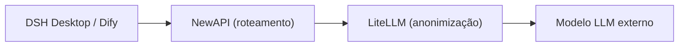

# Capítulo 1: Visão geral e arquitetura da plataforma

*Parte 1 · Implantação*

> Entender a composição, as portas e o fluxo de dados desta plataforma é o pré-requisito para todas as operações de implantação e gestão a seguir.

[📖 Índice](index.md) · [Capítulo 2: Preparação prévia →](ch02-prereq.md)

---

## 1.1 O que é esta plataforma

«AI AllInOne» é uma **plataforma de IA para intranet corporativa** que orquestra mais de uma dezena de produtos de código aberto com Docker: autenticação unificada, roteamento de LLM, anonimização de PII, aplicações de IA, portal corporativo, CI de código-fonte, distribuição de clientes, gestão unificada, monitoramento e alertas, observabilidade, logs, backup e recuperação — tudo integrado, e com **uma única conta Keycloak com SSO para todos os produtos**.

| Camada | Componente | Função |
| --- | --- | --- |
| Autenticação unificada | Keycloak | SSO / OIDC, integrável com AD/LDAP ou contas locais |
| Roteamento de LLM | NewAPI | Canais, chaves, cotas, auditoria, custos |
| Anonimização de PII | LiteLLM + Presidio | Anonimiza automaticamente celular/CPF/e-mail etc. antes de chamar o modelo |
| Aplicações de IA | Dify | Plataforma visual de aplicações de IA / Agente / base de conhecimento |
| Portal corporativo | Ghost | Avisos, notícias, central de downloads, Hub dos funcionários |
| Código-fonte / CI | Gitea + Runner | Repositório Git interno + automação com Actions |
| Cliente | DSH Desktop | Cliente de desktop local de IA (Win/macOS/Linux) |
| Distribuição do cliente | Servidor de Atualização | Hospedagem de instaladores do DSH Desktop e atualização automática |
| Gestão unificada | Central de Administração de IA | Único ponto de gestão: Dashboard + produtos embutidos + auditoria/custos/relatórios |
| Gateway | MCP Gateway | Gestão do mercado de Skills / MCP |
| Monitoramento e alertas | Prometheus + Grafana + Alertmanager | Monitoramento de recursos dos contêineres + notificação de alertas |
| Observabilidade de LLM | Langfuse | Trace / latência / tokens / custo de cada chamada ao modelo |
| Logs unificados | Loki + Promtail | Agregação e busca de logs de todos os contêineres |
| Backup e recuperação | Scripts backup / restore + página de gestão | Backup diário de todos os dados + recuperação com um clique |

## 1.2 Requisitos de software e hardware

| Item | Requisito mínimo | Configuração recomendada |
| --- | --- | --- |
| Sistema operacional | Windows 11 (Docker Desktop + backend WSL2) | Windows 11 Pro / Enterprise (suporte adicional a Hyper-V para rodar o controlador de domínio AD) |
| CPU | 4 núcleos / 8 threads | 8 núcleos / 16 threads |
| Memória | 16 GB | 32 GB |
| Disco | 60 GB de SSD disponível | 150 GB+ de SSD disponível |
| GPU | Sem placa de vídeo dedicada | Sem placa de vídeo dedicada |

> 📌 Conforme testes reais: cerca de 30 contêineres ociosos somam ~5 GB de memória; picos de processamento/indexação do Dify, JVM do Keycloak e cache de banco de dados adicionam mais 3–5 GB, somando a memória virtual do WSL2. 16 GB é o mínimo e 32 GB é o valor confortável. Todos os grandes modelos usam API externa (deepseek-chat etc.), sem inferência local, portanto **não é necessária GPU**.

## 1.3 Tabela de alocação de portas

A seguir, `<IP-do-servidor>` representa o endereço externo da máquina host (no ambiente atual é `192.168.31.117`; substitua pelo seu próprio IP de intranet ou domínio ao implantar).

| # | Produto | Uso | Acesso local | Acesso na intranet (funcionários) |
| --- | --- | --- | --- | --- |
| 1 | Central de Administração de IA | Portal unificado do administrador | `127.0.0.1:10086` | `<IP-do-servidor>:10086` |
| 2 | Keycloak | Autenticação / SSO | `127.0.0.1:9090` | `<IP-do-servidor>:9090` |
| 3 | NewAPI | Gateway de roteamento de LLM | `127.0.0.1:3000` | `<IP-do-servidor>:3000` |
| 4 | LiteLLM | Proxy de anonimização de PII | `<IP-do-servidor>:4001` | — (chamado apenas pelo NewAPI) |
| 5 | Dify | Plataforma de aplicações de IA | `127.0.0.1` | `<IP-do-servidor>` (porta 80) |
| 6 | Ghost | Portal corporativo | `127.0.0.1:8090` | `<IP-do-servidor>:8090` |
| 7 | Gitea | Código-fonte + CI/CD | `127.0.0.1:3002` | `<IP-do-servidor>:3002` |
| 8 | Servidor de Atualização | Instaladores do DSH Desktop | `127.0.0.1:8091` | `<IP-do-servidor>:8091` |
| 9 | MCP Gateway | Gateway de Skills / MCP | `127.0.0.1:3100` | `<IP-do-servidor>:3100` |
| 10 | Grafana | Painel de monitoramento | `127.0.0.1:3030` | `<IP-do-servidor>:3030` |
| 11 | Prometheus | Coleta de métricas / alertas | `127.0.0.1:9091` | `<IP-do-servidor>:9091` |
| 12 | Langfuse | Observabilidade de LLM | `127.0.0.1:3010` | `<IP-do-servidor>:3010` |
| 13 | Loki | Agregação de logs (interno) | `127.0.0.1:3110` | — (visualizar pela página de gestão) |
| 14 | MailHog | Recepção local de e-mails | `127.0.0.1:8025` | `<IP-do-servidor>:8025` |

> ⚠️ Acesse sempre pelo **IP de intranet**, não por `localhost` (o Docker Desktop WSL2 tem suporte instável a IPv6 `::1`, causando falha no encaminhamento de portas). Os bancos de dados (MySQL/Redis/PostgreSQL) não são expostos aos usuários e comunicam-se apenas dentro da rede do Docker.

## 1.4 Fluxos de dados principais

### Fluxo de requisição LLM (a cadeia mais crítica)

*Figura 1-1: cadeia principal de LLM*

*Direção da requisição →; direção da resposta ← (LiteLLM restaura PII antes de devolver); LiteLLM reporta ao Langfuse por caminho paralelo*

1. **① Encaminhar**: DSH Desktop / Dify envia a requisição ao NewAPI (`:3000/v1`);

2. **② Anonimizar**: o NewAPI encaminha ao LiteLLM, que usa regex + Presidio para substituir celular/CPF/e-mail etc. por `[xxx_REDACTED]`;

3. **③ Chamar o modelo externo**: a requisição anonimizada é enviada ao DeepSeek / GPT / Claude;

4. **④ Restaurar PII**: quando a resposta volta, o LiteLLM restaura as informações sensíveis;

5. **⑤ Devolver**: o resultado final chega ao cliente.

### Outros fluxos

- **Fluxo de autenticação**: SSO OIDC do Keycloak para login unificado em todos os produtos Web (compartilhando `ai_all_in_one_admin`);

- **Fluxo de observabilidade**: `success_callback` do LiteLLM → Langfuse rastreia cada chamada;

- **Fluxo de atualização automática**: build do Gitea Actions → Servidor de Atualização (:8091) → DSH Desktop verifica `version.txt` e baixa/instala automaticamente;

- **Fluxo de logs unificados**: Promtail coleta logs de cada contêiner → Loki agrega → consulta na página «Logs unificados» da Central de Administração de IA.

## 1.5 Navegação da estrutura deste manual

Este manual tem três partes: **Implantação** (capítulos 1–13, colocar a plataforma em funcionamento do zero), **Gestão** (capítulos 14–26, operações diárias de cada um dos 13 produtos), **Operações** (capítulos 27–29, backup/verificação de integridade/solução de problemas). A barra lateral permite pular a qualquer momento, e no rodapé da página há navegação para o capítulo anterior/seguinte.

> ✅ Ao implantar, você também pode entregar diretamente a uma ferramenta **AI Agent** (WorkBuddy / OpenClaw etc.) para automatizar: forneça este manual + `docker-compose.yml` + `.env.example` + `scripts/` ao Agent e deixe-o executar passo a passo na ordem da «Implantação» (veja o prompt de implantação do Agent no início do capítulo 2).

---

[📖 Índice](index.md) · [Capítulo 2: Preparação prévia →](ch02-prereq.md)
