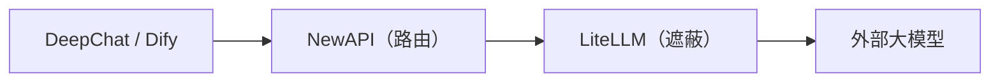

# 第1章：平台概覽與架構

*第一部分 · 部署篇*

> 理解這套平台的組成、埠、資料流，是後續所有部署與管理操作的前提。

[📖 目錄](index.md) · [第2章：前置準備 →](ch02-prereq.md)

---

## 1.1 這套平台是什麼

「AI AllInOne」是一套**企業內網 AI 平台**，把十幾個開源產品用 Docker 編排成一個整體：統一認證、LLM 路由、PII 遮蔽、AI 應用、企業門戶、原始碼 CI、客戶端分發、統一管理、監控告警、可觀測、日誌、備份恢復——全部走通，且**一個 Keycloak 帳號單點登入所有產品**。

| 層 | 元件 | 作用 |
| --- | --- | --- |
| 統一認證 | Keycloak | SSO / OIDC，可對接 AD/LDAP 或本地帳號 |
| LLM 路由 | NewAPI | 渠道、金鑰、額度、審計、成本 |
| PII 遮蔽 | LiteLLM + Presidio | 模型呼叫前自動遮蔽手機號/身分證/郵箱等 |
| AI 應用 | Dify | 視覺化 AI 應用 / Agent / 知識庫平台 |
| 企業門戶 | Ghost | 公告、新聞、下載中心、員工 Hub |
| 原始碼 / CI | Gitea + Runner | 內部 Git 倉庫 + Actions 自動化 |
| 客戶端 | DeepChat | 本地 AI 桌面客戶端（Win/macOS/Linux） |
| 客戶端分發 | 更新伺服器 | DeepChat 安裝包託管與自動更新 |
| 統一管理 | AI 管理中心 | 唯一管理入口：Dashboard + 產品內嵌 + 審計/成本/報告 |
| 閘道器 | MCP Gateway | Skill / MCP 市場管理 |
| 監控告警 | Prometheus + Grafana + Alertmanager | 容器資源監控 + 告警通知 |
| LLM 可觀測 | Langfuse | 每次模型呼叫的 trace / 延遲 / token / 成本 |
| 統一日誌 | Loki + Promtail | 所有容器日誌聚合檢索 |
| 備份恢復 | backup / restore 指令碼 + 管理頁 | 全量資料每日備份 + 一鍵恢復 |

## 1.2 軟硬體要求

| 專案 | 最低要求 | 推薦配置 |
| --- | --- | --- |
| 作業系統 | Windows 11（Docker Desktop + WSL2 後端） | Windows 11 Pro / 企業版（額外支援 Hyper-V 跑 AD 網域控制站） |
| CPU | 4 核 / 8 執行緒 | 8 核 / 16 執行緒 |
| 記憶體 | 16 GB | 32 GB |
| 磁碟 | 60 GB 可用 SSD | 150 GB+ 可用 SSD |
| GPU | 無需獨立顯示卡 | 無需獨立顯示卡 |

> 📌 依據實測：約 30 個容器空閒時合計約 5 GB 記憶體，Dify 處理/索引、Keycloak JVM、資料庫快取等峰值再增 3–5 GB，加 WSL2 虛擬記憶體，16 GB 為最低、32 GB 為舒適值。所有大模型走外部 API（deepseek-chat 等），本地不做推理，**無需 GPU**。

## 1.3 埠分配表

下文統一用 `<伺服器IP>` 表示宿主機對外地址（當前環境為 `192.168.31.117`，部署時替換成你自己的內網 IP 或網域）。

| # | 產品 | 用途 | 本機訪問 | 內網訪問（員工） |
| --- | --- | --- | --- | --- |
| 1 | AI 管理中心 | 統一管理員門戶 | `127.0.0.1:10086` | `<伺服器IP>:10086` |
| 2 | Keycloak | 認證 / SSO | `127.0.0.1:9090` | `<伺服器IP>:9090` |
| 3 | NewAPI | LLM 路由閘道器 | `127.0.0.1:3000` | `<伺服器IP>:3000` |
| 4 | LiteLLM | PII 遮蔽代理 | `<伺服器IP>:4001` | —（僅被 NewAPI 呼叫） |
| 5 | Dify | AI 應用平台 | `127.0.0.1` | `<伺服器IP>`（80 埠） |
| 6 | Ghost | 企業門戶 | `127.0.0.1:8090` | `<伺服器IP>:8090` |
| 7 | Gitea | 原始碼 + CI/CD | `127.0.0.1:3002` | `<伺服器IP>:3002` |
| 8 | 更新伺服器 | DeepChat 安裝包 | `127.0.0.1:8091` | `<伺服器IP>:8091` |
| 9 | MCP Gateway | Skill / MCP 閘道器 | `127.0.0.1:3100` | `<伺服器IP>:3100` |
| 10 | Grafana | 監控大盤 | `127.0.0.1:3030` | `<伺服器IP>:3030` |
| 11 | Prometheus | 指標採集 / 告警 | `127.0.0.1:9091` | `<伺服器IP>:9091` |
| 12 | Langfuse | LLM 可觀測 | `127.0.0.1:3010` | `<伺服器IP>:3010` |
| 13 | Loki | 日誌聚合（內部） | `127.0.0.1:3110` | —（經管理頁檢視） |
| 14 | MailHog | 本地郵件接收 | `127.0.0.1:8025` | `<伺服器IP>:8025` |

> ⚠️ 統一用**內網 IP** 訪問，不用 `localhost`（Docker Desktop WSL2 對 IPv6 `::1` 支援不穩，導致埠轉發失敗）。資料庫（MySQL/Redis/PostgreSQL）不對使用者開放，僅在 Docker 網路內部通訊。

## 1.4 核心資料流

### LLM 請求流（最關鍵的一條鏈路）

*圖 1-1：核心 LLM 鏈路*

*請求方向 →；響應方向 ←（LiteLLM 還原 PII 後返回）；LiteLLM 旁路上報 Langfuse*

1. **① 轉發**：DeepChat / Dify 把請求發給 NewAPI（`:3000/v1`）；

2. **② 遮蔽**：NewAPI 轉發到 LiteLLM，LiteLLM 用正則 + Presidio 把手機號/身分證/郵箱等替換成 `[xxx_REDACTED]`；

3. **③ 請求外部模型**：遮蔽後的請求發給 DeepSeek / GPT / Claude；

4. **④ 還原 PII**：響應回來時 LiteLLM 把敏感資訊還原；

5. **⑤ 返回**：最終結果回到客戶端。

### 其它幾條流

- **認證流**：Keycloak OIDC SSO 統一登入所有 Web 產品（共用 `ai_all_in_one_admin`）；

- **可觀測流**：LiteLLM `success_callback` → Langfuse 追蹤每次呼叫；

- **自動更新流**：Gitea Actions 構建 → 更新伺服器（:8091）→ DeepChat 檢查 `version.txt` 自動下載安裝；

- **統一日誌流**：Promtail 採集各容器日誌 → Loki 聚合 → AI 管理中心「統一日誌」頁查詢。

## 1.5 本書結構導航

本手冊分三部分：**部署篇**（第 1–13 章，從零把平台跑起來）、**管理篇**（第 14–26 章，13 個產品各自的日常操作）、**維運篇**（第 27–29 章，備份/健康檢查/疑難排解）。側邊欄可隨時跳轉，頁面底部有上一章/下一章翻頁。

> ✅ 部署時也可以直接交給 **AI Agent 工具**（WorkBuddy / OpenClaw 等）自動化：把本手冊 + `docker-compose.yml` + `.env.example` + `scripts/` 交給 Agent，讓它按「部署篇」順序逐步執行（詳見第 2 章開頭的 Agent 部署提示詞）。

---

[📖 目錄](index.md) · [第2章：前置準備 →](ch02-prereq.md)
