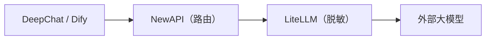

# 第1章：平台概览与架构

*第一部分 · 部署篇*

> 理解这套平台的组成、端口、数据流，是后续所有部署与管理操作的前提。

[📖 目录](index.md) · [第2章：前置准备 →](ch02-prereq.md)

---

## 1.1 这套平台是什么

「AI AllInOne」是一套**企业内网 AI 平台**，把十几个开源产品用 Docker 编排成一个整体：统一认证、LLM 路由、PII 脱敏、AI 应用、企业门户、源码 CI、客户端分发、统一管理、监控告警、可观测、日志、备份恢复——全部走通，且**一个 Keycloak 账号单点登录所有产品**。

| 层 | 组件 | 作用 |
| --- | --- | --- |
| 统一认证 | Keycloak | SSO / OIDC，可对接 AD/LDAP 或本地账号 |
| LLM 路由 | NewAPI | 渠道、密钥、额度、审计、成本 |
| PII 脱敏 | LiteLLM + Presidio | 模型调用前自动脱敏手机号/身份证/邮箱等 |
| AI 应用 | Dify | 可视化 AI 应用 / Agent / 知识库平台 |
| 企业门户 | Ghost | 公告、新闻、下载中心、员工 Hub |
| 源码 / CI | Gitea + Runner | 内部 Git 仓库 + Actions 自动化 |
| 客户端 | DeepChat | 本地 AI 桌面客户端（Win/macOS/Linux） |
| 客户端分发 | 更新服务器 | DeepChat 安装包托管与自动更新 |
| 统一管理 | AI 管理中心 | 唯一管理入口：Dashboard + 产品内嵌 + 审计/成本/报告 |
| 网关 | MCP Gateway | Skill / MCP 市场管理 |
| 监控告警 | Prometheus + Grafana + Alertmanager | 容器资源监控 + 告警通知 |
| LLM 可观测 | Langfuse | 每次模型调用的 trace / 延迟 / token / 成本 |
| 统一日志 | Loki + Promtail | 所有容器日志聚合检索 |
| 备份恢复 | backup / restore 脚本 + 管理页 | 全量数据每日备份 + 一键恢复 |

## 1.2 软硬件要求

| 项目 | 最低要求 | 推荐配置 |
| --- | --- | --- |
| 操作系统 | Windows 11（Docker Desktop + WSL2 后端） | Windows 11 Pro / 企业版（额外支持 Hyper-V 跑 AD 域控） |
| CPU | 4 核 / 8 线程 | 8 核 / 16 线程 |
| 内存 | 16 GB | 32 GB |
| 磁盘 | 60 GB 可用 SSD | 150 GB+ 可用 SSD |
| GPU | 无需独立显卡 | 无需独立显卡 |

> 📌 依据实测：约 30 个容器空闲时合计约 5 GB 内存，Dify 处理/索引、Keycloak JVM、数据库缓存等峰值再增 3–5 GB，加 WSL2 虚拟内存，16 GB 为最低、32 GB 为舒适值。所有大模型走外部 API（deepseek-chat 等），本地不做推理，**无需 GPU**。

## 1.3 端口分配表

下文统一用 `<服务器IP>` 表示宿主机对外地址（当前环境为 `192.168.31.117`，部署时替换成你自己的内网 IP 或域名）。

| # | 产品 | 用途 | 本机访问 | 内网访问（员工） |
| --- | --- | --- | --- | --- |
| 1 | AI 管理中心 | 统一管理员门户 | `127.0.0.1:10086` | `<服务器IP>:10086` |
| 2 | Keycloak | 认证 / SSO | `127.0.0.1:9090` | `<服务器IP>:9090` |
| 3 | NewAPI | LLM 路由网关 | `127.0.0.1:3000` | `<服务器IP>:3000` |
| 4 | LiteLLM | PII 脱敏代理 | `<服务器IP>:4001` | —（仅被 NewAPI 调用） |
| 5 | Dify | AI 应用平台 | `127.0.0.1` | `<服务器IP>`（80 端口） |
| 6 | Ghost | 企业门户 | `127.0.0.1:8090` | `<服务器IP>:8090` |
| 7 | Gitea | 源码 + CI/CD | `127.0.0.1:3002` | `<服务器IP>:3002` |
| 8 | 更新服务器 | DeepChat 安装包 | `127.0.0.1:8091` | `<服务器IP>:8091` |
| 9 | MCP Gateway | Skill / MCP 网关 | `127.0.0.1:3100` | `<服务器IP>:3100` |
| 10 | Grafana | 监控大盘 | `127.0.0.1:3030` | `<服务器IP>:3030` |
| 11 | Prometheus | 指标采集 / 告警 | `127.0.0.1:9091` | `<服务器IP>:9091` |
| 12 | Langfuse | LLM 可观测 | `127.0.0.1:3010` | `<服务器IP>:3010` |
| 13 | Loki | 日志聚合（内部） | `127.0.0.1:3110` | —（经管理页查看） |
| 14 | MailHog | 本地邮件接收 | `127.0.0.1:8025` | `<服务器IP>:8025` |

> ⚠️ 统一用**内网 IP** 访问，不用 `localhost`（Docker Desktop WSL2 对 IPv6 `::1` 支持不稳，导致端口转发失败）。数据库（MySQL/Redis/PostgreSQL）不对用户开放，仅在 Docker 网络内部通信。

## 1.4 核心数据流

### LLM 请求流（最关键的一条链路）

*图 1-1：核心 LLM 链路*

*请求方向 →；响应方向 ←（LiteLLM 还原 PII 后返回）；LiteLLM 旁路上报 Langfuse*

1. **① 转发**：DeepChat / Dify 把请求发给 NewAPI（`:3000/v1`）；

2. **② 脱敏**：NewAPI 转发到 LiteLLM，LiteLLM 用正则 + Presidio 把手机号/身份证/邮箱等替换成 `[xxx_REDACTED]`；

3. **③ 请求外部模型**：脱敏后的请求发给 DeepSeek / GPT / Claude；

4. **④ 还原 PII**：响应回来时 LiteLLM 把敏感信息还原；

5. **⑤ 返回**：最终结果回到客户端。

### 其它几条流

- **认证流**：Keycloak OIDC SSO 统一登录所有 Web 产品（共用 `ai_all_in_one_admin`）；

- **可观测流**：LiteLLM `success_callback` → Langfuse 追踪每次调用；

- **自动更新流**：Gitea Actions 构建 → 更新服务器（:8091）→ DeepChat 检查 `version.txt` 自动下载安装；

- **统一日志流**：Promtail 采集各容器日志 → Loki 聚合 → AI 管理中心「统一日志」页查询。

## 1.5 本书结构导航

本手册分三部分：**部署篇**（第 1–13 章，从零把平台跑起来）、**管理篇**（第 14–26 章，13 个产品各自的日常操作）、**运维篇**（第 27–29 章，备份/健康检查/排错）。侧边栏可随时跳转，页面底部有上一章/下一章翻页。

> ✅ 部署时也可以直接交给 **AI Agent 工具**（WorkBuddy / OpenClaw 等）自动化：把本手册 + `docker-compose.yml` + `.env.example` + `scripts/` 交给 Agent，让它按「部署篇」顺序逐步执行（详见第 2 章开头的 Agent 部署提示词）。

---

[📖 目录](index.md) · [第2章：前置准备 →](ch02-prereq.md)
