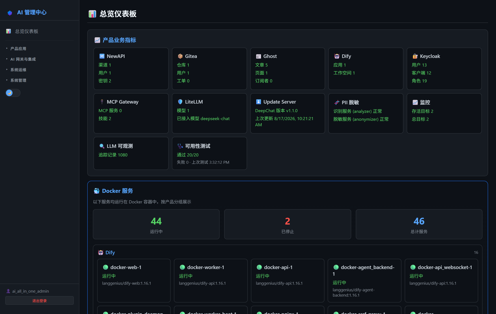
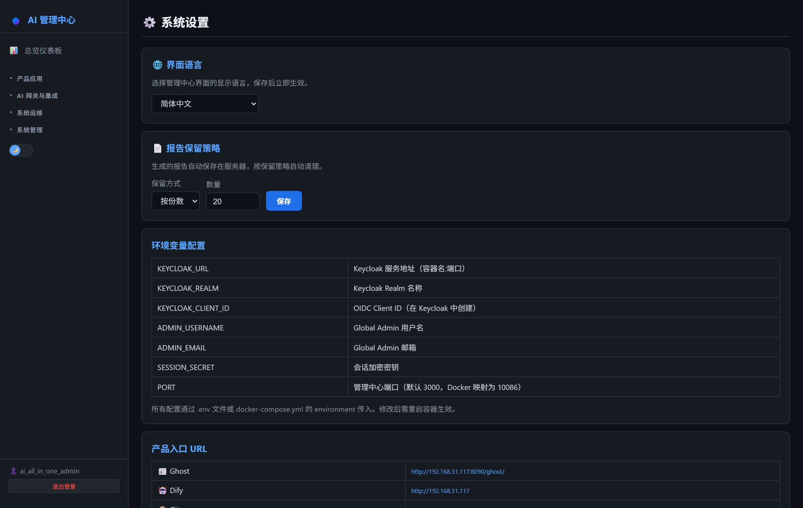
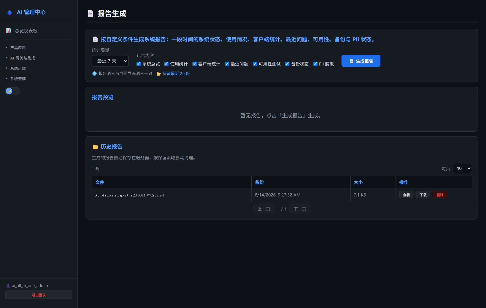
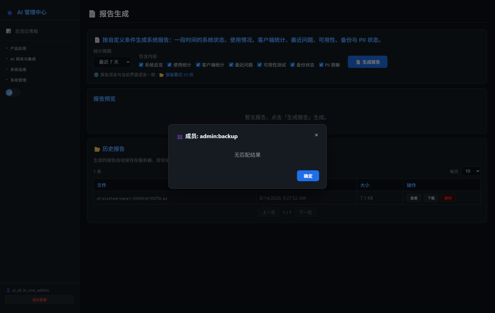
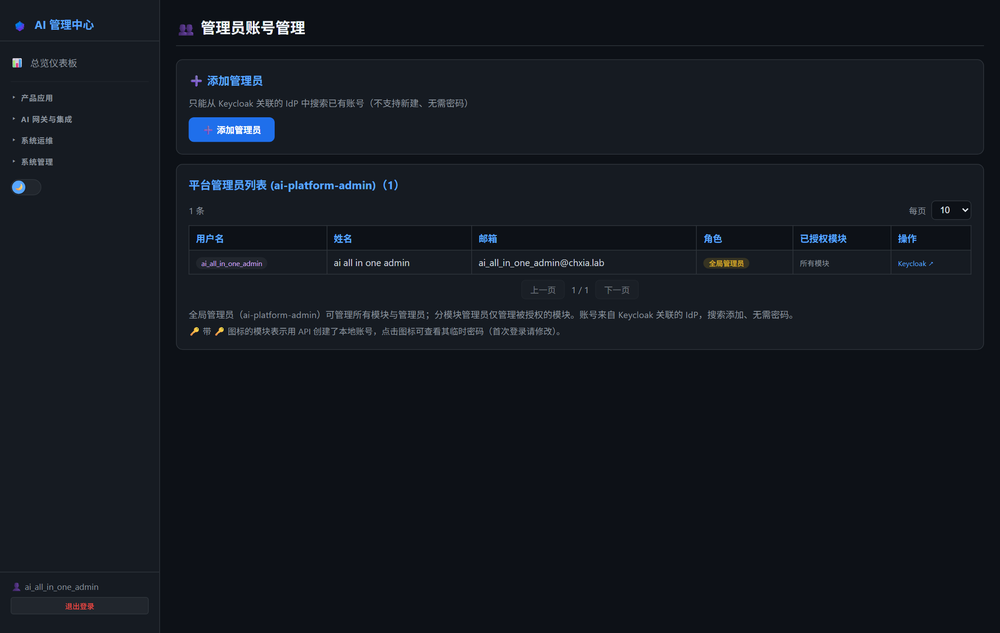
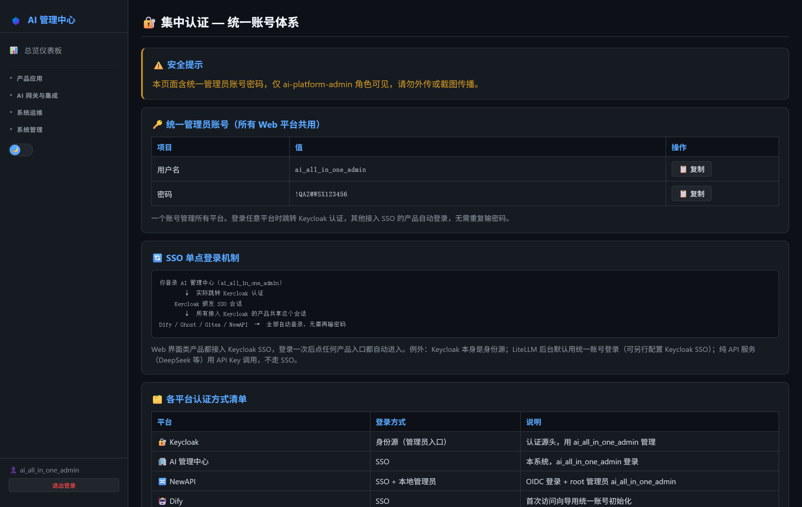
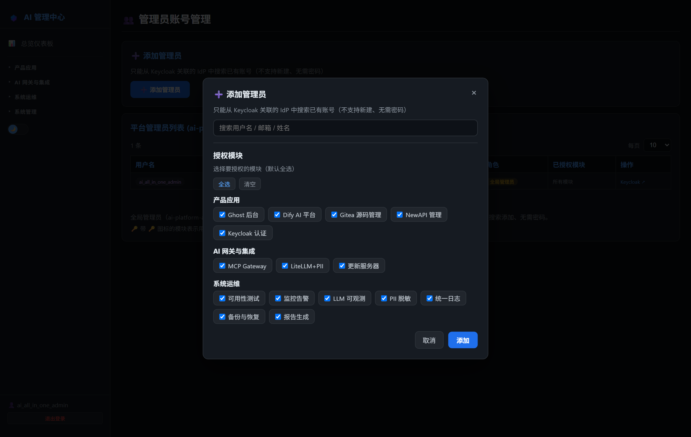

# 第12章：AI 管理中心

*第一部分 · 部署篇*

> 统一管理员门户：Keycloak 鉴权、左侧菜单按「产品应用 / AI 网关与集成 / 系统运维 / 系统管理」分组、Dashboard 集群状态。

[← 第11章：MCP Gateway 与 Skill 市场](ch11-mcp.md) · [📖 目录](index.md) · [第13章：互连验证清单 →](ch13-interconnect.md)

---

> 📌 定位：不是 Docker 管理平台（1Panel/Portainer），而是面向管理员的统一后台——Keycloak 鉴权 + 左侧菜单按组接入全部产品 + Dashboard 集群状态 + 统一管理员账号。产品类页面先展示统计概览，点「打开后台」才在新标签跳转产品自己；运维类页面直接在 AI 管理中心内完成操作。

## 12.1 左侧菜单结构（v0.93 版）

菜单共分 4 组 + 顶部仪表板：

| 分组 | 菜单项 | 行为 | 说明 |
| --- | --- | --- | --- |
| （顶部） | 📊 总览仪表板 | 内嵌页 | 各产品业务指标 + Docker 服务状态（按产品分组）+ 系统信息（版本/容器数/在线时间） |
| 产品应用 | 📰 Ghost 后台 `:8090` | 内嵌统计页 | 门户概览（文章数等）；「打开后台」自动免密登录 |
| 产品应用 | 🤖 Dify AI 平台 `:80` | 内嵌统计页 | 应用/知识库概览 + 知识库检索测试；「打开后台」跳转 |
| 产品应用 | 📦 Gitea 源码管理 `:3002` | 内嵌管理页 | 仓库列表 + deepchat-sync 同步管理（触发/定时/配置/版本/历史）；「打开后台」SSO 登录 |
| 产品应用 | 🔀 NewAPI 管理 `:3000` | 内嵌统计页 | 渠道/用户/令牌概览 + 成本报表 + 审计日志 |
| 产品应用 | 🔐 Keycloak 认证 `:9090` | 内嵌管理页 | 用户/客户端/角色列表（分页+搜索）；全部/增量同步、删用户、角色管理（全局管理员） |
| AI 网关与集成 | 🔌 MCP Gateway `:3100` | 内嵌管理页 | MCP Server 增删改 + 工具列表 + 技能上传/删除 |
| AI 网关与集成 | 🛡️ LiteLLM+PII `:4001` | 内嵌统计页 | LiteLLM 概览 + 模型列表；「打开后台」跳 `/ui` |
| AI 网关与集成 | ⬇️ 更新服务器 `:8091` | 内嵌统计页 | DeepChat 安装包文件列表 + 当前版本 |
| 系统运维 | 🩺 可用性测试 | 内嵌页 | 定时 + 手动跑全链路连通性测试 |
| 系统运维 | 📈 监控告警 `:3030` | 新标签跳转 | Grafana 大盘（SSO 自动登录）；Prometheus `:9091`、Alertmanager `:9093` |
| 系统运维 | 🔔 企业 IM 告警 | 内嵌管理页 | 告警推送到钉钉/企微/飞书：多接收人 + 发送规则 + 发送历史（配置存 Redis） |
| 系统运维 | 🔍 LLM 可观测 `:3010` | 新标签跳转 | Langfuse（SSO 自动登录） |
| 系统运维 | 🧬 PII 脱敏 `:5001/:5002` | 内嵌统计页 | Presidio Analyzer/Anonymizer 状态 |
| 系统运维 | 📜 统一日志（Loki） | 内嵌页 | 按容器 + 关键字 + 时间查日志 |
| 系统运维 | 💾 备份与恢复 | 内嵌管理页 | 备份列表 + 立即备份 + 一键恢复 |
| 系统运维 | 📄 报告生成 | 内嵌管理页 | 按周期生成平台报告（.md） |
| 系统管理（仅全局管理员） | 🔐 集中认证 | 内嵌页 | 各产品 SSO / 账号绑定关系总览 |
| 系统管理（仅全局管理员） | 👥 管理员管理 | 内嵌管理页 | 从 IdP 搜索添加管理员、按模块授权、查看临时密码 |
| 系统管理（仅全局管理员） | ⚙️ 系统设置 | 内嵌页 | 界面语言 9 种 + 产品入口 URL 配置 |

> 📌 权限说明：非管理员登录会提示「你不是管理员」并退出；管理员按 `admin:<产品>` Realm Role 分模块可见，无权模块不显示；「系统管理」组三项仅全局管理员（`ai-platform-admin`）可见。



*图 12-1：总览仪表板（各产品指标 + 容器状态）*



*图 12-2：系统设置（界面语言 9 种 + 产品入口 URL）*



*图 12-3：报告生成（按周期生成平台报告）*



*图 12-4：报告生成设置表单*


## 12.2 初始化 Global Administrator

```
# .env 中配置
ADMIN_USERNAME=ai_all_in_one_admin
ADMIN_PASSWORD=见账号密码清单
ADMIN_EMAIL=ai_all_in_one_admin@<公司域名>
```

启动后自动在 Keycloak 建 `ai_all_in_one_admin` 用户（已有则跳过），分配 `ai-platform-admin` Realm Role。核心理念：**一个 Global Admin 账号管理所有平台**。

## 12.3 Docker Compose 部署

```
# 前置：先装依赖（一次）
cd admin-portal
npm install
cd ..
```

```
  admin-portal:
    image: node:20-alpine
    container_name: admin-portal
    restart: always
    ports: ["10086:3000"]
    working_dir: /app
    command: sh -c "node server.js"
    environment:
      - PORT=3000
      - KEYCLOAK_URL=http://<服务器IP>:9090
      - KEYCLOAK_REALM=enterprise-ai
      - KEYCLOAK_CLIENT_ID=AI-all-in-one-admin-portal
      - KEYCLOAK_CLIENT_SECRET=${KEYCLOAK_CLIENT_SECRET}
      - ADMIN_USERNAME=${ADMIN_USERNAME:-ai_all_in_one_admin}
      - ADMIN_PASSWORD=${ADMIN_PASSWORD}
      - ADMIN_EMAIL=${ADMIN_EMAIL:-ai_all_in_one_admin@<公司域名>}
      - SESSION_SECRET=${SESSION_SECRET:-random-secret-change-me}
      - LITELLM_MASTER_KEY=${LITELLM_MASTER_KEY}
      - LITELLM_URL=http://<服务器IP>:4001
    volumes:
      - ./admin-portal:/app
      - /var/run/docker.sock:/var/run/docker.sock
    networks: [ai-platform]
```

## 12.4 Keycloak 客户端配置

1. Keycloak → enterprise-ai → Clients → Create；

2. Client ID `AI-all-in-one-admin-portal`，Client authentication / Standard flow 都 On；

3. Valid Redirect URIs：`http://127.0.0.1:10086/*` 和 `http://<服务器IP>:10086/*`；

4. 复制 Client Secret → 填 `.env` 的 `KEYCLOAK_CLIENT_SECRET` → `docker compose up -d admin-portal`；

5. 建 Realm Role `ai-platform-admin`，分配给 `ai_all_in_one_admin`。

> ⚠️ 部署/排错要点：
> - admin-portal 会话存 Redis（`admin-session-redis`），重启容器不再清空登录会话；
> - 首页 `/` 必须走 Keycloak 保护（`express.static(..., {index:false})` + 显式 `app.get('/', keycloak.protect())`），否则未登录直接渲染空看板；
> - 统计 Dify 用实际管理员邮箱（`ai_all_in_one_admin@<公司域名>`，须与 AD 全局管理员一致）；
> - **改 server.js 后必须 `docker restart admin-portal`**，不能用 `up -d`（volume 文件内容变化不会触发重建）。

## 12.5 验证

1. 打开 `http://<服务器IP>:10086` → 自动跳 Keycloak 登录（未登录不显示空看板）；

2. 用 `ai_all_in_one_admin` 登录 → 进总览仪表板；

3. Dashboard 显示各产品指标 + 容器分组；

4. 点各产品先看统计、点「打开后台」才跳转（Ghost/Gitea 会自动完成 SSO 登录）；

5. 系统设置可切 9 种语言。

## 12.6 管理员分模块授权 + Keycloak 认证页管理（v0.91）

全局管理员可在 AI 管理中心直接管理其他管理员和 Keycloak：

- **管理员账号管理**：从 Keycloak 关联的 IdP 搜索已有账号（AD/LDAP 用户，无需新建、无需密码）→ 勾选模块 → 确定。系统分配 `admin:<产品>` Realm Role，并**真实开通到产品**（SSO 优先、API 兜底）：Gitea / NewAPI / Dify / Ghost / Grafana / LiteLLM / Keycloak / Langfuse。撤销模块或删除管理员会**从产品删除该账号**。无 SSO 产品建号生成临时密码，🔑 图标可回看（仅全局管理员）。非管理员登录弹「你不是管理员」并退出。



*图 12-5：管理员管理（从 IdP 搜索添加 + 分模块授权）*


- **Keycloak 认证页**：「全部同步 / 增量同步」按钮一键拉取 AD 属性变更；每行用户有「编辑」（跳 Keycloak 控制台）和「删除」；角色区块可新建/删除角色、查看成员。同步/删除/角色操作仅全局管理员。



*图 12-7：集中认证（各产品 SSO / 账号绑定关系总览）*



*图 12-6：添加管理员（搜索 IdP 账号 + 勾选模块）*


> ⚠️ 注意：Keycloak 无「单用户同步」端点，增量同步会同步 AD 里所有有变更的账号；AD 联邦用户删除后下次全量同步或再次 SSO 登录会重新出现，彻底移除请在 AD 里禁用/删除该账号。

---

[← 第11章：MCP Gateway 与 Skill 市场](ch11-mcp.md) · [📖 目录](index.md) · [第13章：互连验证清单 →](ch13-interconnect.md)
