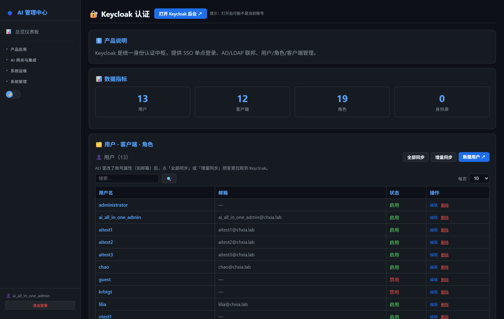
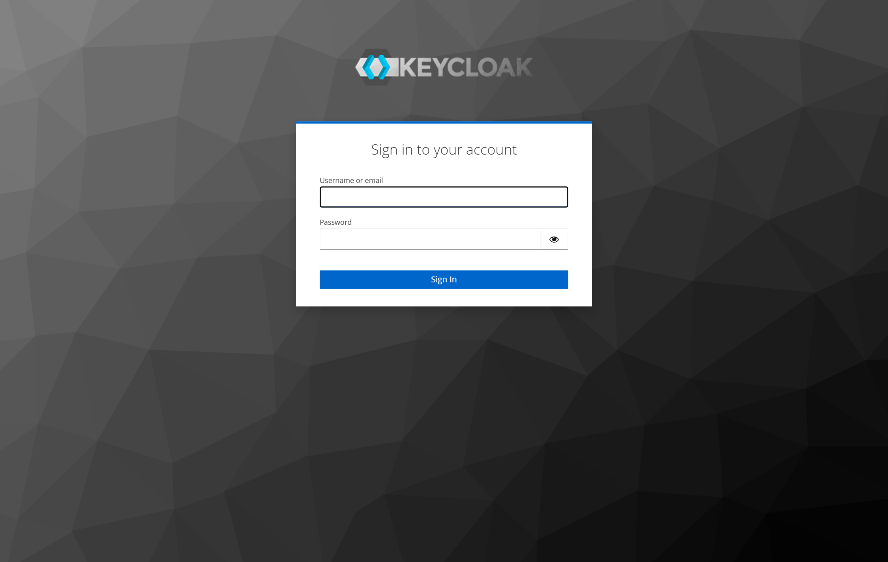
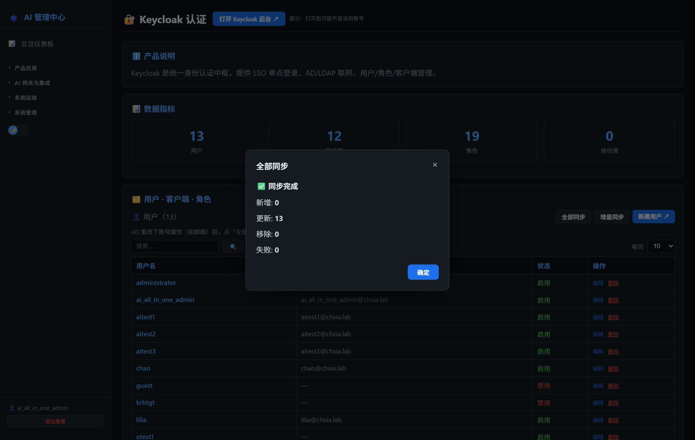
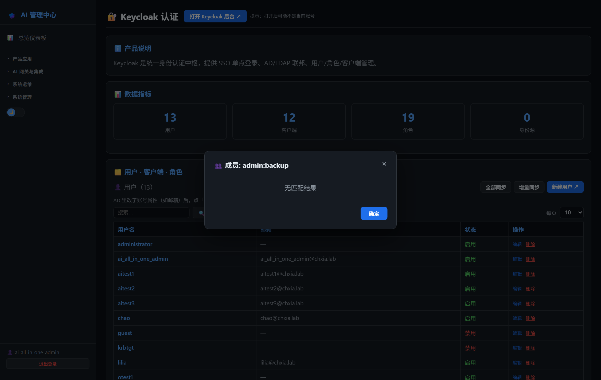

# 第14章：Keycloak 日常管理

*第二部分 · 管理篇（各产品日常操作）*

> 认证中枢：管用户、角色、OIDC 客户端、AD 联邦、会话；大部分操作可在 AI 管理中心完成。

[← 第13章：互连验证清单](ch13-interconnect.md) · [📖 目录](index.md) · [第15章：NewAPI 日常管理 →](ch15-ops-newapi.md)

---

## 14.1 AI 管理中心可执行的操作

菜单：**产品应用 → 🔐 Keycloak 认证**。页面分三块（用户/客户端/角色），均带分页与搜索：

- **用户**：列表显示用户名/邮箱/状态/来源（AD 或本地）。顶部有「全部同步 / 增量同步」按钮（仅全局管理员），一键把 AD 属性变更拉到 Keycloak；每行「编辑」跳 Keycloak 控制台用户设置，「删除」直接删用户（AD 联邦用户会警告：下次同步/SSO 会重新出现）。
- **客户端**：列表显示 Client ID 与类型，「新建客户端」按钮跳 Keycloak 控制台。
- **角色**：列表显示角色名/描述/用户数，可**新建 / 删除角色、查看角色成员**（仅全局管理员）。项目关键角色：`ai-platform-admin`（全局管理员）、`admin:<产品>`（分模块管理员）、`default-roles-enterprise-ai`（默认角色，全员）。

> 📌 同步/删除/角色操作需要全局管理员；普通管理员只能看列表。同步结果弹窗显示 added/updated/removed/failed 计数。

*图 14-1：AI 管理中心「Keycloak 认证」页（用户/客户端/角色）*

## 14.2 登录 Keycloak 管理中心

- **方式一（推荐）**：AI 管理中心 → Keycloak 认证页 → 右上角「打开后台」→ 自动 SSO 登录，直达 Administration Console。
- **方式二（直连）**：浏览器打开 `http://<服务器IP>:9090` → Administration Console → 用 `ai_all_in_one_admin`（AD 账号，SSO）或本地管理员登录。

*图 14-2：Keycloak 管理中心登录页*

## 14.3 项目相关操作

### 14.3.1 管理用户

1. **新建本地用户**：Users → Add user → 填用户名 → Create → Credentials 标签设密码（Temporary 关闭，否则首次登录强制改密）；
2. **重置密码**：Users → 搜到用户 → Credentials → Set password；
3. **禁用/启用**：用户详情顶部 Enabled 开关（禁用后该用户所有 SSO 立即失效）；
4. **删除**：用户详情 → Delete（AD 联邦用户删除是临时的，彻底移除须在 AD 禁用/删除该账号）。

### 14.3.2 AD 同步

1. 全部同步：AI 管理中心 → Keycloak 认证页 → 「全部同步」（等价 User Federation → Company AD → Action → Sync all users）；
2. 增量同步：「增量同步」（等价 Sync changed users），AD 里改了邮箱/部门等属性后用它拉取；
3. 同步计数：弹窗显示 added/updated/removed/failed；**AD 属性为准**（READ_ONLY 模式，Keycloak 侧改不了）。

> ⚠️ Keycloak 没有「单用户同步」端点：只想同步一个账号时，增量同步会把 AD 里所有有变更的账号一起同步。

*图 14-3：全部同步结果弹窗（added/updated/removed/failed）*

*图 14-4：查看角色成员弹窗*

### 14.3.3 角色管理（项目约定）

- **全局管理员**：Realm Role `ai-platform-admin`（AI 管理中心「管理员管理」自动分配）；
- **分模块管理员**：`admin:<产品>` 角色（admin:gitea / admin:newapi / admin:dify / admin:ghost / admin:keycloak / admin:litellm / admin:mcp-gateway / admin:monitoring / admin:observability / admin:pii / admin:logs / admin:backup / admin:report / admin:availability 等），由「管理员管理」按勾选模块分配；
- 新建/删除角色、看成员：AI 管理中心 → Keycloak 认证页 → 角色区块（全局管理员）。

### 14.3.4 OIDC 客户端（项目清单）

项目使用的客户端：`AI-all-in-one-admin-portal`（管理中心）、`gitea`、`newapi`、`litellm`（SSO 跳转）、`deepchat` 等。改回调地址在 Clients → 该客户端 → Valid redirect URIs。

> ⚠️ 常见问题：改客户端回调后浏览器仍报 redirect_uri 错误 → 清浏览器缓存或换隐身窗口；AD 抖动时登录报 `unknown_error` → 等 AD 恢复后重试（见第 29 章）。

> 📖 原厂文档：Keycloak 官方文档 https://www.keycloak.org/documentation · 服务器管理 https://www.keycloak.org/server/ · LDAP 联邦 https://www.keycloak.org/docs/latest/server_admin/#_ldap

---

[← 第13章：互连验证清单](ch13-interconnect.md) · [📖 目录](index.md) · [第15章：NewAPI 日常管理 →](ch15-ops-newapi.md)
