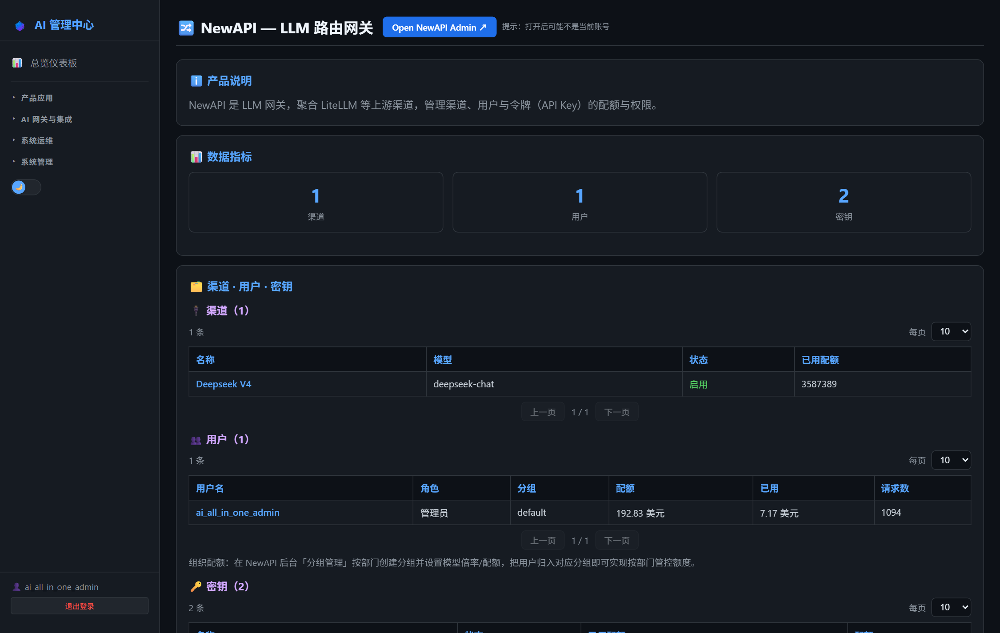
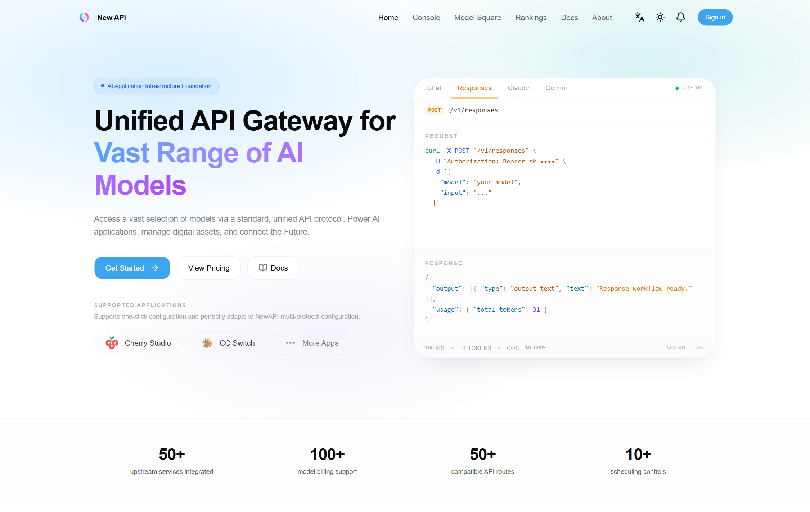
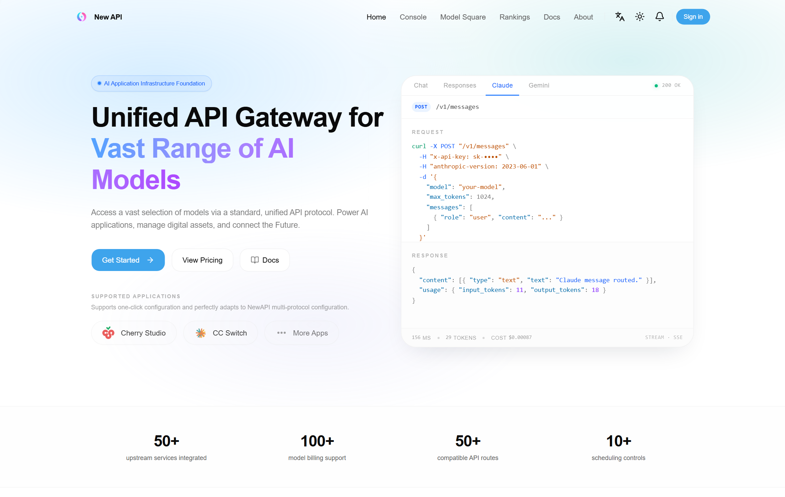

# 第15章：NewAPI 日常管理

*第二部分 · 管理篇（各产品日常操作）*

> LLM 网关：管渠道、令牌、额度、用户、日志、成本；统计可在 AI 管理中心查看。

[← 第14章：Keycloak 日常管理](ch14-ops-keycloak.md) · [📖 目录](index.md) · [第16章：LiteLLM 日常管理 →](ch16-ops-litellm.md)

---

## 15.1 AI 管理中心可执行的操作

菜单：**产品应用 → 🔀 NewAPI 管理**。页面为统计概览：

- **概览指标**：渠道数、用户数、令牌数、今日/总消耗；
- **成本报表**：按用户 / 模型 / 日期聚合的消耗与费用；
- **审计日志**：最近 100 条操作日志（登录、令牌创建、渠道变更等）；
- **渠道 / 用户 / 令牌列表**：分页浏览（含额度、状态）。

> 📌 页面只读（统计视角）；增删改请在 NewAPI 自己的后台操作（15.2/15.3）。页面数据来自 NewAPI Admin API，若 NewAPI 重启后偶发加载失败，刷新页面即可。

*图 15-1：AI 管理中心「NewAPI 管理」页（成本报表 + 审计日志）*

## 15.2 登录 NewAPI 管理中心

- **方式一（推荐）**：AI 管理中心 → NewAPI 管理 → 「打开后台」→ 自动 SSO 登录（Keycloak OIDC）。
- **方式二（直连）**：浏览器打开 `http://<服务器IP>:3000` → 登录（`ai_all_in_one_admin` 统一账号，或 Keycloak SSO 按钮）。

*图 15-2：NewAPI 管理中心（SSO 登录后）*

## 15.3 项目相关操作

### 15.3.1 渠道管理（上游模型）

1. **新增渠道**：渠道 → 添加新渠道 → 类型 OpenAI（或 Claude 等）→ Base URL **填容器名** `http://litellm:4000` → 密钥 `LITELLM_MASTER_KEY` → 填模型名 → 保存；
2. **测试**：渠道列表点「测试」，选模型验证连通；
3. **禁用/启用**：渠道列表开关（禁用后该渠道不再承接请求）；
4. **优先级/权重**：多渠道同模型时按优先级/权重分流。

*图 15-3：NewAPI 渠道列表（登录后）*

### 15.3.2 令牌（API Key）管理

1. **新建**：API 密钥 → 新建令牌 → 起名（如 `dsh-key`）→ 可设额度/过期时间/模型限制 → 保存；
2. **复制 Key**：`sk-` 开头，**只显示一次，立即保存**；
3. **禁用/删除**：令牌列表操作（禁用后该 Key 立即失效）；
4. **查用量**：令牌详情看已消耗额度。

### 15.3.3 额度与用户

- **新用户默认额度**：系统设置里 `DEFAULT_QUOTA`（建议 100 美元）；
- **单个用户提额**：用户页 → 编辑该用户 → 设额度；
- **充值/封禁**：用户页操作；
- **分组管理**：按部门建分组，设模型倍率/配额，用户归组即按部门管控。

### 15.3.4 日志与排错

- **日志页**：查每次调用的用户/模型/token/额度/成本/来源 IP；
- **429 限流**：NewAPI 关键接口默认 20 次/20 分钟触发限流，临时清：`docker exec new-api-redis redis-cli --scan --pattern "rateLimit:*" | xargs -r docker exec new-api-redis redis-cli DEL`；项目已在 `.env` 预置 `CRITICAL_RATE_LIMIT_ENABLE=false` 等四组变量，一般不会再触发；
- **SSO 登录失败**：确认系统设置 → 服务器地址是 `http://<服务器IP>:3000`（localhost 会导致 `invalid_grant - Incorrect redirect_uri`）。

> 📌 客户端 IP 记录依赖用户「记录 IP 日志」设置（`record_ip_log`，默认关），需要 IP 审计时给对应用户开启。

> 📖 原厂文档：NewAPI 官方文档 https://docs.newapi.pro · 官网 https://www.newapi.ai · 开源仓库 https://github.com/QuantumNous/new-api

---

[← 第14章：Keycloak 日常管理](ch14-ops-keycloak.md) · [📖 目录](index.md) · [第16章：LiteLLM 日常管理 →](ch16-ops-litellm.md)
