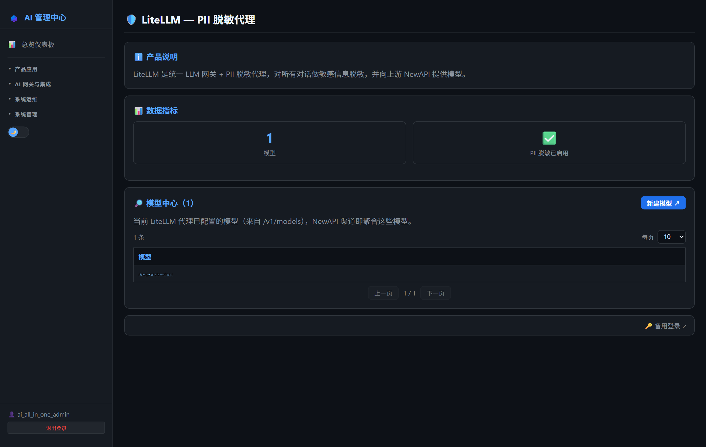
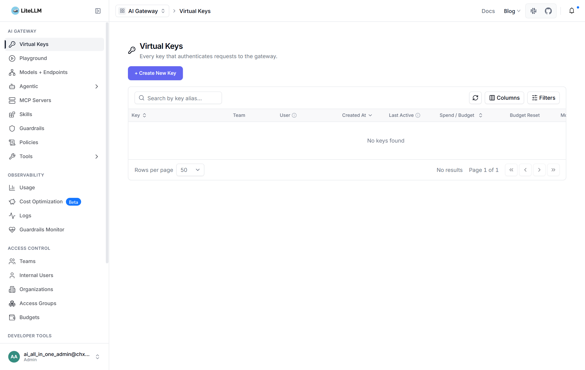

# 第16章：LiteLLM 日常管理

*第二部分 · 管理篇（各产品日常操作）*

> PII 脱敏代理：模型列表、脱敏规则、缓存、Langfuse 上报；AI 管理中心可看概览。

[← 第15章：NewAPI 日常管理](ch15-ops-newapi.md) · [📖 目录](index.md) · [第17章：Dify 日常管理 →](ch17-ops-dify.md)

---

## 16.1 AI 管理中心可执行的操作

菜单：**AI 网关与集成 → 🛡️ LiteLLM+PII**。页面显示：

- **概览**：代理状态、模型数量、健康检查；
- **模型列表**：当前 `litellm-config.yaml` 里配置的全部模型（名称/来源）。

> 📌 页面只读。增删模型、改脱敏/缓存配置都在 LiteLLM 自己的后台或配置文件里完成（见 16.3/16.4）。



*图 16-1：AI 管理中心「LiteLLM+PII」页*


## 16.2 登录 LiteLLM 管理中心

- **方式一（推荐）**：AI 管理中心 → LiteLLM+PII → 「打开后台」→ 跳 `http://<服务器IP>:4001/ui`，自动登录。
- **方式二（直连）**：浏览器打开 `http://<服务器IP>:4001/ui` → 用统一账号 `ai_all_in_one_admin` 登录（密码见 `credentials.html`，由 `.env` 的 `UI_USERNAME`/`UI_PASSWORD` 控制）。

> 📌 项目已配置 **Keycloak SSO 自动登录**：访问 `/ui` 自动跳 Keycloak 免密登录（OIDC Client `litellm`，redirect `<服务器IP>:4001/sso/callback`）。若 SSO 失效，用统一账号兜底。



*图 16-2：LiteLLM 管理后台 /ui*


## 16.3 模型列表维护

编辑 `litellm-config.yaml` 的 `model_list`，增删模型与对应 API Key。加新 provider 的步骤：

1. `.env` 取消 `# OPENAI_API_KEY=` 注释填 Key；

2. `litellm-config.yaml` 取消对应 model 块注释；

3. `docker compose up -d litellm`。

## 16.4 项目相关配置

- **响应缓存**：Redis exact match 缓存，完全相同请求跨用户共享；调 `cache_params.ttl`（默认 3600 秒）；关闭：`cache: false` 后重启；
- **Langfuse 上报**：`success_callback: ["langfuse"]` + `.env` 的 `LANGFUSE_PUBLIC_KEY/SECRET_KEY/HOST` 自动上报每次调用（可观测链路依赖它）；
- **PII 脱敏（Presidio）**：guardrails 要加 `default_on: true` 才全局生效；当前因上游 API 变更暂注释，仅做纯代理——需要启用时按第 25 章配置；
- **重启与排错**：

```
docker compose restart litellm          # 改配置后重启
docker logs litellm --tail 50           # 看日志
```

> ⚠️ 关键坑：① 用稳定版 `v1.95.1`（`main-latest` 有 bug）；② 改 `litellm-config.yaml` 后必须重启容器生效；③ SSO 跳转失败时检查 Keycloak 里 `litellm` 客户端的回调地址。

> 📖 原厂文档：LiteLLM 官方文档 https://docs.litellm.ai · Presidio guardrail https://docs.litellm.ai/docs/proxy/guardrails/presidio

---

[← 第15章：NewAPI 日常管理](ch15-ops-newapi.md) · [📖 目录](index.md) · [第17章：Dify 日常管理 →](ch17-ops-dify.md)
