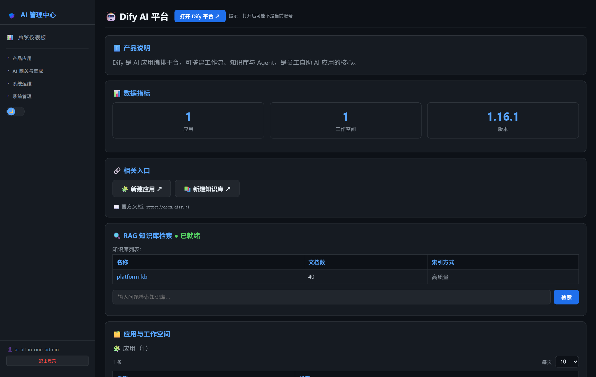
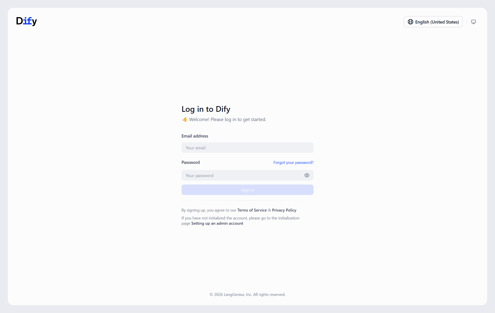
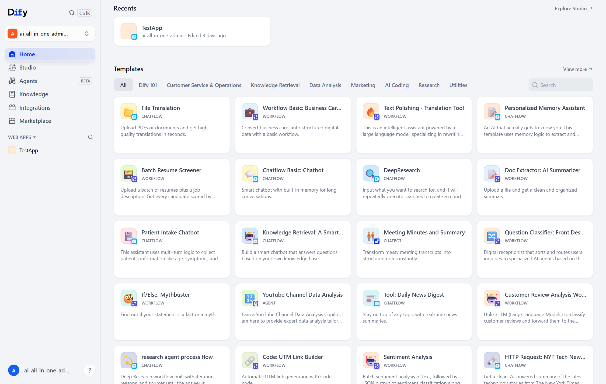

# 第17章：Dify 日常管理

*第二部分 · 管理篇（各产品日常操作）*

> AI 应用平台：应用、知识库、模型供应商、成员权限、发布；AI 管理中心可看概览与检索测试。

[← 第16章：LiteLLM 日常管理](ch16-ops-litellm.md) · [📖 目录](index.md) · [第18章：Ghost 日常管理 →](ch18-ops-ghost.md)

---

## 17.1 AI 管理中心可执行的操作

菜单：**产品应用 → 🤖 Dify AI 平台**。页面提供：

- **概览指标**：应用数、知识库数、文档数、本周对话数；
- **知识库检索测试**：输入问题 → 调 Dify 知识库检索 API，验证知识库是否命中（排查「知识库没生效」最快的办法）。

> 📌 页面只读。应用编排、知识库上传、成员管理在 Dify 自己的工作室里做（见 17.3/17.4）。



*图 17-1：AI 管理中心「Dify AI 平台」页（概览 + 知识库检索测试）*


## 17.2 登录 Dify 管理中心

- **方式一（推荐）**：AI 管理中心 → Dify AI 平台 → 「打开后台」→ 自动 SSO 登录。
- **方式二（直连）**：浏览器打开 `http://<服务器IP>`（80 端口）→ 用 `ai_all_in_one_admin` 统一账号登录（密码见 `credentials.html`；或点 SSO 按钮走 Keycloak）。

> 📌 Dify 独立官方 compose 部署（`dify/docker/`，约 15 个容器），升级维护与核心平台分开（见 17.5）。



*图 17-2：Dify 登录页（统一账号或 SSO）*



*图 17-3：Dify 工作室（登录后）*


## 17.3 应用与知识库（项目相关）

1. **创建应用**：工作室 → 创建空白应用 → 选类型（聊天助手 / Agent / 工作流 / 文本生成）；
2. **编排**：拖拽节点编排提示词、工具、知识库、变量；
3. **调试与发布**：右上角「预览」调试 → 通过后「发布」→ 生成分享链接或嵌入 Web 应用；
4. **知识库**：知识库 → 创建 → 上传文档（Word / PDF / Markdown / 网页链接），选分段规则 + 索引方式（高质量/经济）→ 在应用里「添加」该知识库，AI 即可基于文档回答。

> 📌 知识库内容会被 AI 用于回答，机密资料不要上传（遵守数据分级规范，见用户手册第 6 章）。

## 17.4 模型供应商与成员

- **添加模型**：设置 → 模型供应商 → OpenAI-API-compatible → API endpoint `http://host.docker.internal:3000/v1`（走 NewAPI）+ `dify-key`；
- **系统模型设置**：指定默认聊天/推理/嵌入模型；
- **成员**：邀请成员进工作空间，设 Owner/Admin/Editor/Normal 角色；
- **登录方式**：设置 → 登录方式 → 已接 OIDC（Keycloak）实现 SSO。

## 17.5 升级与维护

```
cd dify\docker
git pull                          # 拉最新版
docker compose pull               # 拉新镜像
docker compose up -d              # 重建
```

> ⚠️ 关键坑：① WebSocket `NEXT_PUBLIC_SOCKET_URL` 要设内网 IP，否则对话一直连 `ws://localhost`；② 登录密码是 base64 编码（脚本登录需 `base64(password)` 先行）；③ 忘密码：`docker exec docker-api-1 flask reset-password --email ai_all_in_one_admin@<公司域名> --new-password '<新密码>'`（≥8 位）。

> 📖 原厂文档：Dify 官方文档 https://docs.dify.ai · 自托管 https://docs.dify.ai/getting-started/install-self-hosted

---

[← 第16章：LiteLLM 日常管理](ch16-ops-litellm.md) · [📖 目录](index.md) · [第18章：Ghost 日常管理 →](ch18-ops-ghost.md)
