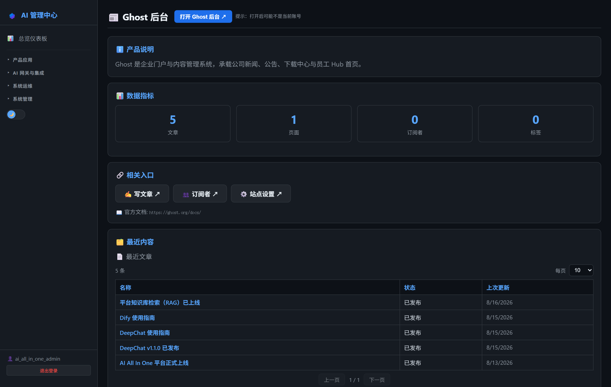
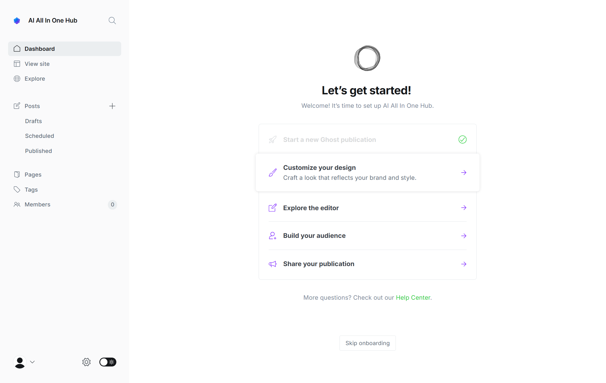
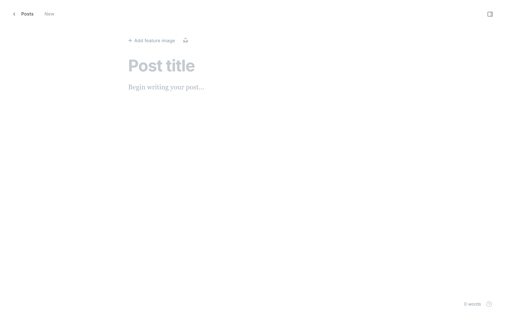

# 第18章：Ghost 日常管理

*第二部分 · 管理篇（各产品日常操作）*

> 企业门户 / Hub：文章、页面、导航、主题、成员；AI 管理中心可一键免密进入后台。

[← 第17章：Dify 日常管理](ch17-ops-dify.md) · [📖 目录](index.md) · [第19章：Gitea 日常管理 →](ch19-ops-gitea.md)

---

## 18.1 AI 管理中心可执行的操作

菜单：**产品应用 → 📰 Ghost 后台**。页面提供：

- **概览指标**：文章数、页面数、标签数、成员数；
- **「打开后台」按钮**：一键免密登录 Ghost 后台——服务端本地计算 TOTP 验证码（`ghostSession` 缓存 24 小时，避免触发 Ghost 429 限流），免去翻邮箱收验证码的步骤。

> 📌 页面只读。发文章、改导航、换主题在 Ghost 后台里做（见 18.3/18.4）。

*图 18-1：AI 管理中心「Ghost 后台」页（概览 + 免密打开）*

## 18.2 登录 Ghost 管理中心

- **方式一（推荐）**：AI 管理中心 → Ghost 后台 → 「打开后台」→ 自动登录直达后台。
- **方式二（直连）**：浏览器打开 `http://<服务器IP>:8090/ghost/`（注意 `/ghost/` 后缀）→ 输入邮箱 → Ghost 发 6 位验证码到 MailHog（`:8025`）→ 填码登录。

> 📌 后台免密（无密码体系），靠邮箱验证码。验证码在 MailHog 收件箱查看（见第 26 章）。

*图 18-2：Ghost 后台 Dashboard（经 AI 管理中心一键免密进入）*

*图 18-3：Ghost 文章编辑器*

## 18.3 发布内容（项目相关）

1. **文章**：Posts → New post → 写内容（Markdown 编辑器）→ Publish（门户首页即最新公告/新闻）；
2. **页面**：Pages → New page——项目已用页面：「下载中心」（slug `downloads`）、「AI 工作台」（跳 Dify）、「帮助文档」；
3. **标签/分类**：Tags → 建分类（如 `news` / `docs`），文章归到分类下。

## 18.4 导航与主题

1. **导航菜单**：后台 → 外观（Design）→ 菜单（Navigation）→ 编辑「Primary」主导航：首页 / 新闻 / 下载中心 / AI 工作台 / 帮助文档（与第 9 章菜单表一致）；
2. **主题**：外观 → 主题 → 激活自带的 Casper / Source；上传新主题用「Upload theme」选 zip。

> ⚠️ 关键坑：① 别从 GitHub 装最新版主题（可能适配 Ghost 6.x，5.x 报 incompatible），要装旧版 zip；② 修改导航/页面后员工端需刷新才能看到（Ghost 有缓存）。

> 📖 原厂文档：Ghost 官方文档 https://ghost.org/docs/ · 后台管理 https://ghost.org/docs/admin/

---

[← 第17章：Dify 日常管理](ch17-ops-dify.md) · [📖 目录](index.md) · [第19章：Gitea 日常管理 →](ch19-ops-gitea.md)
