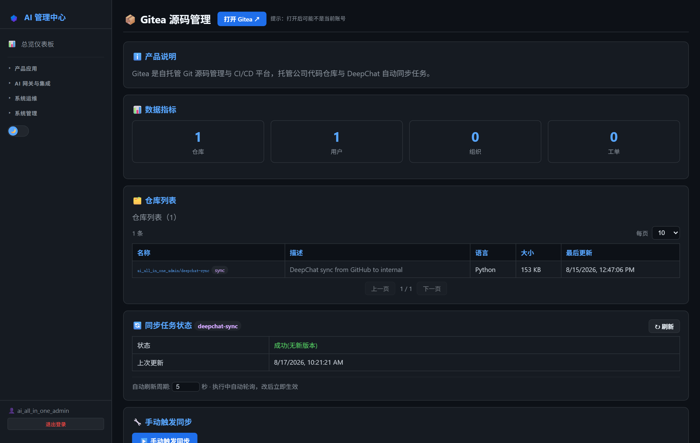
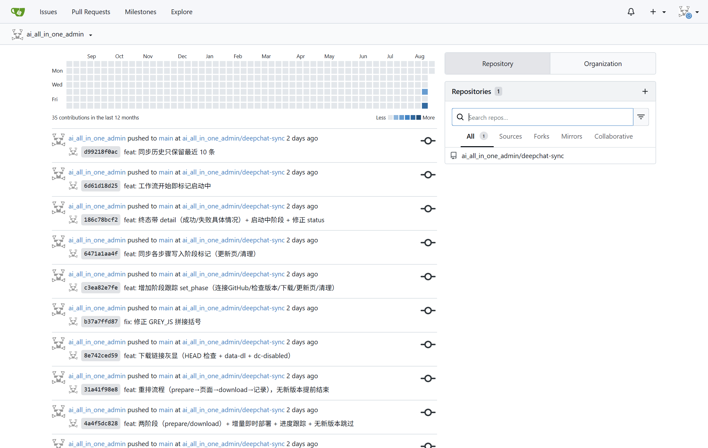
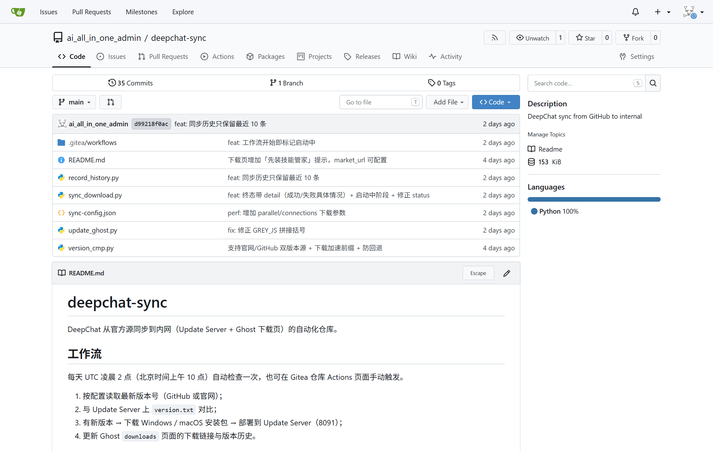
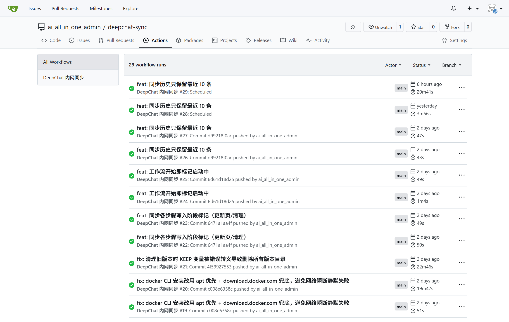

# 第19章：Gitea 日常管理

*第二部分 · 管理篇（各产品日常操作）*

> 内部 Git + CI/CD：仓库、组织、Runner、Actions；dsh-sync 同步管理可在 AI 管理中心完成。

[← 第18章：Ghost 日常管理](ch18-ops-ghost.md) · [📖 目录](index.md) · [第20章：MCP Gateway 日常管理 →](ch20-ops-mcp.md)

---

## 19.1 AI 管理中心可执行的操作

菜单：**产品应用 → 📦 Gitea 源码管理**。页面提供：

- **概览指标**：仓库数、用户数、组织数、Issue 数；
- **仓库列表**：分页查看仓库（名称/描述/语言/大小/更新时间），`dsh-sync` 仓库带 sync 标记；
- **dsh-sync 同步管理**（项目核心）：
  - **手动触发**：点「▶️ 立即同步」跑一次 DSH Desktop 新版本同步（Gitea Actions）；
  - **定时计划**：选频率（每天 02:00 / 每 12h / 每 6h / 每 3h / 每小时 / 每周一 / 自定义 cron）→ 保存；
  - **同步目标与保留数**：配置同步的目标仓库与 `keep_releases`（版本保留数）；
  - **版本列表**：已同步的 DSH Desktop 版本清单；
  - **同步历史**：每次同步结果（时间/结论/日志）。
- **「打开后台」按钮**：强制清旧会话 + 走 SSO，保证打开的是当前账号（不会串号）。

> 📌 仓库/用户/权限等常规管理在 Gitea 自己后台做（见 19.3）。

*图 19-1：AI 管理中心「Gitea 源码管理」页（dsh-sync 同步管理）*

## 19.2 登录 Gitea 管理中心

- **方式一（推荐）**：AI 管理中心 → Gitea 源码管理 → 「打开后台」→ 自动 SSO 登录（纯 Keycloak SSO，自动注册，无需密码）。
- **方式二（直连）**：浏览器打开 `http://<服务器IP>:3002` → 登录页点 Keycloak SSO 按钮；SSH 访问 `ssh://git@<服务器IP>:2222`。

*图 19-2：Gitea 首页（纯 Keycloak SSO 登录后）*

*图 19-3：dsh-sync 仓库页*

*图 19-4：Gitea Actions 运行记录（dsh-sync 自动同步）*

## 19.3 项目相关操作

### 19.3.1 仓库与组织

1. **建仓库**：右上角 + → New repository；
2. **建组织**：+ → New organization，组织下建仓库、管理团队；
3. **迁移外部仓库**：+ → New migration，填 GitHub 地址可 mirror（只读同步源码）。

### 19.3.2 用户与权限

- **添加用户**：Site Administration → User Accounts → Create user（本项目用 Keycloak SSO 自动建号，一般不手动建）；
- **仓库权限**：仓库 → Settings → Collaborators；
- **组织团队**：组织 → Teams → 建团队 → 加成员 → 赋仓库权限。

### 19.3.3 Actions / Runner

1. **启用 Actions**：Site Administration → Actions → Enabled；
2. **注册 Runner**：Runners → Create new Runner → 复制 Token → 填 `.env` 的 `GITEA_RUNNER_TOKEN` → `docker compose up -d gitea-runner`；
3. **看 Runner 状态**：Runners 页显示 Idle（绿色）即正常；
4. **跑工作流**：仓库 → Actions → 手动运行或 push 触发（dsh-sync 的 `sync.yml` 每天自动跑，也可在 AI 管理中心手动触发）。

### 19.3.4 站点设置

- **ROOT_URL**：`GITEA__server__ROOT_URL` 要设内网 `http://<服务器IP>:3002/`，否则生成的仓库链接是 localhost；
- **注册策略**：Site Administration → Config 调注册开关、邮箱配置（本项目走 SSO，注册策略一般关）。

> ⚠️ 关键坑：报 `readonly database` 多为 `gitea.db` 被 root 属主，删掉那个 root 属主的 db 让它以 git 用户重建；改 Runner token 必须 `up -d`（restart 不重读 .env）。

> 📖 原厂文档：Gitea 官方文档（中文） https://docs.gitea.com/zh-cn · 管理 https://docs.gitea.com/zh-cn/category/administration · Actions https://docs.gitea.com/zh-cn/usage/actions/overview

---

[← 第18章：Ghost 日常管理](ch18-ops-ghost.md) · [📖 目录](index.md) · [第20章：MCP Gateway 日常管理 →](ch20-ops-mcp.md)
