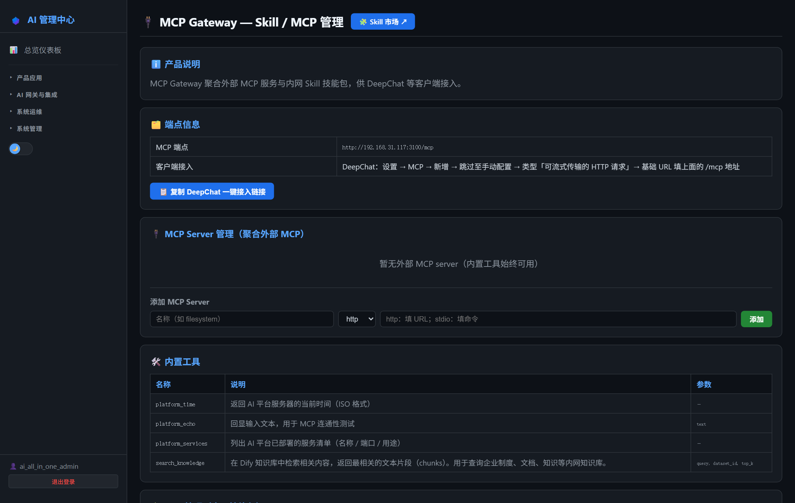
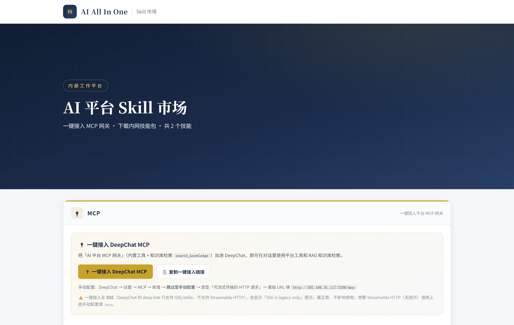

# 第20章：MCP Gateway 日常管理

*第二部分 · 管理篇（各产品日常操作）*

> 增删 MCP Server、上传/删除 Skill、扩展内置工具；管理操作在 AI 管理中心完成。

[← 第19章：Gitea 日常管理](ch19-ops-gitea.md) · [📖 目录](index.md) · [第21章：更新服务器管理 →](ch21-ops-update.md)

---

## 20.1 AI 管理中心可执行的操作

菜单：**AI 网关与集成 → 🔌 MCP Gateway**。页面提供：

- **MCP Server 列表**：查看已注册服务器（名称/类型 stdio-http/状态），可**新增 / 编辑 / 删除**（写回 `mcp-servers.json` 并自动重连）；
- **工具列表**：查看网关暴露的全部工具（内置工具 + 各服务器工具 + 技能工具）；
- **技能（Skill）管理**：**上传技能 zip**（校验含 `SKILL.md`、防路径穿越）与**删除技能**。

> 📌 页面是主要管理入口（需 `admin:mcp-gateway` 角色）。技能放 `mcp-gateway/skills/`（含 SKILL.md 的子目录），每次请求自动扫描，无需重启。



*图 20-1：AI 管理中心「MCP Gateway」页（Server/工具/技能管理）*


## 20.2 登录 MCP Gateway 市场页

- **市场页**：浏览器打开 `http://<服务器IP>:3100/market`——DeepChat / Dify 用户从这里浏览与一键接入 MCP 工具与技能（不需要登录管理）。



*图 20-2：MCP / Skill 市场页（用户接入入口）*


*图 20-3：上传技能包对话框*


## 20.3 项目相关操作

### 20.3.1 新增 MCP Server

1. AI 管理中心 → MCP Gateway → 服务器 → 新增：
   - **stdio 类型**：填 name + command + args（如 `@modelcontextprotocol/server-filesystem`）；
   - **http 类型**：填 name + url（如 Dify 知识库工具地址）；
2. 保存后网关自动写配置并重连；或直接编辑 `mcp-gateway/mcp-servers.json` 后 `docker compose restart mcp-gateway`。

### 20.3.2 管理技能（技能包）

1. **上传**：AI 管理中心 → MCP Gateway → 上传技能 zip（zip 内须含 `SKILL.md`）；
2. **删除**：对应技能删除（DeepChat 用户端下次拉取即消失）；
3. **市场地址**：技能管家 `market_url` 在 `mcp-gateway/skills/skill-market/config.json` + `SKILL.md`，**必须用主机名**（如 `http://skillmarket.<公司域名>:3100`，不能用 IP——DeepChat 的 agent 环境会把 IP 脱敏），是部署参数（详见第 11 章）。

### 20.3.3 扩展内置工具

在 `mcp-gateway/gateway.js` 加两步：

```
// ① 工具定义（builtinTools 数组加一项）
{ name: 'platform_health', description: '查询服务健康状态',
  inputSchema: { type: 'object', properties: {} } }

// ② 执行逻辑（callBuiltin 加一个分支）
if (name === 'platform_health') { return '所有服务运行正常'; }
```

改完 `docker compose restart mcp-gateway`。

> ⚠️ 管理 API 需 `X-Admin-Token` 头（`.env` 的 `MCP_ADMIN_TOKEN`）；未配返回 503、错 token 返回 401。上传技能 zip 最大 200MB。

> 📖 原厂文档：MCP 协议官方 https://modelcontextprotocol.io · SDK https://github.com/modelcontextprotocol

---

[← 第19章：Gitea 日常管理](ch19-ops-gitea.md) · [📖 目录](index.md) · [第21章：更新服务器管理 →](ch21-ops-update.md)
