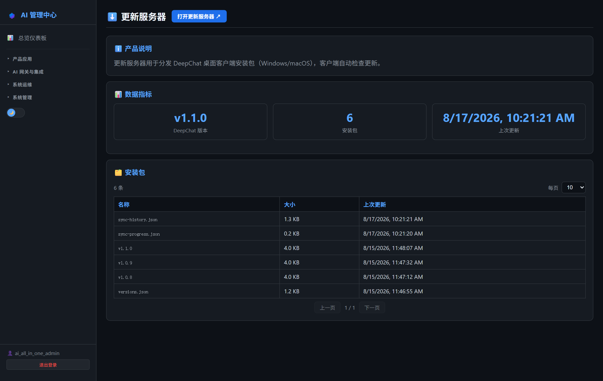
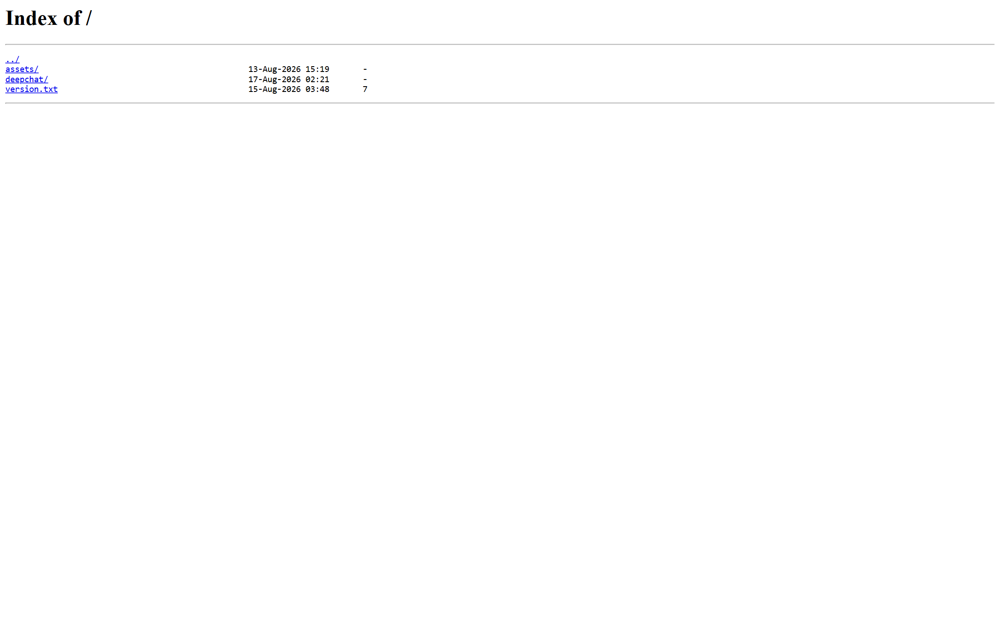

# 第21章：更新服务器管理

*第二部分 · 管理篇（各产品日常操作）*

> DeepChat 安装包托管与自动更新；AI 管理中心可查看文件与版本。

[← 第20章：MCP Gateway 日常管理](ch20-ops-mcp.md) · [📖 目录](index.md) · [第22章：监控告警管理 →](ch22-ops-monitoring.md)

---

## 21.1 AI 管理中心可执行的操作

菜单：**AI 网关与集成 → ⬇️ 更新服务器**。页面提供：

- **概览指标**：当前版本号、安装包数量、最后更新时间；
- **安装包列表**：分页查看 `deepchat-updates/deepchat/` 下的文件（名称/大小/更新时间）。

> 📌 页面只读。放置新版本包、配置同步在服务器目录或 Gitea 仓库里做（见 21.3/21.4）。



*图 21-1：AI 管理中心「更新服务器」页（安装包列表）*


## 21.2 登录更新服务器

- 浏览器打开 `http://<服务器IP>:8091`（nginx 目录列表，无需登录）；数据目录 `deepchat-updates/`。



*图 21-2：更新服务器目录列表*


## 21.3 手动放置新版本

1. 下载 DeepChat 官方安装包到 `deepchat-updates/deepchat/`；
2. 更新 `version.txt`（写入新版本号）；
3. 员工侧 DeepChat 自动更新时检查 `version.txt` 发现新版即下载安装。

## 21.4 自动同步（推荐，项目默认）

靠 `deepchat-sync` 仓库的 Gitea Actions 每天自动检查 GitHub 新版本并同步（见第 10 章；也可以在 AI 管理中心「Gitea 源码管理」页手动触发/改定时）。手动触发：

```
curl -X POST "http://<服务器IP>:3002/api/v1/repos/ai_all_in_one_admin/deepchat-sync/actions/workflows/sync.yml/dispatches" \
  -u "ai_all_in_one_admin:<密码>" -H "Content-Type: application/json" -d '{"ref":"main"}'
```

## 21.5 配置同步（sync-config.json）

| 字段 | 作用 |
| --- | --- |
| `version_source` | `github` / `official` |
| `download_prefix` | 下载加速前缀（如 ghproxy.com） |
| `keep_releases` | 版本历史保留数（AI 管理中心可调） |
| `market_url` | 下载页「技能管家」市场地址 |

> 📌 DeepChat 客户端报「模型连接超时」通常是客户端走了挂掉的系统代理（`ECONNREFUSED 127.0.0.1:33210`）。让用户在 DeepChat「设置 → 网络/代理」改为「不使用代理/直连」。

> 📖 原厂文档：DeepChat 快速开始 https://deepchatai.cn/docs/guide/getting-started/ · 开源仓库 https://github.com/ThinkInAIXYZ/deepchat

---

[← 第20章：MCP Gateway 日常管理](ch20-ops-mcp.md) · [📖 目录](index.md) · [第22章：监控告警管理 →](ch22-ops-monitoring.md)
