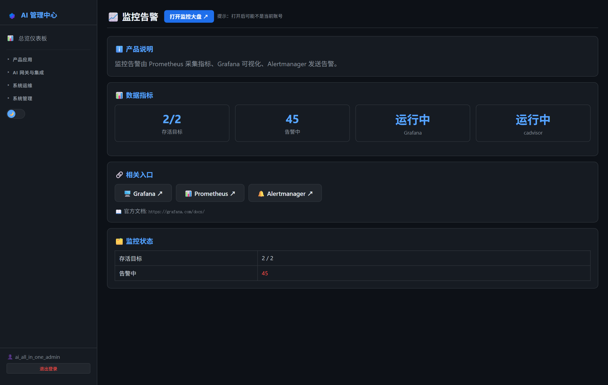
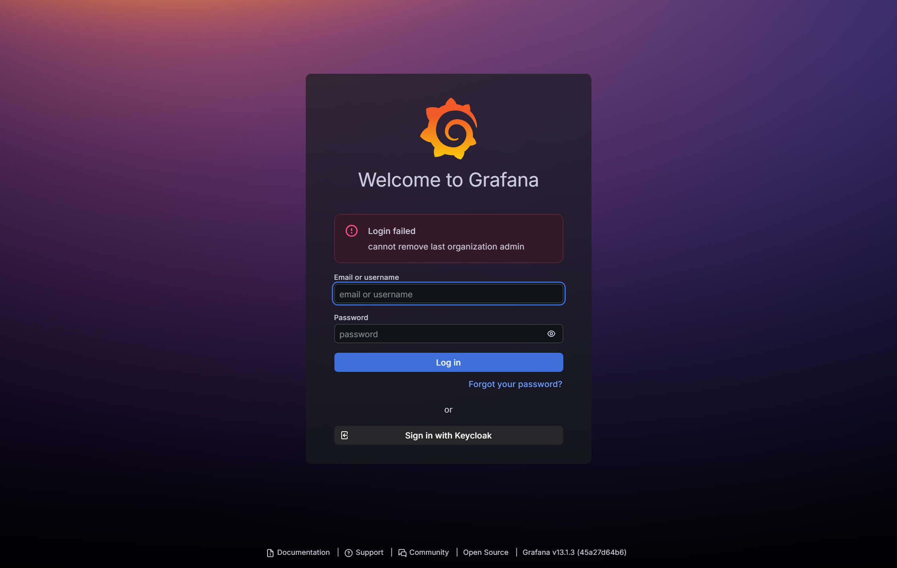
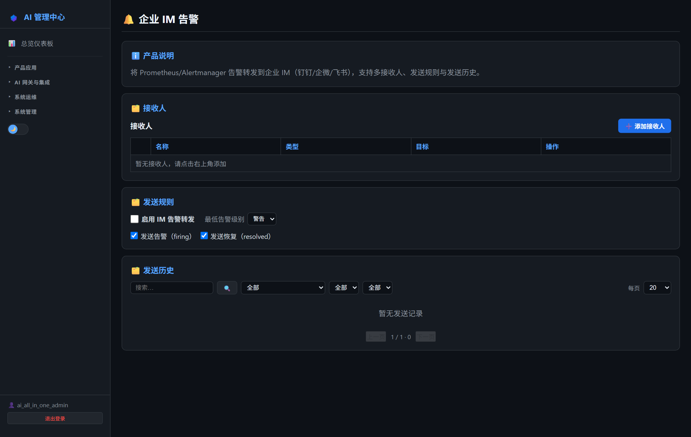
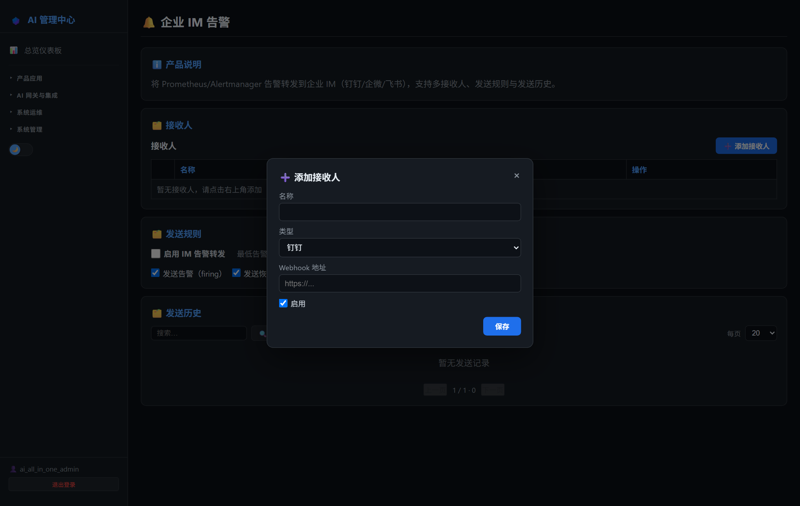

# 第22章：监控告警管理

*第二部分 · 管理篇（各产品日常操作）*

> Prometheus + Grafana + Alertmanager：容器资源监控；企业 IM 告警配置在 AI 管理中心完成。

[← 第21章：更新服务器管理](ch21-ops-update.md) · [📖 目录](index.md) · [第23章：LLM 可观测（Langfuse） →](ch23-ops-langfuse.md)

---

## 22.1 AI 管理中心可执行的操作

菜单：**系统运维** 组下两项：

- **📈 监控告警**：跳转 Grafana `:3030`（SSO 自动登录）查看「AI All In One — 容器监控」大盘；
- **🔔 企业 IM 告警**：内嵌管理页，配置告警推送（详见 22.4）。

*图 22-1：AI 管理中心「监控告警」页*

## 22.2 登录 Grafana 管理中心

- **方式一（推荐）**：AI 管理中心 → 系统运维 → 监控告警 → 自动 SSO 登录 Grafana。
- **方式二（直连）**：浏览器打开 `http://<服务器IP>:3030` → 用 `ai_all_in_one_admin` 统一账号登录（或 SSO 自动登录）。

*图 22-2：Grafana 登录页（SSO 自动登录）*

## 22.3 组件与端口

| 组件 | 端口 | 用途 |
| --- | --- | --- |
| cadvisor | 8080（内部） | 采集每个容器 CPU/内存/网络/磁盘 |
| Prometheus | 9091 | 汇聚指标 + 告警规则（`monitoring/alerts.yml`） |
| Grafana | 3030 | 可视化大盘（预置「AI All In One — 容器监控」） |
| Alertmanager | 9093 | 告警去重/分组/路由/通知 |

> 📌 端口冲突说明：Prometheus 默认 9090 被 Keycloak 占用改 9091；Grafana 默认 3000/3001 被占改 3030。

## 22.4 配置告警通知（企业 IM）

告警链路为 **Prometheus → Alertmanager → AI 管理中心（`/api/alert-webhook`）→ 企业 IM**。在 AI 管理中心的 **「系统运维 → 企业 IM 告警」** 菜单里配置（配置存 Redis，重启不丢）：

- **接收人**：可加多个。类型「钉钉/企微/飞书」= 群机器人（填 webhook 地址，发到群聊）；类型「钉钉企业应用（发个人）」（AppKey/AppSecret/AgentId/userid）或「企微企业应用（发个人）」（corpId/secret/agentid/userid）= 企业应用，发到个人。
- **发送规则**：总开关、最低告警级别（严重/警告/信息）、是否发送「触发 firing」/「恢复 resolved」通知。
- **发送历史**：记录每次发送（时间/接收人/类型/告警名/级别/结果），支持翻页、调整页大小、关键字检索、按类型/结果/级别分类筛选。
- 每个接收人有「测试」按钮可发测试消息，以及启用开关。

*图 22-3：企业 IM 告警（接收人 / 规则 / 历史）*

*图 22-4：添加接收人（群机器人 / 钉钉·企微企业应用发个人）*

> ⚠️ 群机器人 webhook 只能发到**群聊**，不能发到个人。要发个人必须用「企业应用」类型（钉钉/企微），需在钉钉/企微管理后台开通内部应用并授予消息权限。钉钉群机器人还需设「自定义关键词」（如「AI 平台」「告警」）或「加签」，否则会被安全策略拦截。

## 22.5 告警规则（项目预置）

`monitoring/alerts.yml` 预置规则：容器宕机（critical）、容器内存 >90%（warning）、容器 CPU >80%（warning）。

> ⚠️ 告警误报坑：cadvisor 上报宿主机所有 cgroup（含 systemd），告警规则必须写 `{name!=""}` 过滤，内存告警还要加 `container_spec_memory_limit_bytes > 0`（否则 limit=0 除零恒触发）。

> 📖 原厂文档：Grafana https://grafana.com/docs/grafana/latest/ · Prometheus https://prometheus.io/docs/ · Alertmanager https://prometheus.io/docs/alerting/latest/alertmanager/

---

[← 第21章：更新服务器管理](ch21-ops-update.md) · [📖 目录](index.md) · [第23章：LLM 可观测（Langfuse） →](ch23-ops-langfuse.md)
