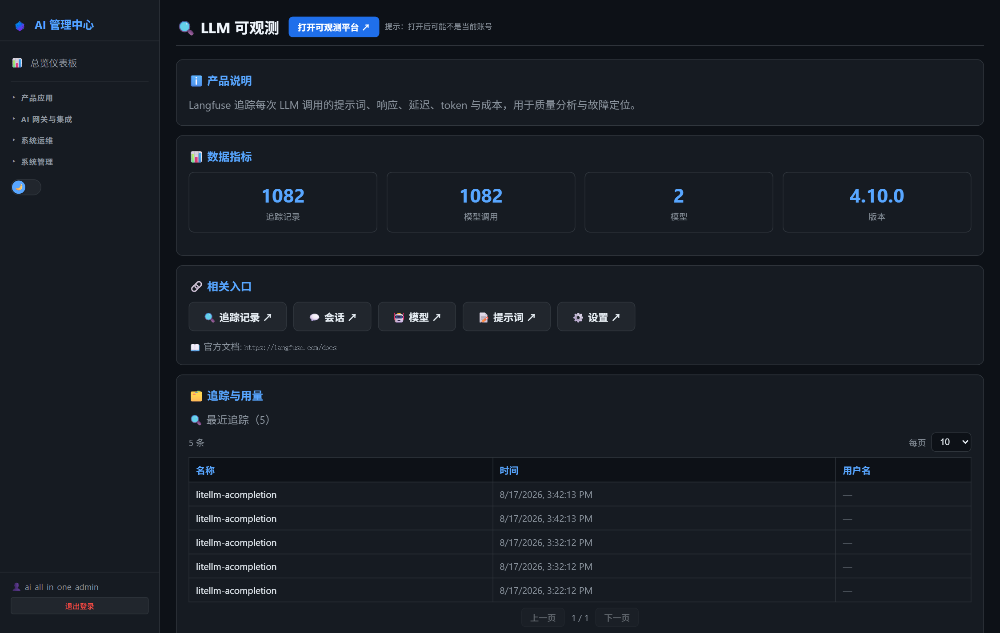
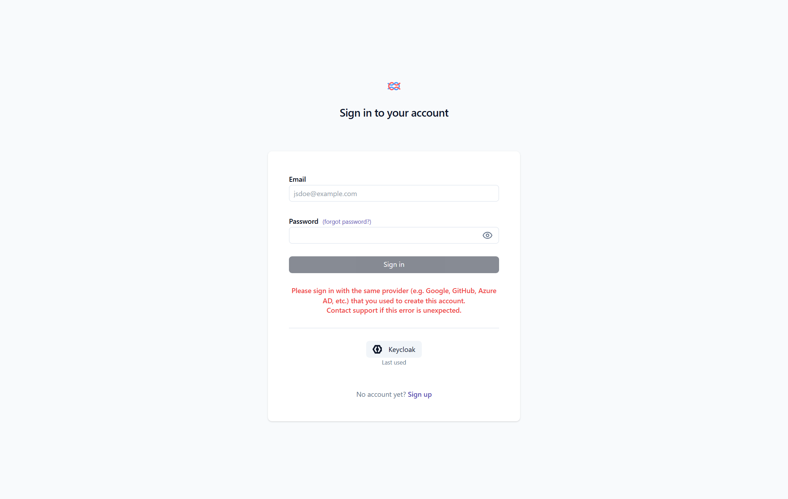
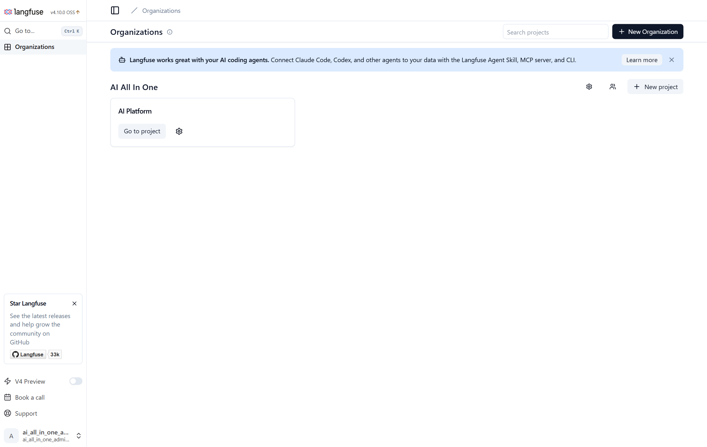

# 第23章：LLM 可观测（Langfuse）

*第二部分 · 管理篇（各产品日常操作）*

> 追踪每次模型调用的提示词、响应、延迟、token、成本；AI 管理中心可看概览。

[← 第22章：监控告警管理](ch22-ops-monitoring.md) · [📖 目录](index.md) · [第24章：统一日志（Loki） →](ch24-ops-loki.md)

---

## 23.1 AI 管理中心可执行的操作

菜单：**系统运维 → 🔍 LLM 可观测**。页面显示概览（追踪数、最近上报时间等），点「打开后台」跳 Langfuse `:3010`（SSO 自动登录，入口指向 `/auth/sso-initiate?provider=KEYCLOAK`）。



*图 23-1：AI 管理中心「LLM 可观测」页（追踪/模型用量）*


## 23.2 登录 Langfuse 管理中心

- **方式一（推荐）**：AI 管理中心 → LLM 可观测 → 「打开后台」→ 自动 SSO 登录。
- **方式二（直连）**：浏览器打开 `http://<服务器IP>:3010` → 选组织 `AI All In One` / 项目 `AI Platform`。



*图 23-2：Langfuse 登录页（SSO 按钮）*



*图 23-3：Langfuse 登录后的项目页*


## 23.3 查看追踪（项目相关）

1. **Traces 列表**：看每次调用（用户/模型/延迟/token/成本），点进去看提示词/响应全文；
2. **Session 关联**：用 Session 把多轮对话串起来（DeepChat 多轮提问按会话看）；
3. **数据链路**：LiteLLM `success_callback: ["langfuse"]` 自动上报（`.env` 的 `LANGFUSE_*`），无需手工配置。

## 23.4 组件与排错

| 组件 | 用途 |
| --- | --- |
| langfuse | Web UI + 追踪展示（3010） |
| langfuse-worker | 异步事件处理 |
| langfuse-postgres / clickhouse / minio / redis | 元数据 / 追踪事件 / S3 附件 / 队列 |

> ⚠️ 关键坑：
> - 必须设 `LANGFUSE_MIGRATION_V4_WRITE_MODE=dual`（web 和 worker 都设），否则旧 SDK 上报 `trace-create` 失败看不到数据；
> - SSO 登录看不到数据：SSO 账号（AD 邮箱）与初始化账号不同，Langfuse 会自动新建一个不属于任何组织的账号。修复（把 SSO 用户加进组织）：

```
docker exec langfuse-postgres psql -U langfuse -d langfuse -c \
"INSERT INTO organization_memberships (id, org_id, user_id, role) \
SELECT gen_random_uuid()::text, 'ai-all-in-one', id, 'ADMIN' FROM users WHERE email='ai_all_in_one_admin@<公司域名>' \
ON CONFLICT (org_id, user_id) DO UPDATE SET role='ADMIN';"
```

> 📖 原厂文档：Langfuse 官方文档 https://langfuse.com/docs · 自托管 https://langfuse.com/self-hosting

---

[← 第22章：监控告警管理](ch22-ops-monitoring.md) · [📖 目录](index.md) · [第24章：统一日志（Loki） →](ch24-ops-loki.md)
