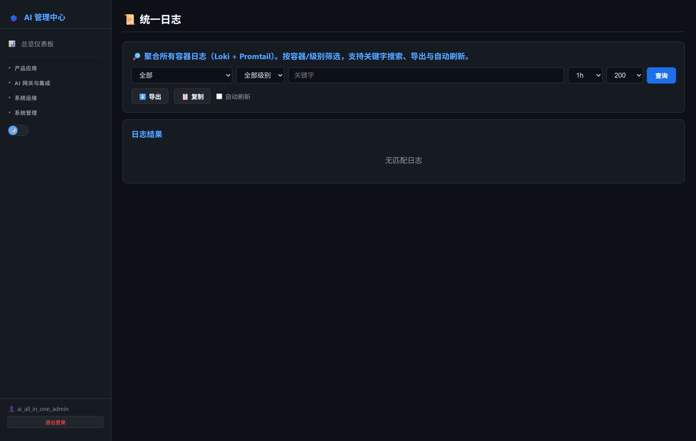
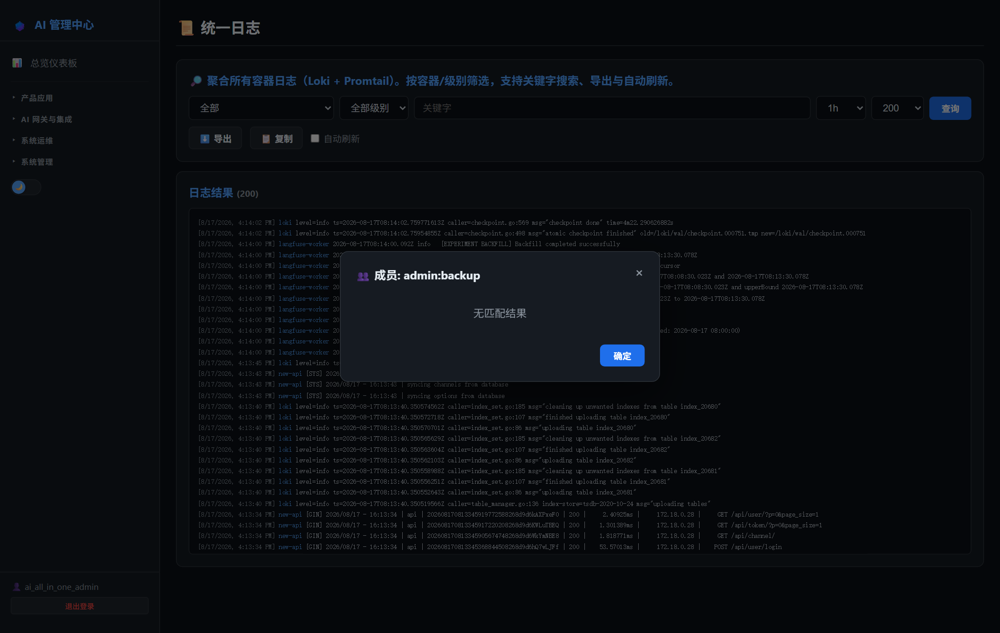

# 第24章：统一日志（Loki）

*第二部分 · 管理篇（各产品日常操作）*

> 聚合所有容器日志，按容器 + 关键字 + 时间检索；在 AI 管理中心完成。

[← 第23章：LLM 可观测（Langfuse）](ch23-ops-langfuse.md) · [📖 目录](index.md) · [第25章：PII 脱敏（Presidio） →](ch25-ops-pii.md)

---

## 24.1 AI 管理中心可执行的操作

菜单：**系统运维 → 📜 统一日志**。内嵌页，无需登录 Loki 本身：

1. 选**容器**（下拉列出全部容器）→ 填**关键字**（可选）→ 选**时间范围**；
2. 点查询，结果分页展示日志行（时间戳 + 内容），支持翻页加载更多。

> 📌 这是查看容器日志的推荐入口——Loki 本身不暴露给用户（内部服务）。

*图 24-1：AI 管理中心「统一日志」页（容器 + 关键字 + 时间）*

*图 24-2：统一日志查询结果*

## 24.2 Loki 服务信息

- Loki `:3110`（内网，仅 AI 管理中心查询）；日志采集由 Promtail 从各容器抓取后推送。

## 24.3 排查场景（项目相关）

| 场景 | 查哪个容器 | 关键字示例 |
| --- | --- | --- |
| NewAPI 登录失败 | `new-api` | `error` / `invalid_grant` |
| Dify 对话报错 | `dify-web-1` / `dify-api-1` | `exception` / `traceback` |
| Ghost 邮件没收到 | `ghost` | `mail` / `error` |
| 告警没推出去 | `admin-portal` | `imalert` / `forwardAlert` |
| 同步任务失败 | `gitea-runner` / `gitea` | `sync` / `fail` |

> 📌 告警排查小技巧：企业 IM 告警的发送记录在「企业 IM 告警 → 发送历史」里直接看，不用翻日志。

> 📖 原厂文档：Loki https://grafana.com/docs/loki/latest/

---

[← 第23章：LLM 可观测（Langfuse）](ch23-ops-langfuse.md) · [📖 目录](index.md) · [第25章：PII 脱敏（Presidio） →](ch25-ops-pii.md)
