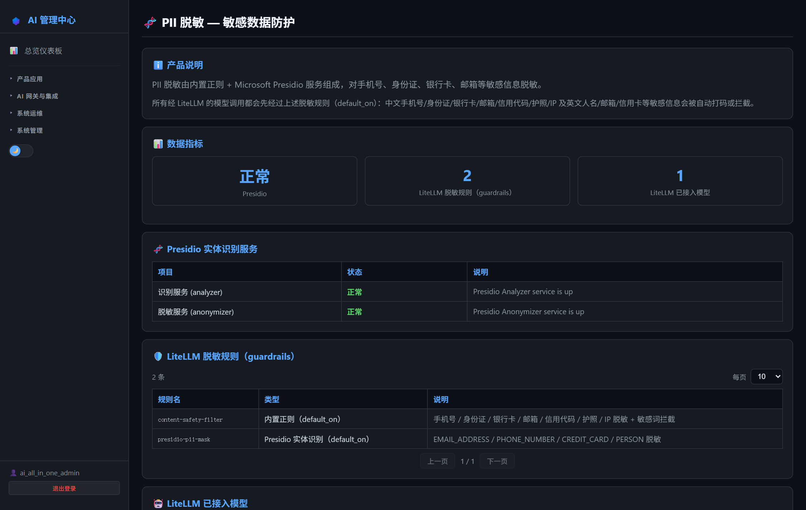

# 第25章：PII 脱敏（Presidio）

*第二部分 · 管理篇（各产品日常操作）*

> 敏感信息在离开内网前自动脱敏；AI 管理中心可看服务状态。

[← 第24章：统一日志（Loki）](ch24-ops-loki.md) · [📖 目录](index.md) · [第26章：MailHog 邮件捕获 →](ch26-ops-mailhog.md)

---

## 25.1 AI 管理中心可执行的操作

菜单：**系统运维 → 🧬 PII 脱敏**。页面显示 Presidio Analyzer / Anonymizer 两个服务的运行状态与版本。

> 📌 页面只读。脱敏规则在 LiteLLM 的 guardrails 里配置（见 16.4），模式为 `["pre_call", "post_call"]`——PII 在请求发出前脱敏，响应返回后自动还原（用户不再看到 `<PERSON>` 占位符）。

*图 25-1：AI 管理中心「PII 脱敏」页（Analyzer/Anonymizer 状态）*

## 25.2 Presidio 服务信息

- Analyzer `:5001`、Anonymizer `:5002`（内网，由 LiteLLM guardrails 调用）。

## 25.3 项目相关配置

数据流：**DSH Desktop/Dify → NewAPI → LiteLLM（Presidio 脱敏）→ 外部大模型**，响应回来后再还原 PII（见第 1 章数据流图）。

启用/调整脱敏的步骤：

1. `litellm-config.yaml` 启用 guardrails（`default_on: true` 全局生效）：
   - Analyzer：`PRESIDIO_ANALYZER_API_BASE=http://presidio-analyzer:5000`（容器网络内）；
   - Anonymizer：`PRESIDIO_ANONYMIZER_API_BASE=http://presidio-anonymizer:5001`；
2. 内置识别器：手机号 / 身份证号 / 邮箱 / 姓名等（正则 + Presidio NER）；
3. `docker compose restart litellm` 生效。

> ⚠️ 脱敏只对走 LiteLLM 的请求生效：不走 NewAPI→LiteLLM 链路的直连请求不会被脱敏；员工侧数据分级要求见用户手册第 6 章。

> 📖 原厂文档：Microsoft Presidio https://microsoft.github.io/presidio/ · 源码 https://github.com/microsoft/presidio

---

[← 第24章：统一日志（Loki）](ch24-ops-loki.md) · [📖 目录](index.md) · [第26章：MailHog 邮件捕获 →](ch26-ops-mailhog.md)
