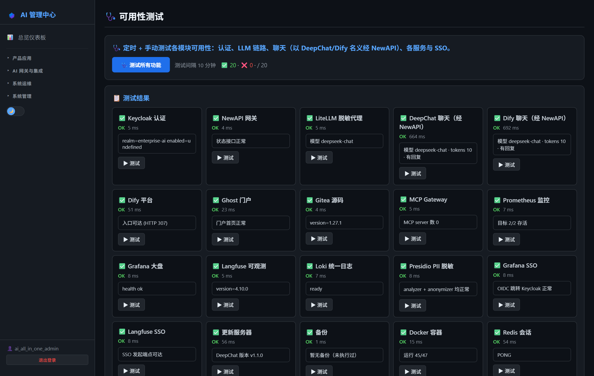

# 第28章：健康检查与开机自检

*第三部分 · 运维篇*

> 一键体检全部 41 个容器 + LLM 全链路 + 认证链路。

[← 第27章：备份与恢复](ch27-backup.md) · [📖 目录](index.md) · [第29章：故障排查手册 →](ch29-troubleshooting.md)

---

**脚本**：`C:\AIAllInOne\windows\scripts\health-check.ps1`，输出 `health_check_<时间戳>.log`。覆盖 41 个容器（25 Windows 核心 + 16 Dify），凭据从 `.env` 读，不硬编码密码。

## 28.1 检查范围（9 个阶段）

| 阶段 | 检查项 |
| --- | --- |
| Stage 1 | Docker Daemon 是否运行（等待就绪，适配开机自检） |
| Stage 2 | 41 个容器状态（Up/Exited/Restarting） |
| Stage 3 | 10 个 HTTP 端点响应 |
| Stage 4 | LiteLLM readiness + 模型注册、Dify API、数据库/Redis/Sandbox 健康 |
| Stage 5 | LLM 全链路（NewAPI → LiteLLM → DeepSeek 真实请求） |
| Stage 6 | AD 账号认证链路 + NewAPI 管理员登录 |
| Stage 7 | MCP Gateway + Skill 功能 |
| Stage 8 | DSH Desktop/Dify 登录前置条件 |
| Stage 9 | 磁盘空间 |



*图 28-1：AI 管理中心「可用性测试」页（全链路测试结果）*


*图 28-2：可用性测试执行结果（9 条链路）*


## 28.2 手动执行

```
C:\AIAllInOne\windows\scripts\health-check.ps1
dir C:\AIAllInOne\windows\scripts\health_check_*.log
```

> ✅ 输出末尾 `ALL CLEAR` 且 `Fail: 0` 表示全部正常。

## 28.3 开机自启（计划任务）

```
$action = New-ScheduledTaskAction -Execute "powershell.exe" -Argument "-NoProfile -ExecutionPolicy Bypass -File C:\AIAllInOne\windows\scripts\health-check.ps1"
$trigger = New-ScheduledTaskTrigger -AtLogOn
$trigger.Delay = "PT2M"   # 登录后延迟 2 分钟等 Docker + 容器启动
Register-ScheduledTask -TaskName "AI-Platform-HealthCheck" -Action $action -Trigger $trigger -RunLevel Highest
```

> 📌 注意：脚本用 `127.0.0.1` 不用 localhost；LiteLLM 内部健康用 `/health/readiness`（无需认证）；`dify-init_permissions-1` Exited(0) 正常；Update Server 返回 403 正常（无默认 index.html）；exit code 0=通过、1=有失败。

---

[← 第27章：备份与恢复](ch27-backup.md) · [📖 目录](index.md) · [第29章：故障排查手册 →](ch29-troubleshooting.md)
