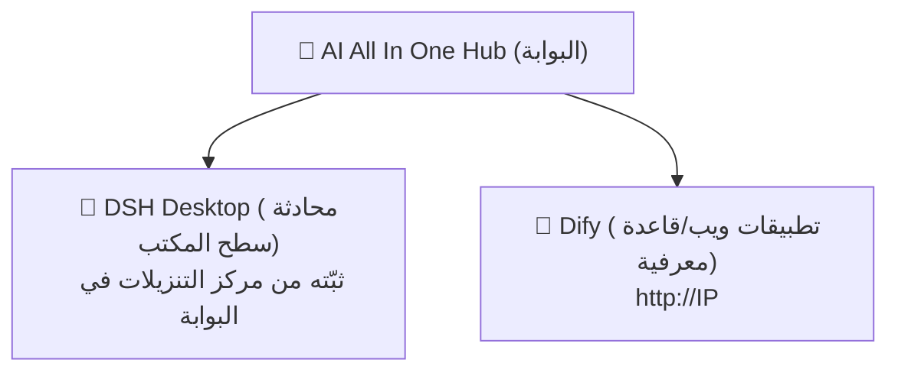

# الفصل 1: التعرّف على المنصة

*البداية السريعة*

> تعرّف في 3 دقائق على: ماهية هذه المنصة وما يمكنك فعله بها ومن أين تدخل.

[📖 الفهرس](index.md) · [الفصل 2: AI All In One Hub (البوابة) →](ch02-hub.md)

---

> 📌 ملاحظة: يشير `IP` في هذا الدليل إلى عنوان خادم الشبكة الداخلية للشركة (المثال `192.168.31.117`، والعنوان الفعلي هو ما يعلنه المدير). استخدم **عنوان IP الداخلي** في جميع العناوين، ولا تستخدم `localhost` أو `127.0.0.1`.

## 1.1 ما هي المنصة

«AI AllInOne» هي منصة ذكاء اصطناعي مؤسسية منشورة على شبكة الشركة الداخلية، تجمع قدرات النماذج الكبيرة (DeepSeek وGPT وClaude وغيرها) في نقطة واحدة داخلية، بحيث يكفي الموظف **حساب واحد** لاستخدامها. لست بحاجة للاهتمام بالخوادم أو النماذج أو المفاتيح خلف الكواليس — يكفي أن تتذكر ثلاثة مداخل.

*الشكل 1: العلاقة بين المداخل الثلاثة*

*ثلاثة مداخل: البوابة (Hub) هي نقطة البداية، وDSH Desktop وDify هما أداتان*

## 1.2 ماذا يمكنني أن أفعل بالمنصة

| ماذا تريد أن تفعل | أيهما تستخدم | أين تفتحه |
| --- | --- | --- |
| محادثات يومية وكتابة مستندات وترجمة وتعديل أكواد مثل ChatGPT | 💬 DSH Desktop | عميل سطح المكتب (نزّله وثبّته من البوابة أولًا) |
| استخدام تطبيقات الذكاء الاصطناعي التي أعدتها الشركة (إجابة العملاء ومساعد الموافقات وغيرها) | 🤖 Dify | المتصفح `http://IP` |
| رفع مستندات لإنشاء «أسئلة وأجوبة من قاعدة معرفية» (للسؤال عن المواد الداخلية) | 🤖 Dify | المتصفح `http://IP` |
| الاطلاع على أخبار الشركة والإعلانات وتنزيل البرامج | 📰 البوابة (Hub) | المتصفح `http://IP:8090` |
| طلب مفتاح API بنفسك لربطه بأدوات خارجية | 🔑 NewAPI | المتصفح `http://IP:3000` |

## 1.3 كيف تختار بين المداخل الثلاثة

> ✅ **تذكّر في جملة واحدة**: **المحادثة/الكتابة/الترجمة ← DSH Desktop**؛ و**التطبيقات التي أعدتها الشركة/قاعدة المعرفة ← Dify**؛ و**البحث/الاطلاع على الإعلانات/تنزيل البرامج ← بوابة Hub**. الثلاثة تستخدم الحساب نفسه لتسجيل الدخول.

طريقة تسجيل الدخول: تستخدم جميع المنتجات **حساب Keycloak الموحد** (وبعضها يدعم حساب نطاق AD الخاص بالشركة، أي الحساب الذي تسجّل به دخول جهازك). عند النقر على «تسجيل الدخول» ستنتقل تلقائيًا إلى صفحة الدخول الموحدة، وأدخل الحساب مرة واحدة فقط، فلن تحتاج بعدها لإعادة تسجيل الدخول في كل منتج.

## 1.4 كيف تستخدم هذا الدليل

- **المبتدئ**: اقرأ الفصول 2~4 بالترتيب وثبّت DSH Desktop أولًا لتبدأ استخدامه؛

- **لربط أدوات خارجية**: اقرأ الفصل 5 لطلب المفتاح؛

- **عند وجود استفسار**: راجع أولًا الأسئلة الشائعة في الفصل 7 ثم اسأل المدير؛

- **مطلوب قراءته**: الفصل 6 الخاص بأمن البيانات والفصل 8 الخاص بمدونة السلوك، ويجب على الجميع الالتزام بهما.

---

[📖 الفهرس](index.md) · [الفصل 2: AI All In One Hub (البوابة) →](ch02-hub.md)
