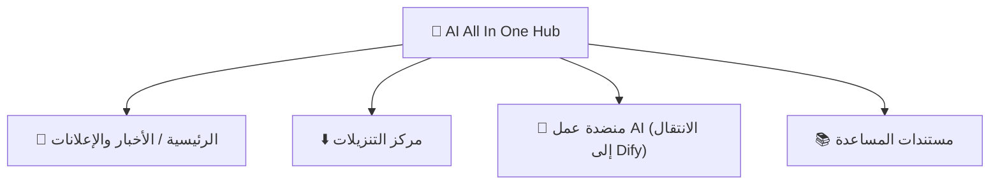

# الفصل 2: AI All In One Hub (البوابة)

*البداية السريعة*

> نقطة البداية للدخول إلى منصة الذكاء الاصطناعي: قراءة الأخبار وتنزيل البرامج والانتقال إلى Dify.

[← الفصل 1: التعرّف على المنصة](ch01-about.md) · [📖 الفهرس](index.md) · [الفصل 3: الأداة الأولى: DSH Desktop →](ch03-dsh.md)

---

## 2.1 ما هي البوابة

**AI All In One Hub** هي بوابة الشركة المؤسسية (المبنية على البرنامج مفتوح المصدر Ghost) وعنوانها `http://IP:8090`. وهي **نقطة البداية** لدخول منصة الذكاء الاصطناعي.

*الشكل 2: الأقسام الأربعة الشائعة في البوابة*

## 2.2 قراءة الأخبار / الإعلانات

1. افتح `http://IP:8090` في المتصفح؛

2. الصفحة الرئيسية هي قائمة أحدث الأخبار والإعلانات، وانقر على العنوان لقراءة النص كاملًا.

## 2.3 مركز التنزيلات (تثبيت DSH Desktop)

1. انقر على قائمة «**مركز التنزيلات**» أعلى البوابة، أو افتح مباشرة `http://IP:8090/downloads/`؛

2. اختر حزمة التثبيت المناسبة لنظامك **Windows** / **macOS** ونزّل **DSH Desktop**؛

3. التثبيت: في Windows انقر نقرًا مزدوجًا على .exe واتبع المعالج؛ وفي macOS افتح .dmg واسحبه إلى «التطبيقات».

> ✅ حزمة «ثبّت مدير المهارات أولًا عند أول استخدام» أعلى صفحة التنزيل مخصصة للمستخدمين المتقدمين، ويمكن للمستخدم العادي تجاهلها.

## 2.4 الانتقال إلى Dify / المساعدة

- انقر على قائمة «**منضدة عمل AI**» في البوابة ← للانتقال مباشرة إلى Dify (منصة تطبيقات الذكاء الاصطناعي)؛

- انقر على «**مستندات المساعدة**» ← للاطلاع على مقالات المساعدة التي أعدتها الشركة.

> 📖 الوثائق الرسمية:البوابة مقدمة عبر Ghost، والوثائق الرسمية https://ghost.org/docs/

---

[← الفصل 1: التعرّف على المنصة](ch01-about.md) · [📖 الفهرس](index.md) · [الفصل 3: الأداة الأولى: DSH Desktop →](ch03-dsh.md)
