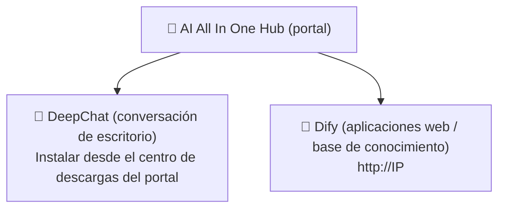

# Capítulo 1: Conoce la plataforma

*Inicio rápido*

> En 3 minutos entiende: qué es esta plataforma, qué puedes hacer con ella y por dónde entrar.

[📖 Índice](index.md) · [Capítulo 2: AI All In One Hub (portal) →](ch02-hub.md)

---

> 📌 Nota: en este manual, `IP` se refiere a la dirección del servidor de la intranet de la empresa (ejemplo `192.168.31.117`; en la práctica, lo que indique el administrador). Todas las direcciones usan **IP de intranet**; no uses `localhost` ni `127.0.0.1`.

## 1.1 Qué es la plataforma

«AI AllInOne» es una plataforma corporativa de IA desplegada en la intranet de la empresa, que unifica en la intranet las capacidades de los modelos grandes (DeepSeek, GPT, Claude, etc.) para que los empleados puedan usarlos con **una sola cuenta**. No necesitas preocuparte por los servidores, modelos ni claves que hay detrás — solo recuerda tres puntos de entrada.

*Figura 1: relación entre los tres puntos de entrada*

*Tres puntos de entrada: el portal (Hub) es el punto de partida; DeepChat y Dify son las dos herramientas*

## 1.2 Qué puedo hacer con la plataforma

| Qué quieres hacer | Cuál usar | Dónde abrirlo |
| --- | --- | --- |
| Conversar a diario como con ChatGPT, redactar documentos, traducir, corregir código | 💬 DeepChat | Cliente de escritorio (primero descárgalo e instálalo desde el portal) |
| Usar aplicaciones de IA ya preparadas por la empresa (respuestas de atención al cliente, asistentes de aprobación, etc.) | 🤖 Dify | Navegador `http://IP` |
| Subir documentos para hacer «respuestas con base de conocimiento» (preguntar sobre material interno) | 🤖 Dify | Navegador `http://IP` |
| Ver noticias, anuncios de la empresa y descargar software | 📰 Portal (Hub) | Navegador `http://IP:8090` |
| Solicitar por tu cuenta una API Key para conectar herramientas de terceros | 🔑 NewAPI | Navegador `http://IP:3000` |

## 1.3 Cómo elegir entre los tres puntos de entrada

> ✅ **Para recordarlo en una frase**: **chatear/redactar/traducir → DeepChat**; **aplicaciones preparadas por la empresa / base de conocimiento → Dify**; **buscar cosas / ver anuncios / descargar software → portal Hub**. Los tres usan la misma cuenta para iniciar sesión.

Método de inicio de sesión: todos los productos usan la **cuenta unificada de Keycloak** (algunos admiten la cuenta de dominio AD de la empresa, es decir, la misma cuenta con la que enciendes tu equipo). Al hacer clic en «Iniciar sesión» salta automáticamente a la página de inicio unificado; introduces la cuenta una vez y después no hace falta volver a iniciar sesión en los demás productos.

## 1.4 Cómo usar este manual

- **Si eres nuevo**: lee en orden los capítulos 2~4 y empieza instalando DeepChat para usarlo;

- **Para conectar herramientas de terceros**: lee el capítulo 5 para solicitar la Key;

- **Si tienes dudas**: consulta primero el FAQ del capítulo 7 y luego pregunta al administrador;

- **Lectura obligatoria**: capítulo 6 (seguridad de datos) y capítulo 8 (código de conducta), que todos deben cumplir.

---

[📖 Índice](index.md) · [Capítulo 2: AI All In One Hub (portal) →](ch02-hub.md)
