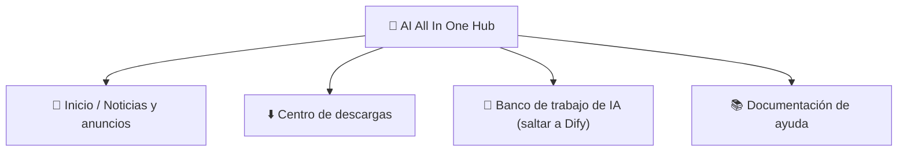

# Capítulo 2: AI All In One Hub (portal)

*Inicio rápido*

> El punto de partida para entrar a la plataforma de IA: ver noticias, descargar software y saltar a Dify.

[← Capítulo 1: Conoce la plataforma](ch01-about.md) · [📖 Índice](index.md) · [Capítulo 3: Herramienta 1: DSH Desktop →](ch03-dsh.md)

---

## 2.1 Qué es el portal

**AI All In One Hub** es el portal corporativo de la empresa (construido con el software libre Ghost), dirección `http://IP:8090`. Es el **punto de partida** para entrar a la plataforma de IA.

*Figura 2: las cuatro secciones habituales del portal*

## 2.2 Ver noticias / anuncios

1. Abre `http://IP:8090` en el navegador;

2. La portada es la lista de noticias y anuncios más recientes; haz clic en el título para leer el texto completo.

## 2.3 Centro de descargas (instalar DSH Desktop)

1. Haz clic en el menú «**Centro de descargas**» de la parte superior del portal, o abre directamente `http://IP:8090/downloads/`;

2. Elige el instalador **Windows** / **macOS** según tu sistema y descarga **DSH Desktop**;

3. Instalación: en Windows haz doble clic en el .exe y sigue el asistente; en macOS abre el .dmg y arrástralo a «Aplicaciones».

> ✅ El aviso de la parte superior de la página de descargas «Si es la primera vez, instala primero el administrador de habilidades» es un paquete de habilidades para usuarios avanzados; los usuarios normales pueden ignorarlo.

## 2.4 Saltar a Dify / ayuda

- Haz clic en el menú del portal «**Banco de trabajo de IA**» → salta directamente a Dify (plataforma de aplicaciones de IA);

- Haz clic en «**Documentación de ayuda**» → consulta los artículos de ayuda preparados por la empresa.

> 📖 Documentación oficial:El portal lo proporciona Ghost; documentación oficial https://ghost.org/docs/

---

[← Capítulo 1: Conoce la plataforma](ch01-about.md) · [📖 Índice](index.md) · [Capítulo 3: Herramienta 1: DSH Desktop →](ch03-dsh.md)
