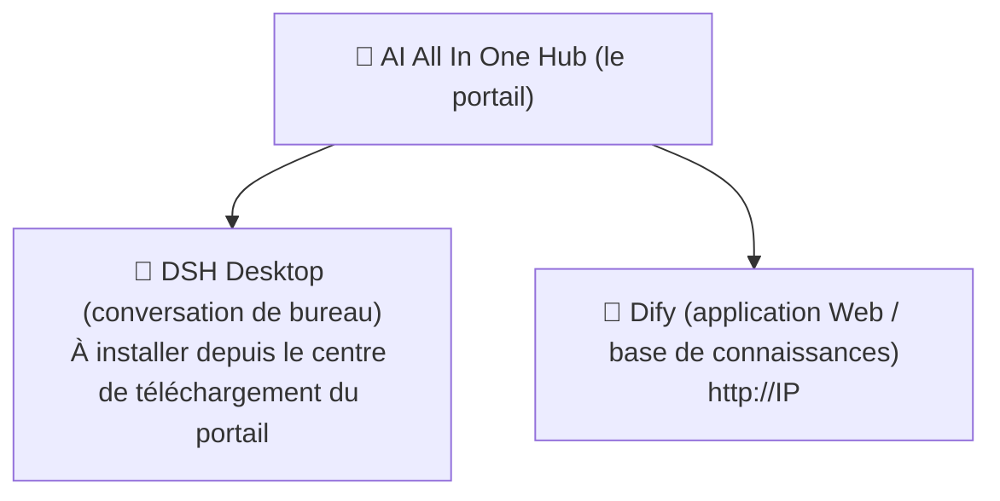

# Chapitre 1 : Découvrir la plateforme

*Démarrage rapide*

> Comprendre en 3 minutes : ce qu'est cette plateforme, ce que vous pouvez en faire et par où entrer.

[📖 Index](index.md) · [Chapitre 2 : AI All In One Hub (le portail) →](ch02-hub.md)

---

> 📌 Remarque : dans ce manuel, `IP` désigne l'adresse du serveur intranet de l'entreprise (exemple `192.168.31.117`, en pratique celle communiquée par l'administrateur). Toutes les adresses utilisent l'**IP intranet** ; n'utilisez pas `localhost` ni `127.0.0.1`.

## 1.1 Ce qu'est la plateforme

« AI AllInOne » est une plateforme IA d'entreprise déployée sur l'intranet de la société ; elle regroupe les capacités des grands modèles (DeepSeek, GPT, Claude, etc.) en un point unique accessible depuis l'intranet, utilisable par les employés avec **un seul compte**. Vous n'avez pas à vous soucier des serveurs, des modèles ni des clés sous-jacents — retenez simplement trois points d'entrée.

*Figure 1 : la relation entre les trois points d'entrée*

*Trois points d'entrée : le portail (Hub) est le point de départ, DSH Desktop et Dify sont deux outils*

## 1.2 Ce que je peux faire avec la plateforme

| Ce que vous voulez faire | Outil à utiliser | Où l'ouvrir |
| --- | --- | --- |
| Converser au quotidien comme avec ChatGPT, rédiger des documents, traduire, corriger du code | 💬 DSH Desktop | Client de bureau (à installer depuis le portail) |
| Utiliser les applications IA prêtes de l'entreprise (assistant de support client, assistant d'approbation, etc.) | 🤖 Dify | Navigateur `http://IP` |
| Téléverser des documents pour du « question-réponse sur base de connaissances » (interroger des ressources internes) | 🤖 Dify | Navigateur `http://IP` |
| Lire les actualités de l'entreprise, les annonces, télécharger des logiciels | 📰 Portail (Hub) | Navigateur `http://IP:8090` |
| Demander soi-même une clé API pour l'intégrer à un outil tiers | 🔑 NewAPI | Navigateur `http://IP:3000` |

## 1.3 Comment choisir entre les trois points d'entrée

> ✅ **En une phrase** : **Discuter / rédiger / traduire → DSH Desktop** ; **applications toutes prêtes de l'entreprise / bases de connaissances → Dify** ; **chercher quelque chose / lire les annonces / télécharger des logiciels → le portail Hub**. Les trois s'utilisent avec le même compte.

Connexion : tous les produits passent par le **compte unifié Keycloak** (certains prennent en charge le compte de domaine AD de l'entreprise, c'est-à-dire celui de votre session Windows). Cliquez sur « Connexion » pour être redirigé automatiquement vers la page de connexion unifiée ; saisissez le compte une seule fois, puis aucun autre produit ne demandera de reconnexion.

## 1.4 Comment utiliser ce manuel

- **Débutant** : lisez les chapitres 2 à 4 dans l'ordre, installez d'abord DSH Desktop pour commencer ;

- **Pour intégrer un outil tiers** : lisez le chapitre 5 pour demander une clé ;

- **En cas de doute** : consultez d'abord la FAQ du chapitre 7, puis interrogez l'administrateur ;

- **À lire absolument** : chapitre 6 sécurité des données, chapitre 8 code de conduite, à respecter par tous.

---

[📖 Index](index.md) · [Chapitre 2 : AI All In One Hub (le portail) →](ch02-hub.md)
