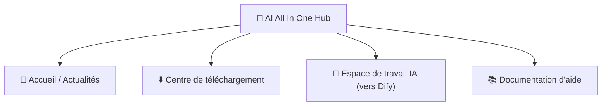

# Chapitre 2 : AI All In One Hub (le portail)

*Démarrage rapide*

> Le point de départ de la plateforme IA : lire les actualités, télécharger des logiciels, basculer vers Dify.

[← Chapitre 1 : Découvrir la plateforme](ch01-about.md) · [📖 Index](index.md) · [Chapitre 3 : Outil 1 : DeepChat →](ch03-deepchat.md)

---

## 2.1 Ce qu'est le portail

**AI All In One Hub** est le portail d'entreprise de la société (construit sur le logiciel open source Ghost), à l'adresse `http://IP:8090`. C'est votre **point de départ** pour entrer dans la plateforme IA.

*Figure 2 : les quatre sections courantes du portail*

## 2.2 Lire les actualités / annonces

1. Ouvrez `http://IP:8090` dans le navigateur ;

2. La page d'accueil affiche la liste des dernières actualités et annonces ; cliquez sur un titre pour lire l'article complet.

## 2.3 Centre de téléchargement (installer DeepChat)

1. Cliquez sur le menu « **Centre de téléchargement** » en haut du portail, ou ouvrez directement `http://IP:8090/downloads/` ;

2. Choisissez le paquet d'installation **Windows** / **macOS** selon votre système, téléchargez **DeepChat** ;

3. Installation : sous Windows, double-cliquez sur le .exe et suivez l'assistant ; sous macOS, ouvrez le .dmg et glissez-le dans « Applications ».

> ✅ En haut de la page de téléchargement, « installez d'abord le gestionnaire de skills » est un paquet de compétences destiné aux utilisateurs avancés ; les utilisateurs ordinaires peuvent l'ignorer.

## 2.4 Basculer vers Dify / l'aide

- Cliquez sur le menu du portail « **Espace de travail IA** » → basculez directement vers Dify (plateforme d'applications IA) ;

- Cliquez sur « **Documentation d'aide** » → consultez les articles d'aide rédigés par l'entreprise.

> 📖 Documentation officielle :le portail est fourni par Ghost, documentation officielle https://ghost.org/docs/

---

[← Chapitre 1 : Découvrir la plateforme](ch01-about.md) · [📖 Index](index.md) · [Chapitre 3 : Outil 1 : DeepChat →](ch03-deepchat.md)
