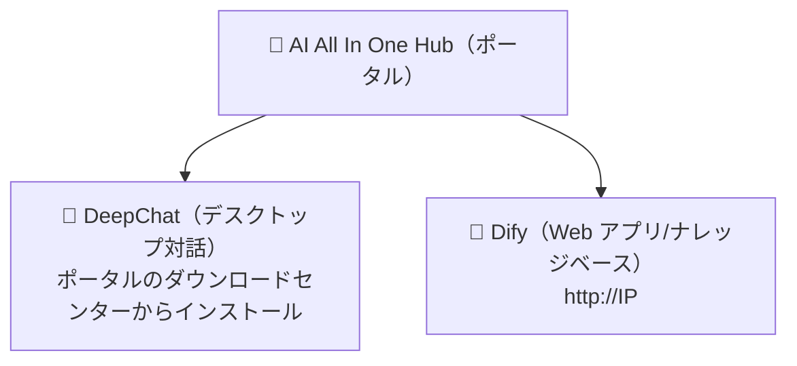

# 第1章：プラットフォームを知る

*クイックスタート*

> 3 分で理解：このプラットフォームとは何か、何に使えるか、どこから入るか。

[📖 目次](index.md) · [第2章：AI All In One Hub（ポータル） →](ch02-hub.md)

---

> 📌 補足：本マニュアルの `IP` は会社イントラネットサーバーのアドレスを指します（例：`192.168.31.117`。実際は管理者の公表に従ってください）。すべてのアドレスは**イントラネット IP** を使い、`localhost` や `127.0.0.1` は使いません。

## 1.1 プラットフォームとは

「AI AllInOne」は会社イントラネットにデプロイされた企業 AI プラットフォームで、大規模モデル（DeepSeek、GPT、Claude など）の能力をイントラネットに一元化し、従業員は**1 つのアカウント**で利用できます。背後にあるサーバー、モデル、キーを気にする必要はありません——3 つの入口を覚えるだけです。

*図 1：3 つの入口の関係*

*3 つの入口：ポータル（Hub）が出発点、DeepChat と Dify が 2 つのツール*

## 1.2 プラットフォームで何ができるか

| やりたいこと | 使うツール | どこで開くか |
| --- | --- | --- |
| ChatGPT のように日常会話、文書作成、翻訳、コード修正 | 💬 DeepChat | デスクトップクライアント（まずポータルからダウンロード・インストール） |
| 会社が用意した AI アプリ（カスタマーサポートQ&A、承認アシスタントなど）を使う | 🤖 Dify | ブラウザ `http://IP` |
| ドキュメントをアップロードして「ナレッジベースQ&A」（社内資料を質問） | 🤖 Dify | ブラウザ `http://IP` |
| 会社のニュース、お知らせ、ソフトウェアダウンロードを見る | 📰 ポータル（Hub） | ブラウザ `http://IP:8090` |
| 自分で API Key を申請してサードパーティツールに接続 | 🔑 NewAPI | ブラウザ `http://IP:3000` |

## 1.3 3 つの入口の選び方

> ✅ **一言で覚える**：**チャット/執筆/翻訳 → DeepChat**；**会社のアプリ/ナレッジベース → Dify**；**探し物/お知らせ閲覧/ソフトダウンロード → ポータル Hub**。3 つとも同じアカウントでログインします。

ログイン方式：すべての製品は **Keycloak 統合アカウント**を利用します（一部は会社の AD ドメインアカウント、つまり PC 起動時のアカウントに対応）。「ログイン」をクリックすると自動で統合ログインページに遷移し、一度アカウントを入力すれば、以降の各製品で再ログインは不要です。

## 1.4 本マニュアルの使い方

- **初心者**：第 2~4 章を順に読み、まず DeepChat をインストールして使い始めましょう；

- **サードパーティツールに接続したい**：第 5 章で Key を申請；

- **疑問がある**：まず第 7 章 FAQ を確認し、それから管理者に問い合わせ；

- **必読**：第 6 章データセキュリティ、第 8 章行動規範。全員が遵守してください。

---

[📖 目次](index.md) · [第2章：AI All In One Hub（ポータル） →](ch02-hub.md)
