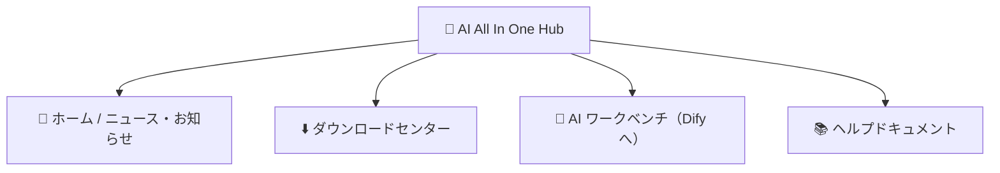

# 第2章：AI All In One Hub（ポータル）

*クイックスタート*

> AI プラットフォームへの出発点：ニュース閲覧、ソフトダウンロード、Dify への遷移。

[← 第1章：プラットフォームを知る](ch01-about.md) · [📖 目次](index.md) · [第3章：ツール1：DSH Desktop →](ch03-dsh.md)

---

## 2.1 ポータルとは

**AI All In One Hub** は会社の企業ポータル（オープンソースの Ghost を基に構築）で、アドレスは `http://IP:8090`。AI プラットフォームへ入る**出発点**です。

*図 2：ポータルの 4 つの主要セクション*

## 2.2 ニュース / お知らせの閲覧

1. ブラウザで `http://IP:8090` を開く；

2. ホームが最新のニュース・お知らせリストで、タイトルをクリックして全文を読む。

## 2.3 ダウンロードセンター（DSH Desktop のインストール）

1. ポータル上部の「**ダウンロードセンター**」メニューをクリック、または直接 `http://IP:8090/downloads/` を開く；

2. OS に合わせて **Windows** / **macOS** インストーラを選び、**DSH Desktop** をダウンロード；

3. インストール：Windows は .exe をダブルクリックしてウィザードに従う。macOS は .dmg を開いて「アプリケーション」にドラッグ。

> ✅ ダウンロードページ上部の「初回はまずスキルマネージャーをインストール」は上級ユーザー向けのスキルパッケージです。一般ユーザーは無視して構いません。

## 2.4 Dify / ヘルプへの遷移

- ポータルメニュー「**AI ワークベンチ**」をクリック → 直接 Dify（AI アプリケーションプラットフォーム）へ遷移；

- 「**ヘルプドキュメント**」をクリック → 会社が整理したヘルプ記事を閲覧。

> 📖 公式ドキュメント：ポータルは Ghost が提供します。公式ドキュメント https://ghost.org/docs/

---

[← 第1章：プラットフォームを知る](ch01-about.md) · [📖 目次](index.md) · [第3章：ツール1：DSH Desktop →](ch03-dsh.md)
