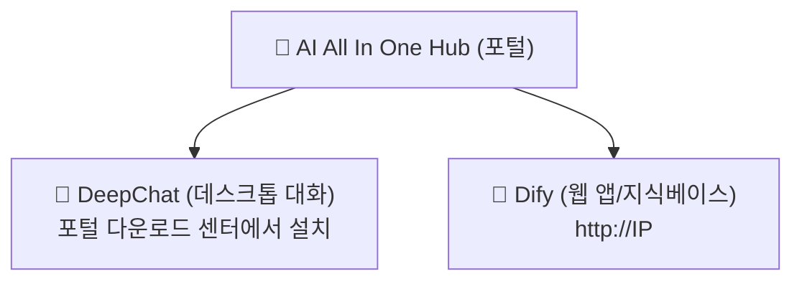

# 제1장: 플랫폼 알아보기

*빠른 시작*

> 3분 만에 이해: 이 플랫폼이 무엇인지, 무엇을 할 수 있는지, 어디서 들어가는지.

[📖 목차](index.md) · [제2장: AI All In One Hub (포털) →](ch02-hub.md)

---

> 📌 안내: 본 매뉴얼의 `IP`는 회사 내부망 서버 주소를 의미합니다 (예시 `192.168.31.117`, 실제는 관리자가 공지한 값 기준). 모든 주소는 **내부망 IP**를 사용하고, `localhost`나 `127.0.0.1`을 사용하지 마세요.

## 1.1 플랫폼이란

「AI AllInOne」은 회사 내부망에 배포된 기업 AI 플랫폼으로, 대형 모델 (DeepSeek, GPT, Claude 등)의 능력을 내부망으로 통합 수용하여 직원이 **계정 하나**로 사용할 수 있게 합니다. 뒤에 있는 서버, 모델, 키를 신경 쓸 필요 없이——세 가지 진입점만 기억하면 됩니다.

*그림 1: 세 가지 진입점의 관계*

*세 가지 진입점: 포털(Hub)이 시작점, DeepChat과 Dify가 두 도구*

## 1.2 플랫폼으로 무엇을 할 수 있나

| 하고 싶은 것 | 무엇을 쓸까 | 어디서 열까 |
| --- | --- | --- |
| ChatGPT처럼 일상 대화, 문서 작성, 번역, 코드 수정 | 💬 DeepChat | 데스크톱 클라이언트 (먼저 포털에서 다운로드 설치) |
| 회사가 만든 AI 앱 사용 (고객 Q&A, 승인 어시스턴트 등) | 🤖 Dify | 브라우저 `http://IP` |
| 문서 업로드로 「지식베이스 Q&A」 (내부 자료 질문) | 🤖 Dify | 브라우저 `http://IP` |
| 회사 뉴스, 공지, 소프트웨어 다운로드 | 📰 포털 (Hub) | 브라우저 `http://IP:8090` |
| 직접 API Key 신청해 서드파티 도구 연결 | 🔑 NewAPI | 브라우저 `http://IP:3000` |

## 1.3 세 가지 진입점 선택 방법

> ✅ **한 문장으로 기억**: **채팅/작성/번역 → DeepChat**; **회사가 만든 앱/지식베이스 → Dify**; **찾기/공지 확인/소프트웨어 다운로드 → 포털 Hub**. 세 가지 모두 같은 계정으로 로그인.

로그인 방식: 모든 제품은 **Keycloak 통합 계정**을 사용합니다 (일부는 회사 AD 도메인 계정, 즉 컴퓨터 부팅 시 쓰는 그 계정 지원). 「로그인」 클릭 시 자동으로 통합 로그인 페이지로 이동하며, 계정을 한 번 입력하면 이후 각 제품에서 재로그인이 필요 없습니다.

## 1.4 본 매뉴얼 사용법

- **초보자**: 제2~4장을 순서대로 읽고, 먼저 DeepChat을 설치해 사용하세요;

- **서드파티 도구 연결**: 제5장을 읽어 Key를 신청하세요;

- **궁금한 점**: 먼저 제7장 FAQ를 확인하고, 그래도 모르면 관리자에게 문의하세요;

- **필독**: 제6장 데이터 보안, 제8장 행동 수칙, 모두가 준수해야 합니다.

---

[📖 목차](index.md) · [제2장: AI All In One Hub (포털) →](ch02-hub.md)
