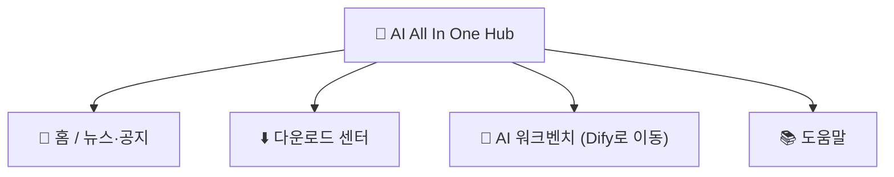

# 제2장: AI All In One Hub (포털)

*빠른 시작*

> AI 플랫폼 진입 시작점: 뉴스 보기, 소프트웨어 다운로드, Dify로 이동.

[← 제1장: 플랫폼 알아보기](ch01-about.md) · [📖 목차](index.md) · [제3장: 도구 1: DeepChat →](ch03-deepchat.md)

---

## 2.1 포털이란

**AI All In One Hub**는 회사의 기업 포털입니다 (오픈소스 소프트웨어 Ghost 기반 구축), 주소 `http://IP:8090`. AI 플랫폼에 들어가는 **시작점**입니다.

*그림 2: 포털의 네 가지 주요 섹션*

## 2.2 뉴스 / 공지 보기

1. 브라우저에서 `http://IP:8090` 열기;

2. 홈이 최신 뉴스, 공지 목록, 제목 클릭해 전문 읽기.

## 2.3 다운로드 센터 (DeepChat 설치)

1. 포털 상단 「**다운로드 센터**」 메뉴 클릭, 또는 `http://IP:8090/downloads/` 직접 열기;

2. 시스템에 따라 **Windows** / **macOS** 설치 패키지 선택, **DeepChat** 다운로드;

3. 설치: Windows는 .exe 더블클릭 후 마법사 진행; macOS는 .dmg 열어 「응용 프로그램」으로 드래그.

> ✅ 다운로드 페이지 상단의 「처음 사용 시 먼저 스킬 매니저 설치」는 고급 사용자용 스킬 패키지로, 일반 사용자는 무시해도 됩니다.

## 2.4 Dify / 도움말로 이동

- 포털 메뉴 「**AI 워크벤치**」 클릭 → 바로 Dify (AI 앱 플랫폼)로 이동;

- 「**도움말**」 클릭 → 회사가 정리한 도움말 문서 확인.

> 📖 원문 문서:포털은 Ghost가 제공, 공식 문서 https://ghost.org/docs/

---

[← 제1장: 플랫폼 알아보기](ch01-about.md) · [📖 목차](index.md) · [제3장: 도구 1: DeepChat →](ch03-deepchat.md)
