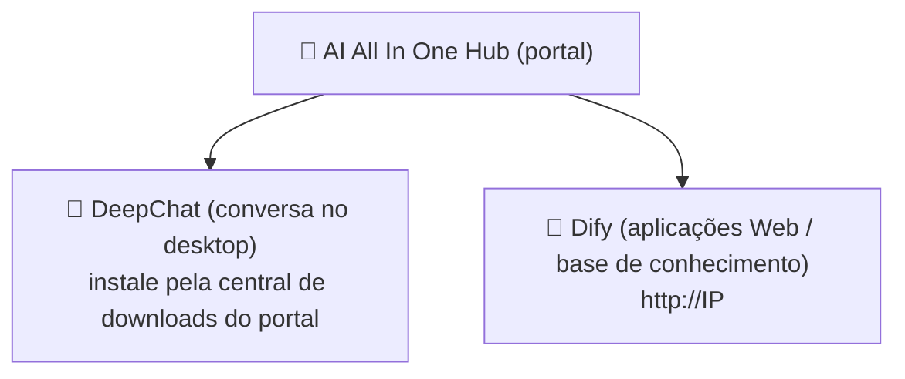

# Capítulo 1: Conhecendo a plataforma

*Início rápido*

> Entenda em 3 minutos: o que é esta plataforma, o que você pode fazer com ela e por onde entrar.

[📖 Índice](index.md) · [Capítulo 2: AI All In One Hub (portal) →](ch02-hub.md)

---

> 📌 Observação: neste manual, `IP` refere-se ao endereço do servidor da intranet da empresa (exemplo `192.168.31.117`; na prática, siga o que o administrador divulgar). Todos os endereços usam o **IP de intranet**; não use `localhost` nem `127.0.0.1`.

## 1.1 O que é a plataforma

«AI AllInOne» é uma plataforma corporativa de IA implantada na intranet da empresa, que centraliza as capacidades dos grandes modelos (DeepSeek, GPT, Claude etc.) na rede interna; os funcionários usam com **uma única conta**. Você não precisa se preocupar com servidores, modelos ou chaves — basta lembrar das três entradas.

*Figura 1: relação entre as três entradas*

*Três entradas: o portal (Hub) é o ponto de partida; DeepChat e Dify são as duas ferramentas*

## 1.2 O que posso fazer com a plataforma

| O que você quer fazer | Qual usar | Onde abrir |
| --- | --- | --- |
| Conversar no dia a dia como no ChatGPT, escrever documentos, traduzir, corrigir código | 💬 DeepChat | Cliente de desktop (instale primeiro pelo portal) |
| Usar aplicações de IA prontas da empresa (QA de atendimento, assistente de aprovação etc.) | 🤖 Dify | Navegador `http://IP` |
| Enviar documentos para «perguntas e respostas da base de conhecimento» (consultar material interno) | 🤖 Dify | Navegador `http://IP` |
| Ver notícias da empresa, avisos, baixar software | 📰 Portal (Hub) | Navegador `http://IP:8090` |
| Solicitar você mesmo uma API Key para integrar ferramentas de terceiros | 🔑 NewAPI | Navegador `http://IP:3000` |

## 1.3 Como escolher entre as três entradas

> ✅ **Resumo em uma frase**: **conversar/escrever/traduzir → DeepChat**; **aplicações prontas da empresa / base de conhecimento → Dify**; **achar coisas / ver avisos / baixar software → portal Hub**. As três usam a mesma conta para login.

Método de login: todos os produtos usam a **conta unificada do Keycloak** (alguns também aceitam a conta de domínio AD da empresa, ou seja, a mesma conta de ligar o computador). Clique em «Entrar» e você será redirecionado à página de login unificada; digite a conta uma vez e os demais produtos não exigirão novo login.

## 1.4 Como usar este manual

- **Iniciante**: leia os capítulos 2~4 em ordem e instale o DeepChat para começar;

- **Integrar ferramentas de terceiros**: leia o capítulo 5 para solicitar uma Key;

- **Dúvidas**: consulte primeiro o FAQ do capítulo 7 e depois fale com o administrador;

- **Leitura obrigatória**: capítulo 6 (segurança de dados) e capítulo 8 (código de conduta) — todos devem cumprir.

---

[📖 Índice](index.md) · [Capítulo 2: AI All In One Hub (portal) →](ch02-hub.md)
