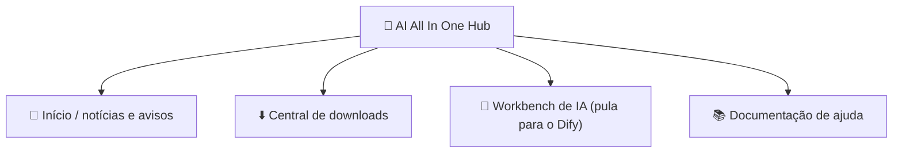

# Capítulo 2: AI All In One Hub (portal)

*Início rápido*

> O ponto de partida da plataforma de IA: ver notícias, baixar software, pular para o Dify.

[← Capítulo 1: Conhecendo a plataforma](ch01-about.md) · [📖 Índice](index.md) · [Capítulo 3: Ferramenta 1: DSH Desktop →](ch03-dsh.md)

---

## 2.1 O que é o portal

**AI All In One Hub** é o portal corporativo da empresa (baseado no software open source Ghost), endereço `http://IP:8090`. É o **ponto de partida** da plataforma de IA.

*Figura 2: os quatro blocos comuns do portal*

## 2.2 Ver notícias / avisos

1. Abra `http://IP:8090` no navegador;

2. A página inicial traz as notícias e avisos mais recentes; clique no título para ler o texto completo.

## 2.3 Central de downloads (instalar o DSH Desktop)

1. Clique no menu «**Central de downloads**» no topo do portal, ou abra diretamente `http://IP:8090/downloads/`;

2. Escolha o instalador **Windows** / **macOS** conforme seu sistema e baixe o **DSH Desktop**;

3. Instalação: no Windows, dê dois cliques no .exe e siga o assistente; no macOS, abra o .dmg e arraste para «Aplicativos».

> ✅ O aviso «instale primeiro o Assistente de Skills» no topo da página de downloads é o pacote de skills para usuários avançados; usuários comuns podem ignorar.

## 2.4 Pular para o Dify / ajuda

- Clique no menu «**Workbench de IA**» do portal → pula direto para o Dify (plataforma de aplicações de IA);

- Clique em «**Documentação de ajuda**» → veja os artigos de ajuda organizados pela empresa.

> 📖 Documentação oficial:o portal é fornecido pelo Ghost; documentação oficial https://ghost.org/docs/

---

[← Capítulo 1: Conhecendo a plataforma](ch01-about.md) · [📖 Índice](index.md) · [Capítulo 3: Ferramenta 1: DSH Desktop →](ch03-dsh.md)
