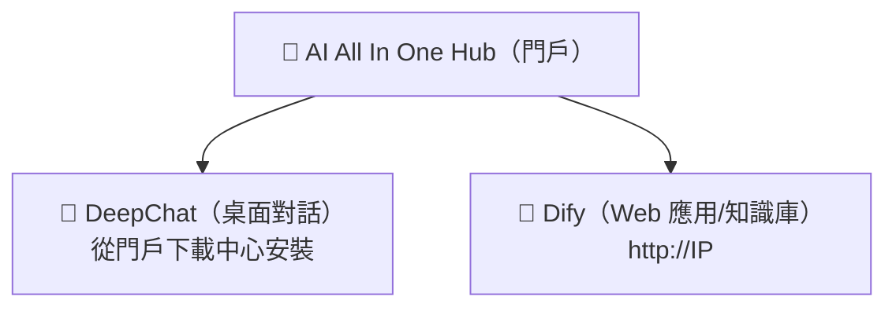

# 第1章：認識平台

*快速開始*

> 3 分鐘瞭解：這套平台是什麼、你能用它做什麼、從哪進。

[📖 目錄](index.md) · [第2章：AI All In One Hub（門戶） →](ch02-hub.md)

---

> 📌 說明：本手冊裡的 `IP` 指公司內網伺服器地址（示例 `192.168.31.117`，實際以管理員公佈為準）。所有地址都用**內網 IP**，不要用 `localhost` 或 `127.0.0.1`。

## 1.1 平台是什麼

「AI AllInOne」是公司內網部署的一套企業 AI 平台，把大模型（DeepSeek、GPT、Claude 等）的能力統一收口到內網，員工**一個帳號**就能用。你不需要關心背後的伺服器、模型、金鑰——只需要記住三個入口。

*圖 1：三個入口的關係*

*三個入口：門戶（Hub）是起點，DeepChat 和 Dify 是兩個工具*

## 1.2 我能用平台做什麼

| 想做什麼 | 用哪個 | 在哪開啟 |
| --- | --- | --- |
| 像 ChatGPT 一樣日常對話、寫文件、翻譯、改程式碼 | 💬 DeepChat | 桌面客戶端（先從門戶下載安裝） |
| 用公司搭好的 AI 應用（客服問答、審批助手等） | 🤖 Dify | 瀏覽器 `http://IP` |
| 上傳文件做「知識庫問答」（問內部資料） | 🤖 Dify | 瀏覽器 `http://IP` |
| 看公司新聞、公告、下載軟體 | 📰 門戶（Hub） | 瀏覽器 `http://IP:8090` |
| 自己申請 API Key 接第三方工具 | 🔑 NewAPI | 瀏覽器 `http://IP:3000` |

## 1.3 三個入口怎麼選

> ✅ **一句話記住**：**聊天/寫作/翻譯 → DeepChat**；**公司搭好的應用/知識庫 → Dify**；**找東西/看公告/下軟體 → 門戶 Hub**。三個都用同一個帳號登入。

登入方式：所有產品都走 **Keycloak 統一帳號**（部分支援公司 AD 網域帳號，即你電腦開機那套帳號）。點「登入」自動跳統一登入頁，輸一次帳號，之後各產品無需重複登入。

## 1.4 本手冊怎麼用

- **新手**：按順序讀第 2~4 章，先裝上 DeepChat 用起來；

- **要接第三方工具**：讀第 5 章申請 Key；

- **有疑問**：先查第 7 章 FAQ，再問管理員；

- **必讀**：第 6 章資料安全、第 8 章行為準則，人人都要遵守。

---

[📖 目錄](index.md) · [第2章：AI All In One Hub（門戶） →](ch02-hub.md)
