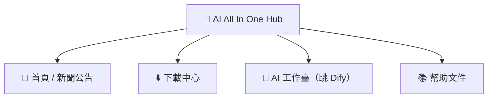

# 第2章：AI All In One Hub（門戶）

*快速開始*

> 進入 AI 平台的起點：看新聞、下軟體、跳到 Dify。

[← 第1章：認識平台](ch01-about.md) · [📖 目錄](index.md) · [第3章：工具一：DSH Desktop →](ch03-dsh.md)

---

## 2.1 門戶是什麼

**AI All In One Hub** 是公司的企業門戶（基於開源軟體 Ghost 搭建），地址 `http://IP:8090`。它是你進入 AI 平台的**起點**。

*圖 2：門戶的四個常用板塊*

## 2.2 看新聞 / 公告

1. 瀏覽器開啟 `http://IP:8090`；

2. 首頁就是最新新聞、公告列表，點標題讀全文。

## 2.3 下載中心（裝 DSH Desktop）

1. 點門戶頂部「**下載中心**」選單，或直接開啟 `http://IP:8090/downloads/`；

2. 按系統選 **Windows** / **macOS** 安裝包，下載 **DSH Desktop**；

3. 安裝：Windows 雙擊 .exe 按嚮導；macOS 開啟 .dmg 拖進「應用程式」。

> ✅ 下載頁頂部「首次使用先裝技能管家」是給高階使用者的技能包，普通使用者可忽略。

## 2.4 跳轉到 Dify / 幫助

- 點門戶選單「**AI 工作臺**」→ 直接跳 Dify（AI 應用平台）；

- 點「**幫助文件**」→ 檢視公司整理的幫助文章。

> 📖 原廠文件：門戶由 Ghost 提供，官方文件 https://ghost.org/docs/

---

[← 第1章：認識平台](ch01-about.md) · [📖 目錄](index.md) · [第3章：工具一：DSH Desktop →](ch03-dsh.md)
