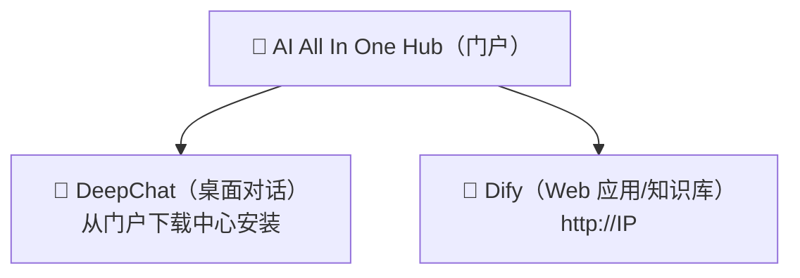

# 第1章：认识平台

*快速开始*

> 3 分钟了解：这套平台是什么、你能用它做什么、从哪进。

[📖 目录](index.md) · [第2章：AI All In One Hub（门户） →](ch02-hub.md)

---

> 📌 说明：本手册里的 `IP` 指公司内网服务器地址（示例 `192.168.31.117`，实际以管理员公布为准）。所有地址都用**内网 IP**，不要用 `localhost` 或 `127.0.0.1`。

## 1.1 平台是什么

「AI AllInOne」是公司内网部署的一套企业 AI 平台，把大模型（DeepSeek、GPT、Claude 等）的能力统一收口到内网，员工**一个账号**就能用。你不需要关心背后的服务器、模型、密钥——只需要记住三个入口。

*图 1：三个入口的关系*

*三个入口：门户（Hub）是起点，DeepChat 和 Dify 是两个工具*

## 1.2 我能用平台做什么

| 想做什么 | 用哪个 | 在哪打开 |
| --- | --- | --- |
| 像 ChatGPT 一样日常对话、写文档、翻译、改代码 | 💬 DeepChat | 桌面客户端（先从门户下载安装） |
| 用公司搭好的 AI 应用（客服问答、审批助手等） | 🤖 Dify | 浏览器 `http://IP` |
| 上传文档做「知识库问答」（问内部资料） | 🤖 Dify | 浏览器 `http://IP` |
| 看公司新闻、公告、下载软件 | 📰 门户（Hub） | 浏览器 `http://IP:8090` |
| 自己申请 API Key 接第三方工具 | 🔑 NewAPI | 浏览器 `http://IP:3000` |

## 1.3 三个入口怎么选

> ✅ **一句话记住**：**聊天/写作/翻译 → DeepChat**；**公司搭好的应用/知识库 → Dify**；**找东西/看公告/下软件 → 门户 Hub**。三个都用同一个账号登录。

登录方式：所有产品都走 **Keycloak 统一账号**（部分支持公司 AD 域账号，即你电脑开机那套账号）。点「登录」自动跳统一登录页，输一次账号，之后各产品无需重复登录。

## 1.4 本手册怎么用

- **新手**：按顺序读第 2~4 章，先装上 DeepChat 用起来；

- **要接第三方工具**：读第 5 章申请 Key；

- **有疑问**：先查第 7 章 FAQ，再问管理员；

- **必读**：第 6 章数据安全、第 8 章行为准则，人人都要遵守。

---

[📖 目录](index.md) · [第2章：AI All In One Hub（门户） →](ch02-hub.md)
