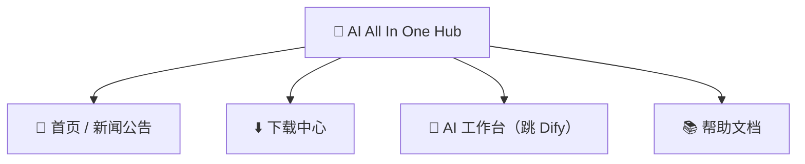

# 第2章：AI All In One Hub（门户）

*快速开始*

> 进入 AI 平台的起点：看新闻、下软件、跳到 Dify。

[← 第1章：认识平台](ch01-about.md) · [📖 目录](index.md) · [第3章：工具一：DSH Desktop →](ch03-dsh.md)

---

## 2.1 门户是什么

**AI All In One Hub** 是公司的企业门户（基于开源软件 Ghost 搭建），地址 `http://IP:8090`。它是你进入 AI 平台的**起点**。

*图 2：门户的四个常用板块*

## 2.2 看新闻 / 公告

1. 浏览器打开 `http://IP:8090`；

2. 首页就是最新新闻、公告列表，点标题读全文。

## 2.3 下载中心（装 DSH Desktop）

1. 点门户顶部「**下载中心**」菜单，或直接打开 `http://IP:8090/downloads/`；

2. 按系统选 **Windows** / **macOS** 安装包，下载 **DSH Desktop**；

3. 安装：Windows 双击 .exe 按向导；macOS 打开 .dmg 拖进「应用程序」。

> ✅ 下载页顶部「首次使用先装技能管家」是给高级用户的技能包，普通用户可忽略。

## 2.4 跳转到 Dify / 帮助

- 点门户菜单「**AI 工作台**」→ 直接跳 Dify（AI 应用平台）；

- 点「**帮助文档**」→ 查看公司整理的帮助文章。

> 📖 原厂文档：门户由 Ghost 提供，官方文档 https://ghost.org/docs/

---

[← 第1章：认识平台](ch01-about.md) · [📖 目录](index.md) · [第3章：工具一：DSH Desktop →](ch03-dsh.md)
