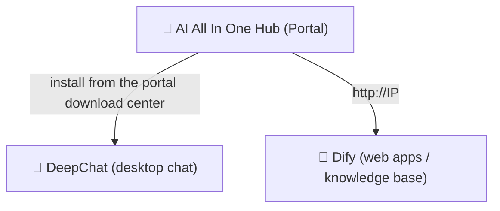

# Chapter 1: Getting to Know the Platform

*Quick Start*

> Understand in 3 minutes: what this platform is, what you can do with it, and where to enter.

[📖 Index](index.md) · [Chapter 2: AI All In One Hub (Portal) →](ch02-hub.md)

---

> 📌 Note: in this manual, `IP` refers to the company intranet server address (example `192.168.31.117`, subject to the address published by the admin). All addresses use the **intranet IP**, not `localhost` or `127.0.0.1`.

## 1.1 What the Platform Is

"AI AllInOne" is an enterprise AI platform deployed on the company intranet, bringing the capabilities of large models (DeepSeek, GPT, Claude, etc.) together on the intranet; employees can use it with **a single account**. You don't need to care about the servers, models, or keys behind it — just remember the three entry points.

*Figure 1: relationship of the three entry points*

## 1.2 What I Can Do with the Platform

| What you want to do | Which to use | Where to open |
| --- | --- | --- |
| Daily chat, writing documents, translation, editing code like ChatGPT | 💬 DeepChat | desktop client (download and install from the portal first) |
| Use company-built AI apps (customer service Q&A, approval assistant, etc.) | 🤖 Dify | browser `http://IP` |
| Upload documents for "knowledge base Q&A" (ask about internal material) | 🤖 Dify | browser `http://IP` |
| Read company news and announcements, download software | 📰 Portal (Hub) | browser `http://IP:8090` |
| Apply for your own API Key to connect third-party tools | 🔑 NewAPI | browser `http://IP:3000` |

## 1.3 How to Choose Among the Three Entry Points

> ✅ **Remember in one sentence**: **chat/writing/translation → DeepChat**; **company-built apps/knowledge base → Dify**; **find things / read announcements / download software → the Hub portal**. All three use the same account to log in.

Login: all products use the **Keycloak unified account** (some also support the company AD domain account, i.e. the account you use to log in to your computer). Click "Log in" to be redirected to the unified login page; enter the account once and you won't need to log in again for each product.

## 1.4 How to Use This Manual

- **Beginners**: read Chapters 2~4 in order, install DeepChat first and start using it;

- **Want to connect third-party tools**: read Chapter 5 to request a Key;

- **Have questions**: check the FAQ in Chapter 7 first, then ask the admin;

- **Must-read**: Chapter 6 Data Security and Chapter 8 Code of Conduct — everyone must follow them.

---

[📖 Index](index.md) · [Chapter 2: AI All In One Hub (Portal) →](ch02-hub.md)
