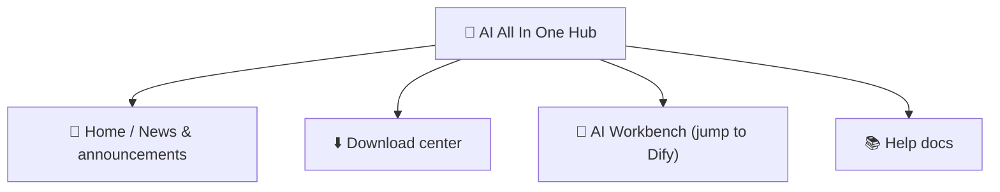

# Chapter 2: AI All In One Hub (Portal)

*Quick Start*

> The starting point into the AI platform: read news, download software, jump to Dify.

[← Chapter 1: Getting to Know the Platform](ch01-about.md) · [📖 Index](index.md) · [Chapter 3: Tool 1: DSH Desktop →](ch03-dsh.md)

---

## 2.1 What the Portal Is

**AI All In One Hub** is the company's enterprise portal (built on the open-source software Ghost), at `http://IP:8090`. It is the **starting point** into the AI platform.

*Figure 2: the four common sections of the portal*

## 2.2 Read News / Announcements

1. Open `http://IP:8090` in a browser;

2. The home page is the latest news/announcement list; click a title to read the full text.

## 2.3 Download Center (install DSH Desktop)

1. Click the "**Download center**" menu at the top of the portal, or open `http://IP:8090/downloads/` directly;

2. Choose the **Windows** / **macOS** installer for your system, and download **DSH Desktop**;

3. Install: on Windows double-click the .exe and follow the wizard; on macOS open the .dmg and drag it into "Applications".

> ✅ The "Install Skill Butler on first use" item at the top of the download page is a skill package for advanced users; regular users can ignore it.

## 2.4 Jump to Dify / Help

- Click the "**AI Workbench**" portal menu → jumps directly to Dify (the AI app platform);

- Click "**Help docs**" → view the help articles compiled by the company.

> 📖 Vendor docs:the portal is powered by Ghost, official docs https://ghost.org/docs/

---

[← Chapter 1: Getting to Know the Platform](ch01-about.md) · [📖 Index](index.md) · [Chapter 3: Tool 1: DSH Desktop →](ch03-dsh.md)
